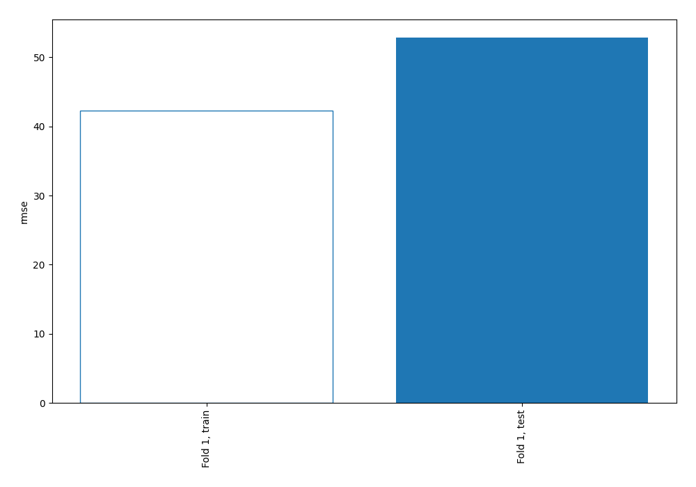
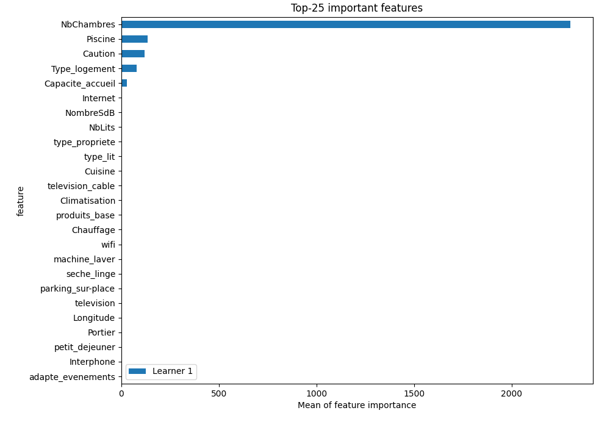
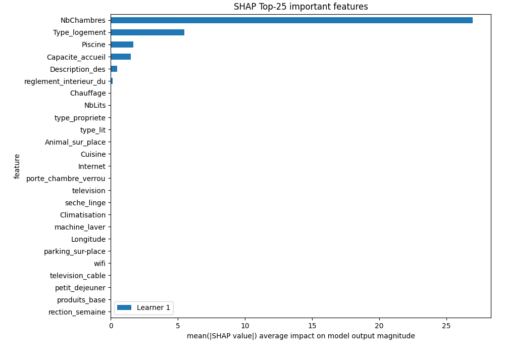
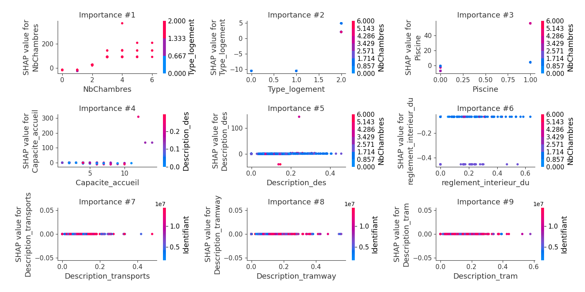
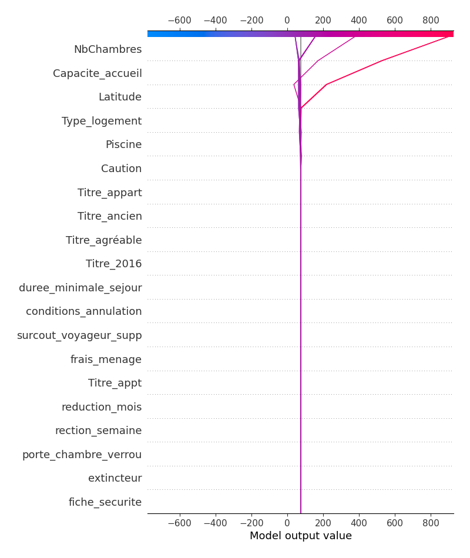
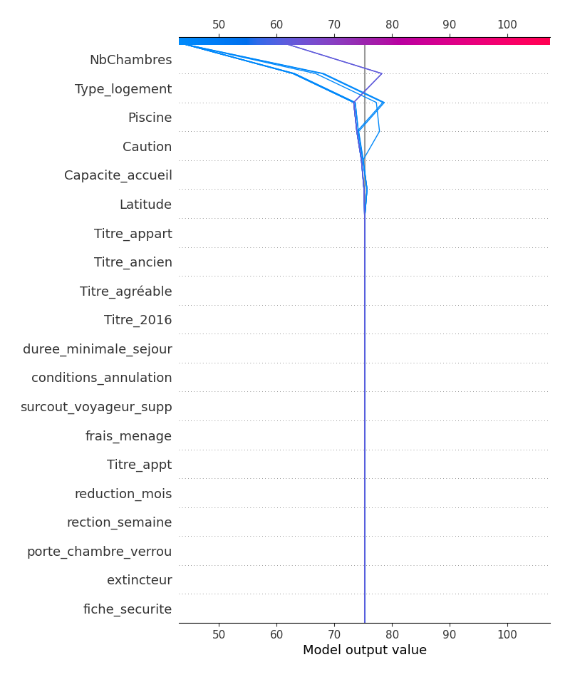

# Summary of 2_DecisionTree

[<< Go back](../README.md)

## Decision Tree
- **criterion**: mse
- **max_depth**: 3
- **explain_level**: 2

## Validation
 - **validation_type**: split
 - **train_ratio**: 0.75
 - **shuffle**: True

## Optimized metric
rmse

## Training time

11.8 seconds

### Metric details:
| Metric   |       Score |
|:---------|------------:|
| MAE      |   26.6166   |
| MSE      | 2718.92     |
| RMSE     |   52.1432   |
| R2       |    0.367074 |

## Learning curves

## Permutation-based Importance

## SHAP Importance

## SHAP Dependence plots

### Dependence (Fold 1)

## SHAP Decision plots

### Top-10 Worst decisions (Fold 1)

### Top-10 Best decisions (Fold 1)

[<< Go back](../README.md)
