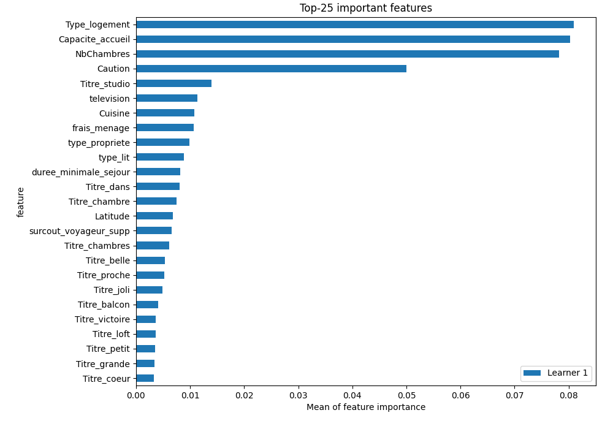

# Summary of 5_Default_NeuralNetwork

[<< Go back](../README.md)

## Neural Network
- **dense_1_size**: 32
- **dense_2_size**: 16
- **learning_rate**: 0.05
- **explain_level**: 2

## Validation
 - **validation_type**: split
 - **train_ratio**: 0.75
 - **shuffle**: True

## Optimized metric
rmse

## Training time

2.2 seconds

### Metric details:
| Metric   |       Score |
|:---------|------------:|
| MAE      |   23.6519   |
| MSE      | 1929.02     |
| RMSE     |   43.9206   |
| R2       |    0.550951 |

## Learning curves

## Permutation-based Importance

[<< Go back](../README.md)
