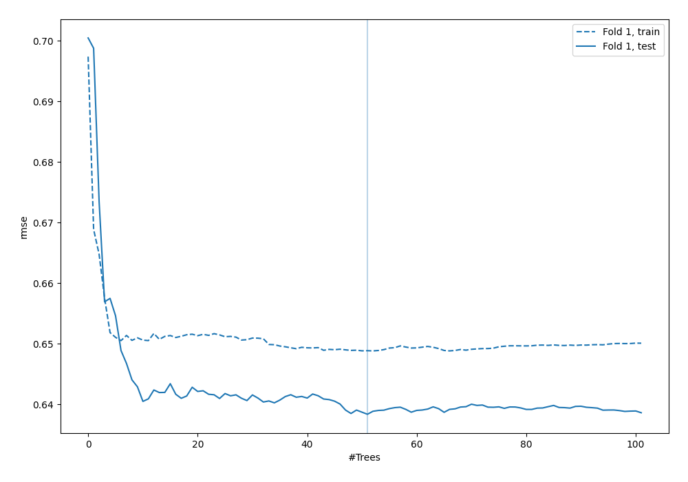
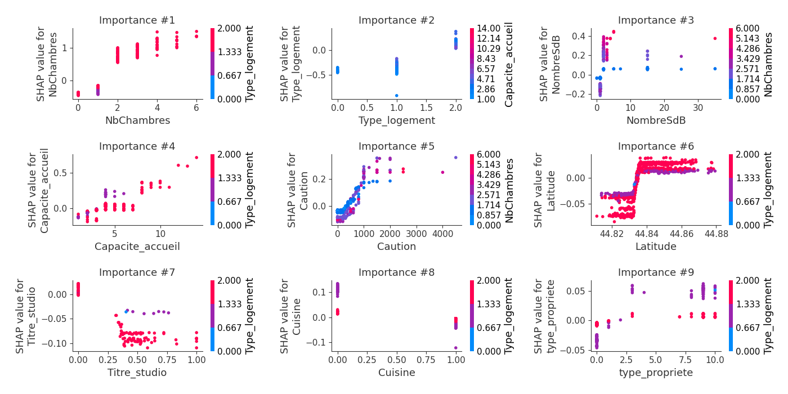
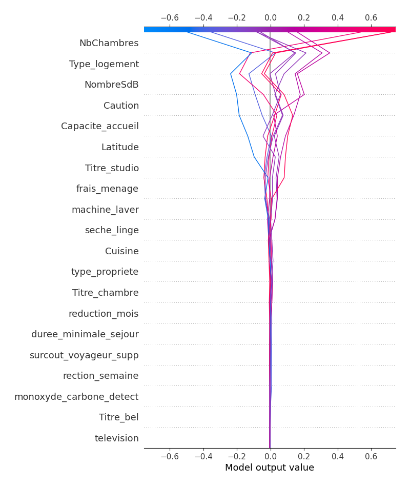

# Summary of 6_Default_RandomForest

[<< Go back](../README.md)

## Random Forest
- **criterion**: mse
- **max_features**: 0.9
- **min_samples_split**: 30
- **max_depth**: 4
- **explain_level**: 2

## Validation
 - **validation_type**: split
 - **train_ratio**: 0.75
 - **shuffle**: True

## Optimized metric
rmse

## Training time

17.5 seconds

### Metric details:
| Metric   |       Score |
|:---------|------------:|
| MAE      |   23.0653   |
| MSE      | 2093.95     |
| RMSE     |   45.7597   |
| R2       |    0.512557 |

## Learning curves

## Permutation-based Importance

## SHAP Importance

## SHAP Dependence plots

### Dependence (Fold 1)

## SHAP Decision plots

### Top-10 Worst decisions (Fold 1)

### Top-10 Best decisions (Fold 1)

[<< Go back](../README.md)
