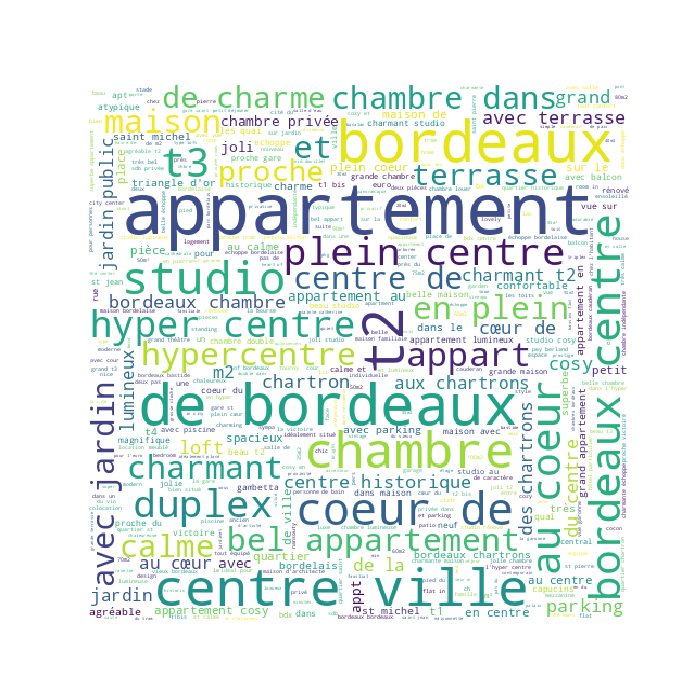
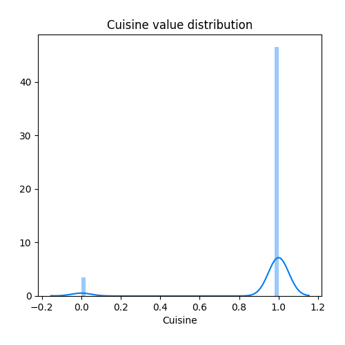
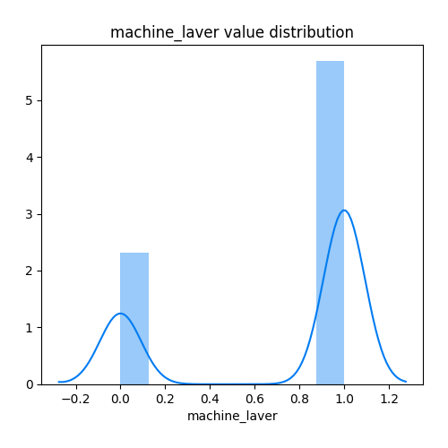
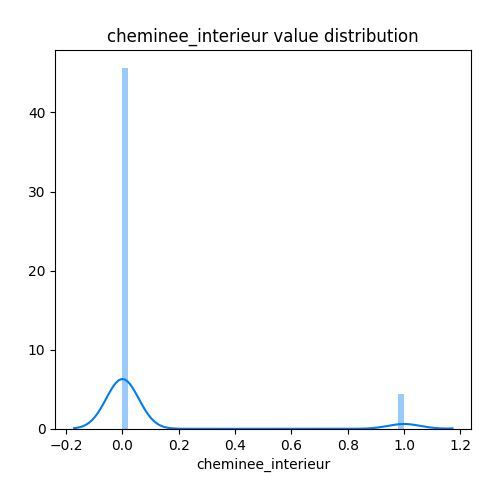

# Exploratory Data Analysis

[<< Go back](../README.md)
## Feature : target
- **Feature type** : discrete
- **Missing** : 0.0%
- **Unique** : 193
- **Count** :3927.0
- **Mean** :75.81945505474917
- **Std** :62.6276526107421
- **Min** :0.0
- **25%th Percentile** : 40.0
- **50%th Percentile** : 60.0
- **75%th Percentile** : 90.0
- **Max** :900.0

## Feature : Titre
- **Feature type** : text
- **Missing** : 0.0%
- **Unique** : 3765
- **Count** :3927
- **Unique** :3765
- **Top** :Appartement au coeur de Bordeaux
- **Freq** :10

## Feature : Latitude
- **Feature type** : continous
- **Missing** : 0.0%
- **Unique** : 3927
- **Count** :3927.0
- **Mean** :44.84080594967102
- **Std** :0.012070445717321127
- **Min** :44.8112449636
- **25%th Percentile** : 44.832558734450004
- **50%th Percentile** : 44.8393058626
- **75%th Percentile** : 44.8487307166
- **Max** :44.885275470100005

## Feature : Longitude
- **Feature type** : continous
- **Missing** : 0.0%
- **Unique** : 3927
- **Count** :3927.0
- **Mean** :-0.575628491570079
- **Std** :0.013918186978845094
- **Min** :-0.6368829356
- **25%th Percentile** : -0.5809139186500001
- **50%th Percentile** : -0.5734955327000001
- **75%th Percentile** : -0.5684178578
- **Max** :-0.5382718796

## Feature : Capacite_accueil
- **Feature type** : discrete
- **Missing** : 0.0%
- **Unique** : 15
- **Count** :3927.0
- **Mean** :3.3142347848230203
- **Std** :1.6823856169494218
- **Min** :1.0
- **25%th Percentile** : 2.0
- **50%th Percentile** : 3.0
- **75%th Percentile** : 4.0
- **Max** :16.0

## Feature : NombreSdB
- **Feature type** : discrete
- **Missing** : 0.0%
- **Unique** : 12
- **Count** :3927.0
- **Mean** :1.687293099057805
- **Std** :3.031503627730334
- **Min** :0.0
- **25%th Percentile** : 1.0
- **50%th Percentile** : 1.0
- **75%th Percentile** : 1.0
- **Max** :35.0

## Feature : NbChambres
- **Feature type** : discrete
- **Missing** : 0.0%
- **Unique** : 8
- **Count** :3927.0
- **Mean** :1.2915711739241151
- **Std** :0.8958998421797776
- **Min** :0.0
- **25%th Percentile** : 1.0
- **50%th Percentile** : 1.0
- **75%th Percentile** : 2.0
- **Max** :10.0

## Feature : NbLits
- **Feature type** : discrete
- **Missing** : 0.0%
- **Unique** : 9
- **Count** :3927.0
- **Mean** :0.5938375350140056
- **Std** :1.0097803522261972
- **Min** :0.0
- **25%th Percentile** : 0.0
- **50%th Percentile** : 0.0
- **75%th Percentile** : 1.0
- **Max** :9.0

## Feature : Type_logement
- **Feature type** : categorical
- **Missing** : 0.0%
- **Unique** : 3
- **Count** :3927
- **Unique** :3
- **Top** :Logement entier
- **Freq** :2999

## Feature : type_propriete
- **Feature type** : categorical
- **Missing** : 0.0%
- **Unique** : 13
- **Count** :3927
- **Unique** :13
- **Top** :Appartement
- **Freq** :3109

## Feature : type_lit
- **Feature type** : categorical
- **Missing** : 54.59638400814871%
- **Unique** : 3
- **Count** :1783
- **Unique** :3
- **Top** :Vrai lit
- **Freq** :1590

## Feature : Cuisine
- **Feature type** : discrete
- **Missing** : 0.0%
- **Unique** : 2
- **Count** :3927.0
- **Mean** :0.9307359307359307
- **Std** :0.25393498851135726
- **Min** :0.0
- **25%th Percentile** : 1.0
- **50%th Percentile** : 1.0
- **75%th Percentile** : 1.0
- **Max** :1.0

## Feature : Internet
- **Feature type** : discrete
- **Missing** : 0.0%
- **Unique** : 2
- **Count** :3927.0
- **Mean** :0.5709192768016298
- **Std** :0.49500793239674146
- **Min** :0.0
- **25%th Percentile** : 0.0
- **50%th Percentile** : 1.0
- **75%th Percentile** : 1.0
- **Max** :1.0

## Feature : television
- **Feature type** : discrete
- **Missing** : 0.0%
- **Unique** : 2
- **Count** :3927.0
- **Mean** :0.7226890756302521
- **Std** :0.4477282907678305
- **Min** :0.0
- **25%th Percentile** : 0.0
- **50%th Percentile** : 1.0
- **75%th Percentile** : 1.0
- **Max** :1.0

## Feature : produits_base
- **Feature type** : discrete
- **Missing** : 0.0%
- **Unique** : 2
- **Count** :3927.0
- **Mean** :0.8500127323656735
- **Std** :0.357104411501812
- **Min** :0.0
- **25%th Percentile** : 1.0
- **50%th Percentile** : 1.0
- **75%th Percentile** : 1.0
- **Max** :1.0

## Feature : Chauffage
- **Feature type** : discrete
- **Missing** : 0.0%
- **Unique** : 2
- **Count** :3927.0
- **Mean** :0.9251336898395722
- **Std** :0.2632090185982046
- **Min** :0.0
- **25%th Percentile** : 1.0
- **50%th Percentile** : 1.0
- **75%th Percentile** : 1.0
- **Max** :1.0

## Feature : Climatisation
- **Feature type** : discrete
- **Missing** : 0.0%
- **Unique** : 2
- **Count** :3927.0
- **Mean** :0.08479755538579067
- **Std** :0.27861568049256513
- **Min** :0.0
- **25%th Percentile** : 0.0
- **50%th Percentile** : 0.0
- **75%th Percentile** : 0.0
- **Max** :1.0

## Feature : machine_laver
- **Feature type** : discrete
- **Missing** : 0.0%
- **Unique** : 2
- **Count** :3927.0
- **Mean** :0.7109752992105933
- **Std** :0.4533671401645178
- **Min** :0.0
- **25%th Percentile** : 0.0
- **50%th Percentile** : 1.0
- **75%th Percentile** : 1.0
- **Max** :1.0

## Feature : seche_linge
- **Feature type** : discrete
- **Missing** : 0.0%
- **Unique** : 2
- **Count** :3927.0
- **Mean** :0.22103386809269163
- **Std** :0.4149960880001292
- **Min** :0.0
- **25%th Percentile** : 0.0
- **50%th Percentile** : 0.0
- **75%th Percentile** : 0.0
- **Max** :1.0

## Feature : parking_sur-place
- **Feature type** : discrete
- **Missing** : 0.0%
- **Unique** : 2
- **Count** :3927.0
- **Mean** :0.23427552839317545
- **Std** :0.4235991007250468
- **Min** :0.0
- **25%th Percentile** : 0.0
- **50%th Percentile** : 0.0
- **75%th Percentile** : 0.0
- **Max** :1.0

## Feature : wifi
- **Feature type** : discrete
- **Missing** : 0.0%
- **Unique** : 2
- **Count** :3927.0
- **Mean** :0.8971224853577795
- **Std** :0.3038375223049372
- **Min** :0.0
- **25%th Percentile** : 1.0
- **50%th Percentile** : 1.0
- **75%th Percentile** : 1.0
- **Max** :1.0

## Feature : television_cable
- **Feature type** : discrete
- **Missing** : 0.0%
- **Unique** : 2
- **Count** :3927.0
- **Mean** :0.2019353195823784
- **Std** :0.40149532382238456
- **Min** :0.0
- **25%th Percentile** : 0.0
- **50%th Percentile** : 0.0
- **75%th Percentile** : 0.0
- **Max** :1.0

## Feature : petit_dejeuner
- **Feature type** : discrete
- **Missing** : 0.0%
- **Unique** : 2
- **Count** :3927.0
- **Mean** :0.18843901196842372
- **Std** :0.39111213712470927
- **Min** :0.0
- **25%th Percentile** : 0.0
- **50%th Percentile** : 0.0
- **75%th Percentile** : 0.0
- **Max** :1.0

## Feature : animaux_acceptes
- **Feature type** : discrete
- **Missing** : 0.0%
- **Unique** : 2
- **Count** :3927.0
- **Mean** :0.1252864782276547
- **Std** :0.3310856240481432
- **Min** :0.0
- **25%th Percentile** : 0.0
- **50%th Percentile** : 0.0
- **75%th Percentile** : 0.0
- **Max** :1.0

## Feature : pourEnfants_famille
- **Feature type** : discrete
- **Missing** : 0.0%
- **Unique** : 2
- **Count** :3927.0
- **Mean** :0.5938375350140056
- **Std** :0.4911781267550322
- **Min** :0.0
- **25%th Percentile** : 0.0
- **50%th Percentile** : 1.0
- **75%th Percentile** : 1.0
- **Max** :1.0

## Feature : adapte_evenements
- **Feature type** : discrete
- **Missing** : 0.0%
- **Unique** : 2
- **Count** :3927.0
- **Mean** :0.07919531448943214
- **Std** :0.27007775016545454
- **Min** :0.0
- **25%th Percentile** : 0.0
- **50%th Percentile** : 0.0
- **75%th Percentile** : 0.0
- **Max** :1.0

## Feature : logement_fumeur
- **Feature type** : discrete
- **Missing** : 0.0%
- **Unique** : 2
- **Count** :3927.0
- **Mean** :0.2992105933282404
- **Std** :0.45797054833021766
- **Min** :0.0
- **25%th Percentile** : 0.0
- **50%th Percentile** : 0.0
- **75%th Percentile** : 1.0
- **Max** :1.0

## Feature : accessibilite
- **Feature type** : discrete
- **Missing** : 0.0%
- **Unique** : 2
- **Count** :3927.0
- **Mean** :0.052711993888464474
- **Std** :0.22348637149450953
- **Min** :0.0
- **25%th Percentile** : 0.0
- **50%th Percentile** : 0.0
- **75%th Percentile** : 0.0
- **Max** :1.0

## Feature : Ascenseur
- **Feature type** : discrete
- **Missing** : 0.0%
- **Unique** : 2
- **Count** :3927.0
- **Mean** :0.17290552584670232
- **Std** :0.3782137374079072
- **Min** :0.0
- **25%th Percentile** : 0.0
- **50%th Percentile** : 0.0
- **75%th Percentile** : 0.0
- **Max** :1.0

## Feature : cheminee_interieur
- **Feature type** : discrete
- **Missing** : 0.0%
- **Unique** : 2
- **Count** :3927.0
- **Mean** :0.08785332314744079
- **Std** :0.2831175165002957
- **Min** :0.0
- **25%th Percentile** : 0.0
- **50%th Percentile** : 0.0
- **75%th Percentile** : 0.0
- **Max** :1.0

## Feature : Interphone
- **Feature type** : discrete
- **Missing** : 0.0%
- **Unique** : 2
- **Count** :3927.0
- **Mean** :0.44435956200662086
- **Std** :0.49695777602418434
- **Min** :0.0
- **25%th Percentile** : 0.0
- **50%th Percentile** : 0.0
- **75%th Percentile** : 1.0
- **Max** :1.0

## Feature : Portier
- **Feature type** : discrete
- **Missing** : 0.0%
- **Unique** : 2
- **Count** :3927.0
- **Mean** :0.010185892538833716
- **Std** :0.10042264772383355
- **Min** :0.0
- **25%th Percentile** : 0.0
- **50%th Percentile** : 0.0
- **75%th Percentile** : 0.0
- **Max** :1.0

## Feature : Piscine
- **Feature type** : discrete
- **Missing** : 0.0%
- **Unique** : 2
- **Count** :3927.0
- **Mean** :0.02750190985485103
- **Std** :0.16356150900389183
- **Min** :0.0
- **25%th Percentile** : 0.0
- **50%th Percentile** : 0.0
- **75%th Percentile** : 0.0
- **Max** :1.0

## Feature : Jacuzzi
- **Feature type** : discrete
- **Missing** : 0.0%
- **Unique** : 2
- **Count** :3927.0
- **Mean** :0.008658008658008658
- **Std** :0.09265653647097254
- **Min** :0.0
- **25%th Percentile** : 0.0
- **50%th Percentile** : 0.0
- **75%th Percentile** : 0.0
- **Max** :1.0

## Feature : salle_sport
- **Feature type** : discrete
- **Missing** : 0.0%
- **Unique** : 2
- **Count** :3927.0
- **Mean** :0.0073847720906544435
- **Std** :0.08562770773817253
- **Min** :0.0
- **25%th Percentile** : 0.0
- **50%th Percentile** : 0.0
- **75%th Percentile** : 0.0
- **Max** :1.0

## Feature : Entree_24-24
- **Feature type** : discrete
- **Missing** : 0.0%
- **Unique** : 2
- **Count** :3927.0
- **Mean** :0.24420677361853832
- **Std** :0.4296706151449713
- **Min** :0.0
- **25%th Percentile** : 0.0
- **50%th Percentile** : 0.0
- **75%th Percentile** : 0.0
- **Max** :1.0

## Feature : Cintres
- **Feature type** : discrete
- **Missing** : 0.0%
- **Unique** : 2
- **Count** :3927.0
- **Mean** :0.533231474407945
- **Std** :0.49895798006040654
- **Min** :0.0
- **25%th Percentile** : 0.0
- **50%th Percentile** : 1.0
- **75%th Percentile** : 1.0
- **Max** :1.0

## Feature : fer_repasser
- **Feature type** : discrete
- **Missing** : 0.0%
- **Unique** : 2
- **Count** :3927.0
- **Mean** :0.4856124267888974
- **Std** :0.4998566024920637
- **Min** :0.0
- **25%th Percentile** : 0.0
- **50%th Percentile** : 0.0
- **75%th Percentile** : 1.0
- **Max** :1.0

## Feature : seche_cheveux
- **Feature type** : discrete
- **Missing** : 0.0%
- **Unique** : 2
- **Count** :3927.0
- **Mean** :0.49477973007384773
- **Std** :0.5000364185581802
- **Min** :0.0
- **25%th Percentile** : 0.0
- **50%th Percentile** : 0.0
- **75%th Percentile** : 1.0
- **Max** :1.0

## Feature : espace_travail_ordi
- **Feature type** : discrete
- **Missing** : 0.0%
- **Unique** : 2
- **Count** :3927.0
- **Mean** :0.4239877769289534
- **Std** :0.4942513007537908
- **Min** :0.0
- **25%th Percentile** : 0.0
- **50%th Percentile** : 0.0
- **75%th Percentile** : 1.0
- **Max** :1.0

## Feature : detecteur_fumee
- **Feature type** : discrete
- **Missing** : 0.0%
- **Unique** : 2
- **Count** :3927.0
- **Mean** :0.6549528902470079
- **Std** :0.4754441755949444
- **Min** :0.0
- **25%th Percentile** : 0.0
- **50%th Percentile** : 1.0
- **75%th Percentile** : 1.0
- **Max** :1.0

## Feature : monoxyde_carbone_detect
- **Feature type** : discrete
- **Missing** : 0.0%
- **Unique** : 2
- **Count** :3927.0
- **Mean** :0.11764705882352941
- **Std** :0.3222307699210849
- **Min** :0.0
- **25%th Percentile** : 0.0
- **50%th Percentile** : 0.0
- **75%th Percentile** : 0.0
- **Max** :1.0

## Feature : kit_secours
- **Feature type** : discrete
- **Missing** : 0.0%
- **Unique** : 2
- **Count** :3927.0
- **Mean** :0.137764196587726
- **Std** :0.34469621229240627
- **Min** :0.0
- **25%th Percentile** : 0.0
- **50%th Percentile** : 0.0
- **75%th Percentile** : 0.0
- **Max** :1.0

## Feature : fiche_securite
- **Feature type** : discrete
- **Missing** : 0.0%
- **Unique** : 2
- **Count** :3927.0
- **Mean** :0.09549274255156608
- **Std** :0.2939317593423122
- **Min** :0.0
- **25%th Percentile** : 0.0
- **50%th Percentile** : 0.0
- **75%th Percentile** : 0.0
- **Max** :1.0

## Feature : extincteur
- **Feature type** : discrete
- **Missing** : 0.0%
- **Unique** : 2
- **Count** :3927.0
- **Mean** :0.07130124777183601
- **Std** :0.25736014883985564
- **Min** :0.0
- **25%th Percentile** : 0.0
- **50%th Percentile** : 0.0
- **75%th Percentile** : 0.0
- **Max** :1.0

## Feature : porte_chambre_verrou
- **Feature type** : discrete
- **Missing** : 0.0%
- **Unique** : 2
- **Count** :3927.0
- **Mean** :0.03896103896103896
- **Std** :0.19352677750521763
- **Min** :0.0
- **25%th Percentile** : 0.0
- **50%th Percentile** : 0.0
- **75%th Percentile** : 0.0
- **Max** :1.0

## Feature : rection_semaine
- **Feature type** : discrete
- **Missing** : 0.0%
- **Unique** : 51
- **Count** :3927.0
- **Mean** :7.163992869875223
- **Std** :8.729249299020648
- **Min** :0.0
- **25%th Percentile** : 0.0
- **50%th Percentile** : 1.0
- **75%th Percentile** : 14.0
- **Max** :69.0

## Feature : reduction_mois
- **Feature type** : discrete
- **Missing** : 0.0%
- **Unique** : 69
- **Count** :3927.0
- **Mean** :12.035395976572447
- **Std** :17.438269553563355
- **Min** :0.0
- **25%th Percentile** : 0.0
- **50%th Percentile** : 0.0
- **75%th Percentile** : 27.0
- **Max** :75.0

## Feature : surcout_voyageur_supp
- **Feature type** : discrete
- **Missing** : 0.0%
- **Unique** : 32
- **Count** :3927.0
- **Mean** :3.220269926152279
- **Std** :7.339737317536831
- **Min** :0.0
- **25%th Percentile** : 0.0
- **50%th Percentile** : 0.0
- **75%th Percentile** : 0.0
- **Max** :100.0

## Feature : frais_menage
- **Feature type** : discrete
- **Missing** : 0.0%
- **Unique** : 53
- **Count** :3927.0
- **Mean** :13.15711739241151
- **Std** :20.522616890068534
- **Min** :0.0
- **25%th Percentile** : 0.0
- **50%th Percentile** : 0.0
- **75%th Percentile** : 20.0
- **Max** :200.0

## Feature : Caution
- **Feature type** : discrete
- **Missing** : 0.0%
- **Unique** : 71
- **Count** :3927.0
- **Mean** :259.7257448433919
- **Std** :370.66421484942816
- **Min** :0.0
- **25%th Percentile** : 0.0
- **50%th Percentile** : 150.0
- **75%th Percentile** : 400.0
- **Max** :4501.0

## Feature : conditions_annulation
- **Feature type** : categorical
- **Missing** : 18.36007130124777%
- **Unique** : 3
- **Count** :3206
- **Unique** :3
- **Top** :Flexibles
- **Freq** :1493

## Feature : duree_minimale_sejour
- **Feature type** : discrete
- **Missing** : 0.0%
- **Unique** : 17
- **Count** :3927.0
- **Mean** :2.224089635854342
- **Std** :1.9129556096936025
- **Min** :1.0
- **25%th Percentile** : 1.0
- **50%th Percentile** : 2.0
- **75%th Percentile** : 3.0
- **Max** :27.0

[<< Go back](../README.md)
