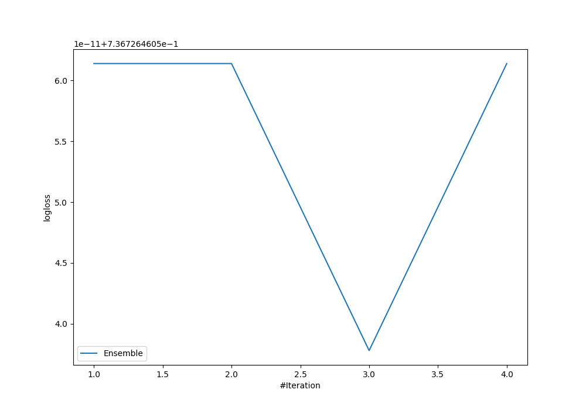

# Summary of Ensemble

[<< Go back](../README.md)

## Ensemble structure
| Model             |   Weight |
|:------------------|---------:|
| 3_Default_Xgboost |        3 |

### Metric details
|           |            1 |           2 |           3 |           4 |   accuracy |    macro avg |   weighted avg |   logloss |
|:----------|-------------:|------------:|------------:|------------:|-----------:|-------------:|---------------:|----------:|
| precision |     0.738655 |   0.393701  |    0.517142 |    0.664934 |   0.677055 |     0.578608 |       0.665338 |  0.736726 |
| recall    |     0.819267 |   0.0763359 |    0.458727 |    0.654    |   0.677055 |     0.502083 |       0.677055 |  0.736726 |
| f1-score  |     0.776875 |   0.127877  |    0.486186 |    0.659422 |   0.677055 |     0.51259  |       0.66722  |  0.736726 |
| support   | 10391        | 655         | 3913        | 9974        |   0.677055 | 24933        |   24933        |  0.736726 |

## Confusion matrix
|              |   Predicted as 1 |   Predicted as 2 |   Predicted as 3 |   Predicted as 4 |
|:-------------|-----------------:|-----------------:|-----------------:|-----------------:|
| Labeled as 1 |             8513 |                4 |              313 |             1561 |
| Labeled as 2 |               86 |               50 |              382 |              137 |
| Labeled as 3 |              473 |               56 |             1795 |             1589 |
| Labeled as 4 |             2453 |               17 |              981 |             6523 |

## Learning curves

[<< Go back](../README.md)
