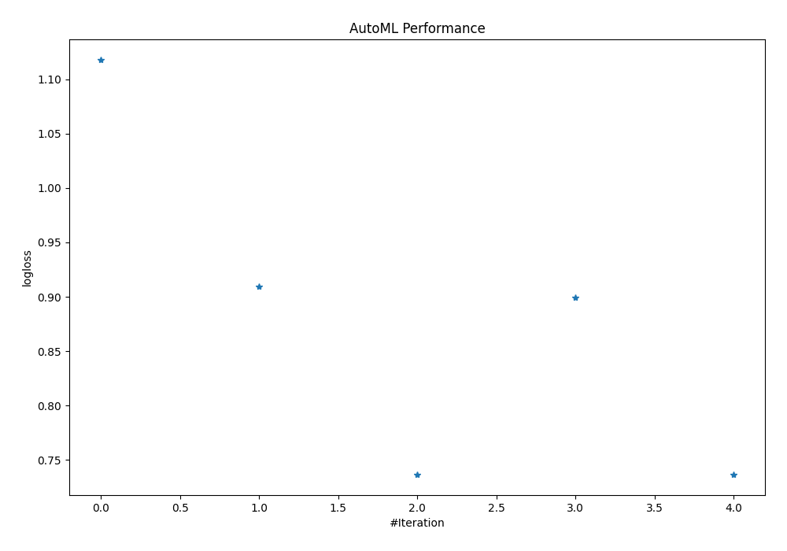
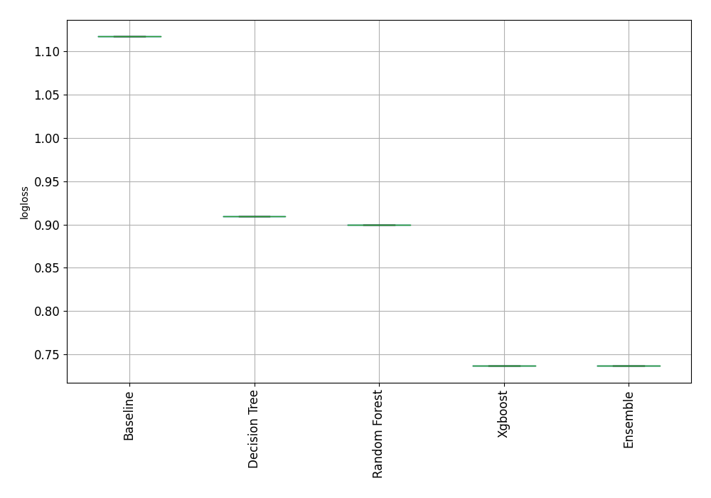

# AutoML Leaderboard

| Best model   | name                                                       | model_type    | metric_type   |   metric_value |   train_time |
|:-------------|:-----------------------------------------------------------|:--------------|:--------------|---------------:|-------------:|
|              | [1_Baseline](1_Baseline/README.md)                         | Baseline      | logloss       |       1.11752  |         1.24 |
|              | [2_DecisionTree](2_DecisionTree/README.md)                 | Decision Tree | logloss       |       0.909709 |         1.5  |
| **the best** | [3_Default_Xgboost](3_Default_Xgboost/README.md)           | Xgboost       | logloss       |       0.736726 |        17.62 |
|              | [4_Default_RandomForest](4_Default_RandomForest/README.md) | Random Forest | logloss       |       0.899588 |        15.67 |
|              | [Ensemble](Ensemble/README.md)                             | Ensemble      | logloss       |       0.736726 |         0.72 |

### AutoML Performance

### AutoML Performance Boxplot
