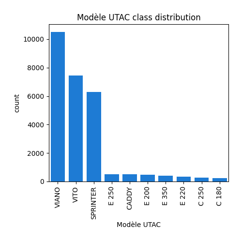
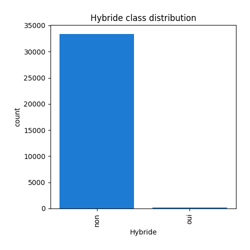

# Exploratory Data Analysis

[<< Go back](../README.md)
## Feature : target
- **Feature type** : continous
- **Missing** : 0.0%
- **Unique** : 261
- **Count** :33608.0
- **Mean** :199.0420138062366
- **Std** :39.04384963194276
- **Min** :27.0
- **25%th Percentile** : 187.0
- **50%th Percentile** : 203.0
- **75%th Percentile** : 221.0
- **Max** :572.0

## Feature : Marque
- **Feature type** : categorical
- **Missing** : 0.0%
- **Unique** : 49
- **Count** :33608
- **Unique** :49
- **Top** :MERCEDES-BENZ
- **Freq** :28873

## Feature : Modèle dossier
- **Feature type** : categorical
- **Missing** : 0.0%
- **Unique** : 430
- **Count** :33608
- **Unique** :430
- **Top** :VIANO
- **Freq** :10524

## Feature : Modèle UTAC
- **Feature type** : categorical
- **Missing** : 0.0%
- **Unique** : 409
- **Count** :33608
- **Unique** :409
- **Top** :VIANO
- **Freq** :10524

## Feature : Désignation commerciale
- **Feature type** : categorical
- **Missing** : 0.0%
- **Unique** : 2943
- **Count** :33608
- **Unique** :2943
- **Top** :VIANO 2.2 CDI
- **Freq** :4391

## Feature : CNIT
- **Feature type** : text
- **Missing** : 0.0%
- **Unique** : 33131
- **Count** :33608
- **Unique** :33131
- **Top** :M10FATVP001P595
- **Freq** :15

## Feature : Type Variante Version (TVV)
- **Feature type** : text
- **Missing** : 0.0%
- **Unique** : 23562
- **Count** :33608
- **Unique** :23562
- **Top** :263AXG1B05
- **Freq** :25

.png)
## Feature : Carburant
- **Feature type** : categorical
- **Missing** : 0.0%
- **Unique** : 11
- **Count** :33608
- **Unique** :11
- **Top** :GO
- **Freq** :28358

## Feature : Hybride
- **Feature type** : categorical
- **Missing** : 0.0%
- **Unique** : 2
- **Count** :33608
- **Unique** :2
- **Top** :non
- **Freq** :33410

## Feature : Puissance administrative
- **Feature type** : discrete
- **Missing** : 0.0%
- **Unique** : 60
- **Count** :33608.0
- **Mean** :11.030320161866221
- **Std** :5.537156640514163
- **Min** :3.0
- **25%th Percentile** : 9.0
- **50%th Percentile** : 10.0
- **75%th Percentile** : 11.0
- **Max** :81.0

## Feature : Puissance maximale (kW)
- **Feature type** : continous
- **Missing** : 0.0%
- **Unique** : 215
- **Count** :33608.0
- **Mean** :124.89434658414663
- **Std** :48.972027259031705
- **Min** :40.0
- **25%th Percentile** : 100.0
- **50%th Percentile** : 120.0
- **75%th Percentile** : 125.0
- **Max** :559.3

.png)
## Feature : Boîte de vitesse
- **Feature type** : categorical
- **Missing** : 0.0%
- **Unique** : 13
- **Count** :33608
- **Unique** :13
- **Top** :M 6
- **Freq** :14479

## Feature : Consommation urbaine (l/100km)
- **Feature type** : continous
- **Missing** : 0.008926446084265651%
- **Unique** : 199
- **Count** :33605.0
- **Mean** :9.712627585180778
- **Std** :2.3648938306287812
- **Min** :3.1
- **25%th Percentile** : 8.8
- **50%th Percentile** : 9.8
- **75%th Percentile** : 10.7
- **Max** :41.1

.png)
## Feature : Consommation extra-urbaine (l/100km)
- **Feature type** : continous
- **Missing** : 0.008926446084265651%
- **Unique** : 91
- **Count** :33605.0
- **Mean** :6.571178396072012
- **Std** :1.198034305081748
- **Min** :2.8
- **25%th Percentile** : 6.3
- **50%th Percentile** : 6.7
- **75%th Percentile** : 7.1
- **Max** :14.9

.png)
## Feature : Consommation mixte (l/100km)
- **Feature type** : continous
- **Missing** : 0.0%
- **Unique** : 132
- **Count** :33608.0
- **Mean** :7.720719769102595
- **Std** :1.59816184813969
- **Min** :1.2
- **25%th Percentile** : 7.2
- **50%th Percentile** : 7.7
- **75%th Percentile** : 8.4
- **Max** :24.5

.png)
## Feature : CO type I (g/km)
- **Feature type** : continous
- **Missing** : 0.5831944775053559%
- **Unique** : 576
- **Count** :33412.0
- **Mean** :0.15366539865916437
- **Std** :0.13920065635356219
- **Min** :0.005
- **25%th Percentile** : 0.046
- **50%th Percentile** : 0.09300000000000001
- **75%th Percentile** : 0.223
- **Max** :0.968

.png)
## Feature : HC (g/km)
- **Feature type** : continous
- **Missing** : 76.75255891454415%
- **Unique** : 71
- **Count** :7813.0
- **Mean** :0.030275873544093175
- **Std** :0.018388554393659225
- **Min** :0.008
- **25%th Percentile** : 0.008
- **50%th Percentile** : 0.031
- **75%th Percentile** : 0.044000000000000004
- **Max** :0.14300000000000002

.png)
## Feature : NOX (g/km)
- **Feature type** : continous
- **Missing** : 0.5831944775053559%
- **Unique** : 215
- **Count** :33412.0
- **Mean** :0.31366597330300494
- **Std** :0.4656989212719559
- **Min** :0.001
- **25%th Percentile** : 0.158
- **50%th Percentile** : 0.19699999999999998
- **75%th Percentile** : 0.228
- **Max** :1.8459999999999999

.png)
## Feature : HC+NOX (g/km)
- **Feature type** : continous
- **Missing** : 23.72946917400619%
- **Unique** : 178
- **Count** :25633.0
- **Mean** :0.22474843365973549
- **Std** :0.041898658548405535
- **Min** :0.046
- **25%th Percentile** : 0.201
- **50%th Percentile** : 0.22
- **75%th Percentile** : 0.248
- **Max** :0.306

.png)
## Feature : Particules (g/km)
- **Feature type** : continous
- **Missing** : 7.031064032373244%
- **Unique** : 16
- **Count** :31245.0
- **Mean** :0.000968511761881901
- **Std** :0.006588602532973322
- **Min** :0.0
- **25%th Percentile** : 0.0
- **50%th Percentile** : 0.001
- **75%th Percentile** : 0.001
- **Max** :0.61

.png)
## Feature : masse vide euro min (kg)
- **Feature type** : discrete
- **Missing** : 0.0%
- **Unique** : 803
- **Count** :33608.0
- **Mean** :2072.6989109735778
- **Std** :341.32466279861217
- **Min** :825.0
- **25%th Percentile** : 1976.0
- **50%th Percentile** : 2076.0
- **75%th Percentile** : 2265.0
- **Max** :3115.0

.png)
## Feature : masse vide euro max (kg)
- **Feature type** : discrete
- **Missing** : 0.0%
- **Unique** : 876
- **Count** :33608.0
- **Mean** :2171.5720959295404
- **Std** :409.1406478546089
- **Min** :825.0
- **25%th Percentile** : 2070.0
- **50%th Percentile** : 2185.0
- **75%th Percentile** : 2355.0
- **Max** :3115.0

.png)
## Feature : Champ V9
- **Feature type** : categorical
- **Missing** : 0.42846941204475125%
- **Unique** : 13
- **Count** :33464
- **Unique** :13
- **Top** :715/2007*692/2008EURO5
- **Freq** :19808

## Feature : Carrosserie
- **Feature type** : categorical
- **Missing** : 0.0%
- **Unique** : 10
- **Count** :33608
- **Unique** :10
- **Top** :MINIBUS
- **Freq** :24615

## Feature : gamme
- **Feature type** : categorical
- **Missing** : 0.0%
- **Unique** : 7
- **Count** :33608
- **Unique** :7
- **Top** :MOY-INFER
- **Freq** :15384

[<< Go back](../README.md)
