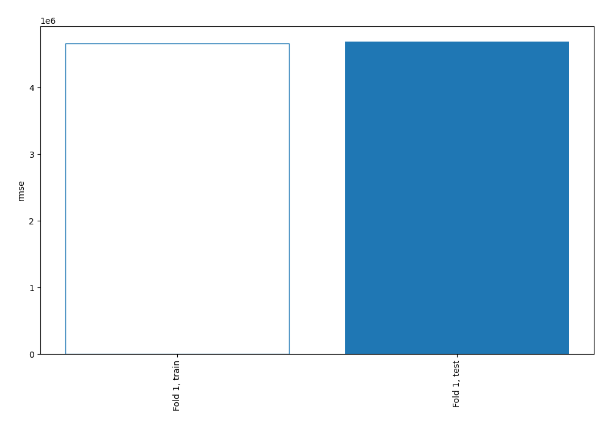

# Summary of 1_Baseline

[<< Go back](../README.md)

## Baseline Regressor (Baseline)
- **explain_level**: 2

## Validation
 - **validation_type**: split
 - **train_ratio**: 0.75
 - **shuffle**: True

## Optimized metric
rmse

## Training time

0.8 seconds

### Metric details:
| Metric   |            Score |
|:---------|-----------------:|
| MAE      | 848637           |
| MSE      |      2.19612e+13 |
| RMSE     |      4.68628e+06 |
| R2       |     -1.07028e-06 |

## Learning curves

[<< Go back](../README.md)
