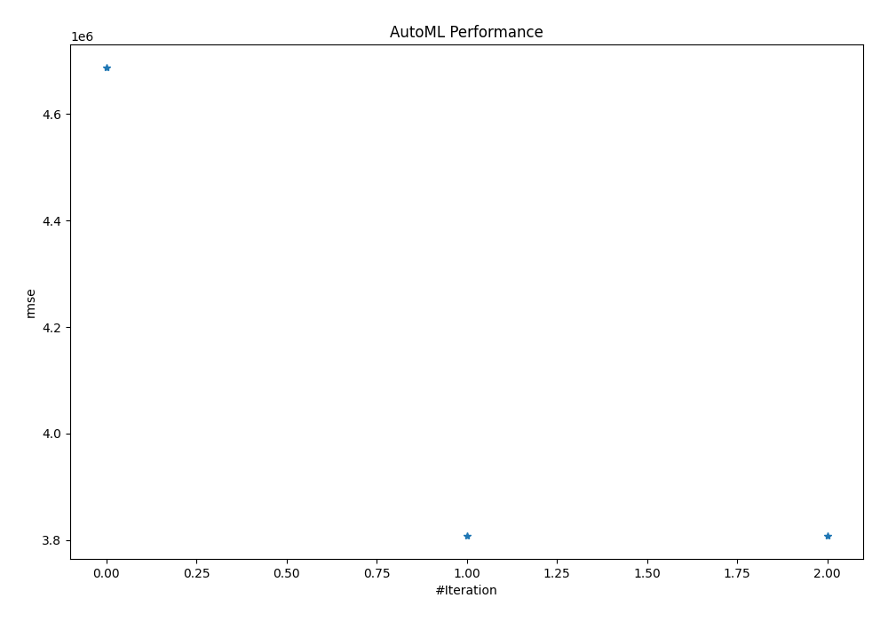
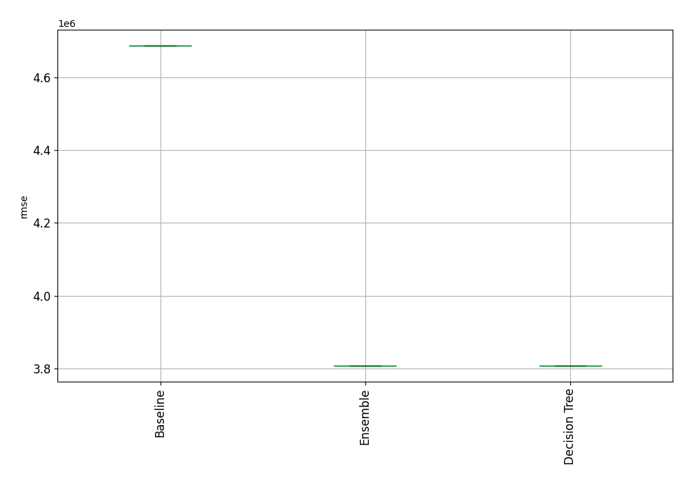

# AutoML Leaderboard

| Best model   | name                                       | model_type    | metric_type   |   metric_value |   train_time |
|:-------------|:-------------------------------------------|:--------------|:--------------|---------------:|-------------:|
|              | [1_Baseline](1_Baseline/README.md)         | Baseline      | rmse          |    4.68628e+06 |         1.21 |
| **the best** | [2_DecisionTree](2_DecisionTree/README.md) | Decision Tree | rmse          |    3.80876e+06 |       414.27 |
|              | [Ensemble](Ensemble/README.md)             | Ensemble      | rmse          |    3.80876e+06 |         0.03 |

### AutoML Performance

### AutoML Performance Boxplot
