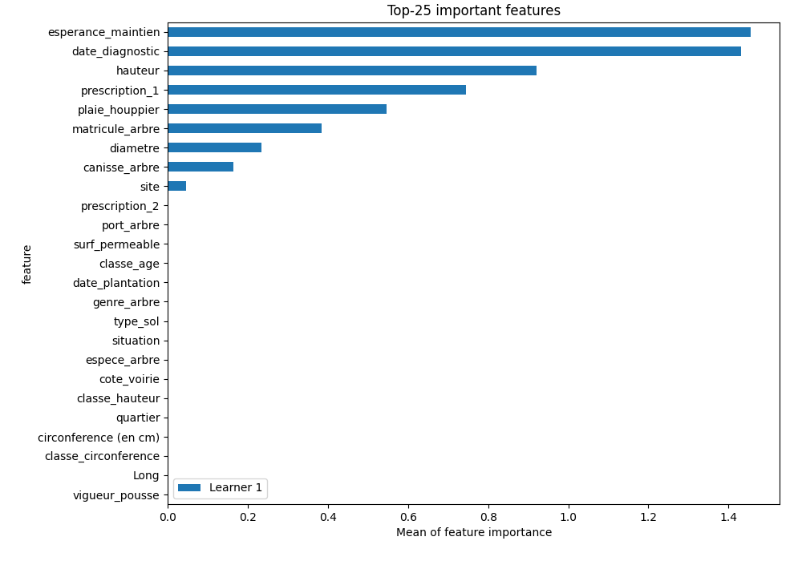
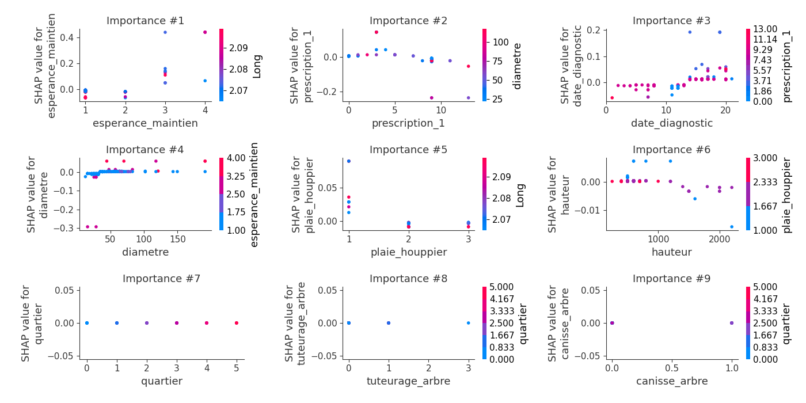

# Summary of 2_DecisionTree

[<< Go back](../README.md)

## Decision Tree
- **criterion**: entropy
- **max_depth**: 4
- **num_class**: 6
- **explain_level**: 2

## Validation
 - **validation_type**: split
 - **train_ratio**: 0.75
 - **shuffle**: True
 - **stratify**: True

## Optimized metric
logloss

## Training time

24.6 seconds

### Metric details
|           |        C1 |        C2 |       C3 |       C4 |   C5 |   nan |   accuracy |   macro avg |   weighted avg |   logloss |
|:----------|----------:|----------:|---------:|---------:|-----:|------:|-----------:|------------:|---------------:|----------:|
| precision |  0.825    |  0.855422 | 1        | 0.666667 |  0.8 |     1 |    0.84507 |    0.857848 |        0.84983 |   0.69032 |
| recall    |  0.767442 |  0.922078 | 0.428571 | 0.8      |  0.8 |     1 |    0.84507 |    0.786349 |        0.84507 |   0.69032 |
| f1-score  |  0.795181 |  0.8875   | 0.6      | 0.727273 |  0.8 |     1 |    0.84507 |    0.801659 |        0.84061 |   0.69032 |
| support   | 43        | 77        | 7        | 5        |  5   |     5 |    0.84507 |  142        |      142       |   0.69032 |

## Confusion matrix
|                |   Predicted as C1 |   Predicted as C2 |   Predicted as C3 |   Predicted as C4 |   Predicted as C5 |   Predicted as nan |
|:---------------|------------------:|------------------:|------------------:|------------------:|------------------:|-------------------:|
| Labeled as C1  |                33 |                10 |                 0 |                 0 |                 0 |                  0 |
| Labeled as C2  |                 5 |                71 |                 0 |                 1 |                 0 |                  0 |
| Labeled as C3  |                 2 |                 1 |                 3 |                 1 |                 0 |                  0 |
| Labeled as C4  |                 0 |                 0 |                 0 |                 4 |                 1 |                  0 |
| Labeled as C5  |                 0 |                 1 |                 0 |                 0 |                 4 |                  0 |
| Labeled as nan |                 0 |                 0 |                 0 |                 0 |                 0 |                  5 |

## Learning curves

## Permutation-based Importance

## SHAP Importance

## SHAP Dependence plots

### Dependence C1 (Fold 1)

### Dependence C2 (Fold 1)

### Dependence C3 (Fold 1)

### Dependence C4 (Fold 1)

### Dependence C5 (Fold 1)

### Dependence nan (Fold 1)

## SHAP Decision plots

### Worst decisions for selected sample 1 (Fold 1)

### Worst decisions for selected sample 2 (Fold 1)

### Worst decisions for selected sample 3 (Fold 1)

### Worst decisions for selected sample 4 (Fold 1)

### Best decisions for selected sample 1 (Fold 1)

### Best decisions for selected sample 2 (Fold 1)

### Best decisions for selected sample 3 (Fold 1)

### Best decisions for selected sample 4 (Fold 1)

[<< Go back](../README.md)
