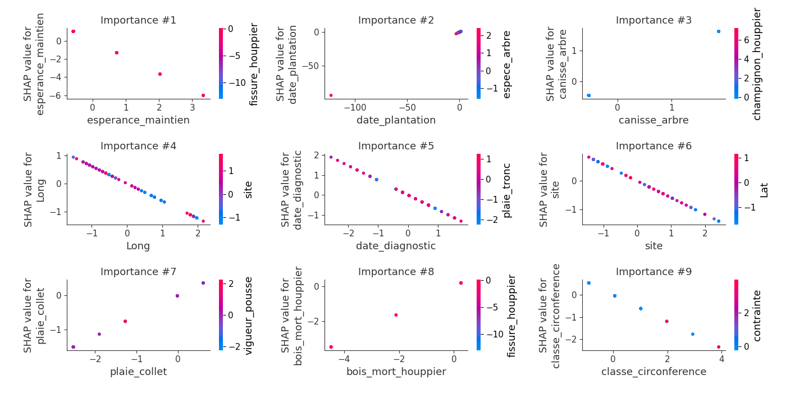
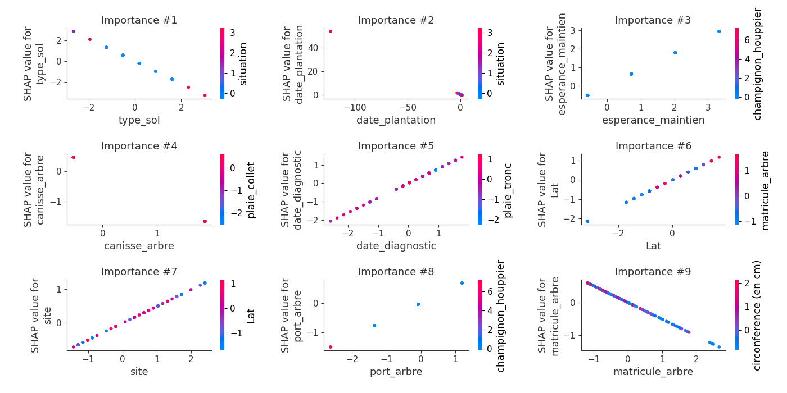
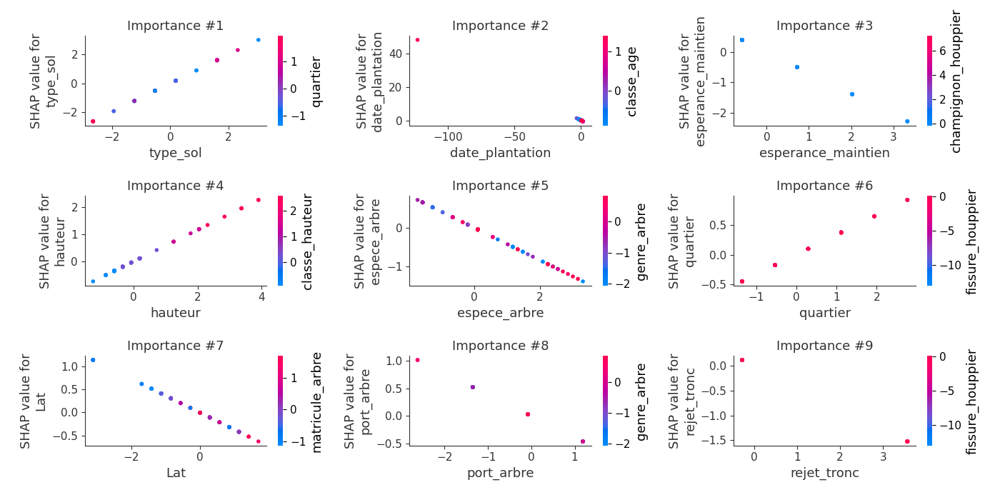
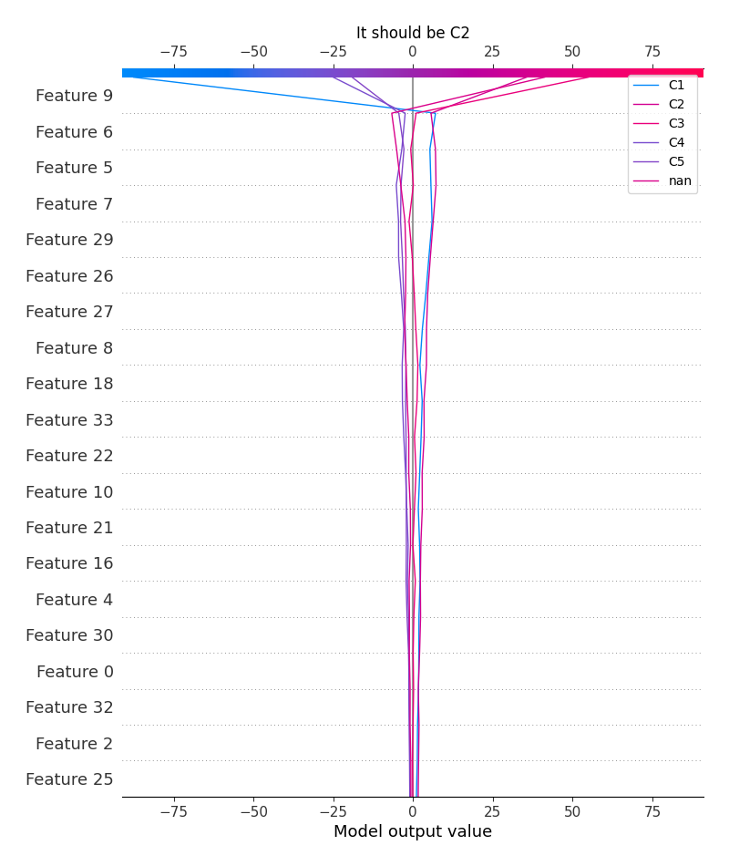
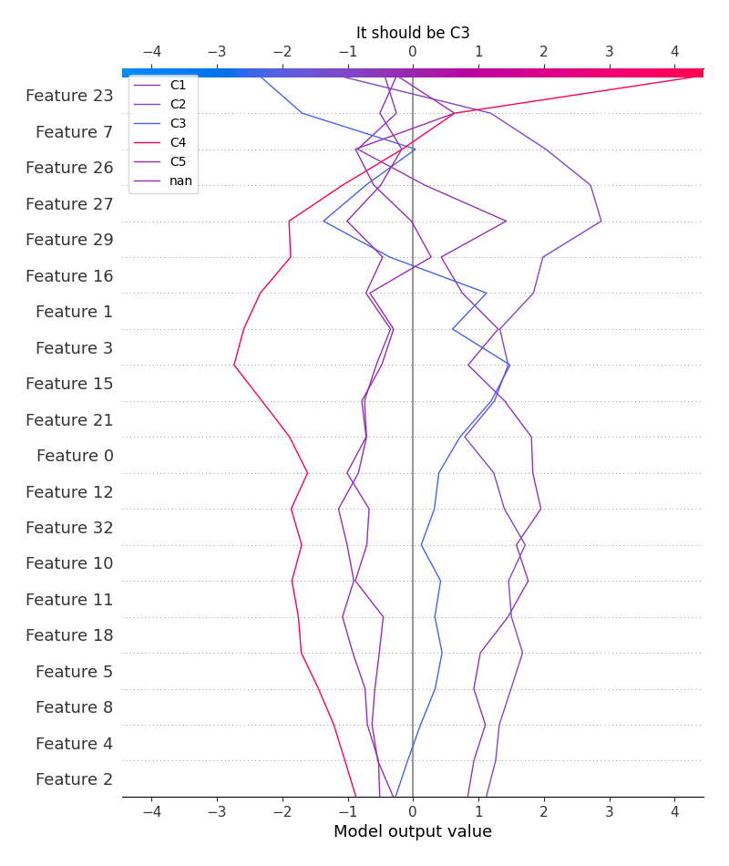
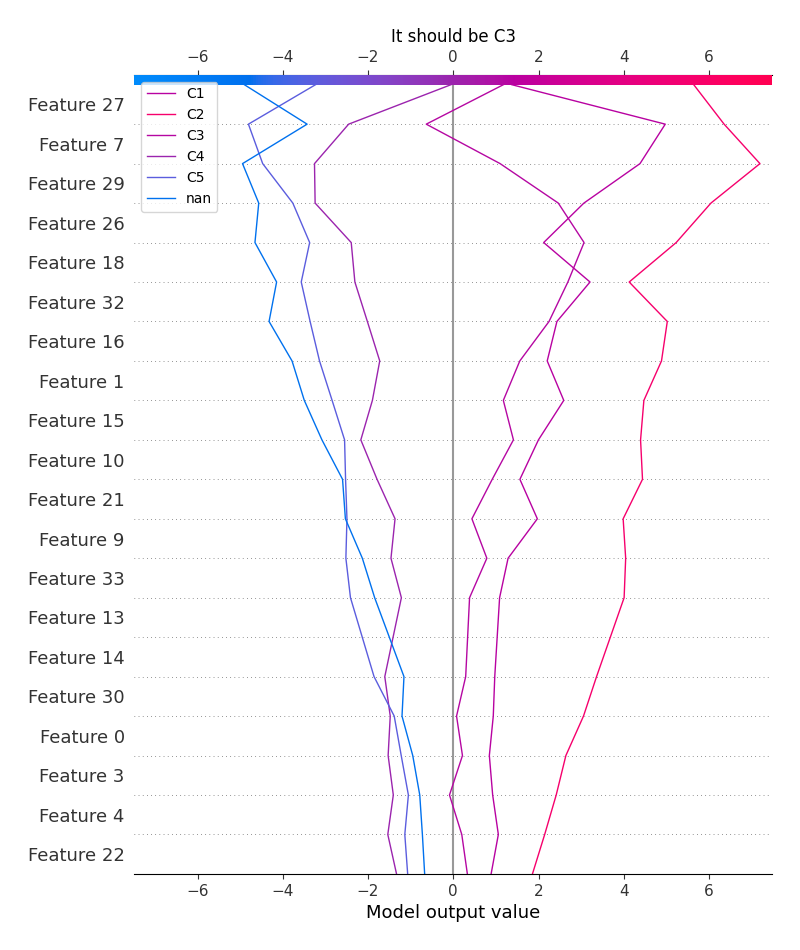
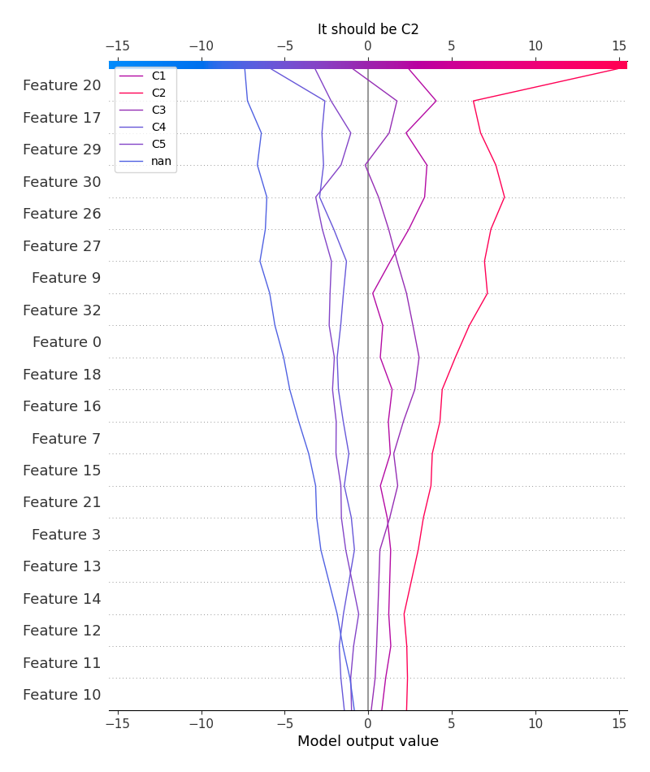
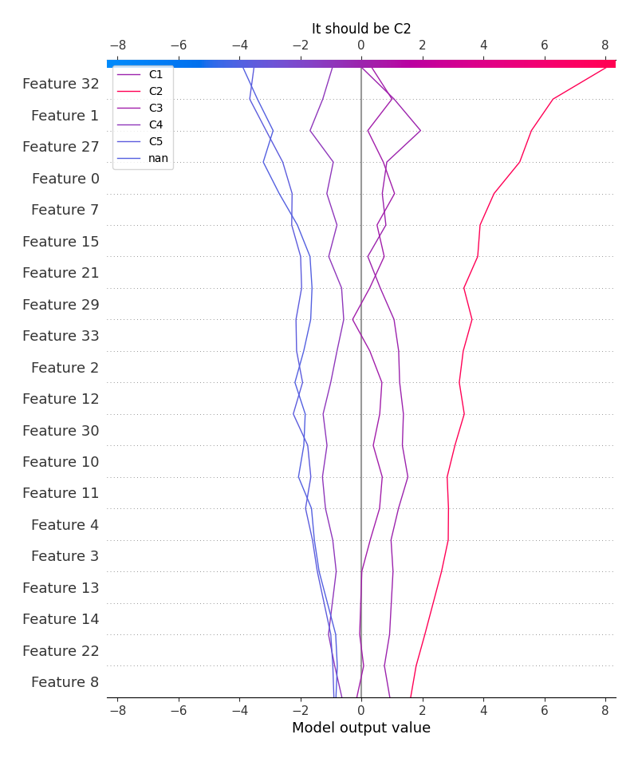

# Summary of 3_Linear

[<< Go back](../README.md)

## Logistic Regression (Linear)
- **num_class**: 6
- **explain_level**: 2

## Validation
 - **validation_type**: split
 - **train_ratio**: 0.75
 - **shuffle**: True
 - **stratify**: True

## Optimized metric
logloss

## Training time

14.0 seconds

### Metric details
|           |        C1 |        C2 |       C3 |       C4 |   C5 |      nan |   accuracy |   macro avg |   weighted avg |   logloss |
|:----------|----------:|----------:|---------:|---------:|-----:|---------:|-----------:|------------:|---------------:|----------:|
| precision |  0.825    |  0.848101 | 0.666667 | 0.833333 |    1 | 0.833333 |   0.838028 |    0.834406 |       0.83647  |  0.515071 |
| recall    |  0.767442 |  0.87013  | 0.571429 | 1        |    1 | 1        |   0.838028 |    0.868167 |       0.838028 |  0.515071 |
| f1-score  |  0.795181 |  0.858974 | 0.615385 | 0.909091 |    1 | 0.909091 |   0.838028 |    0.847954 |       0.836144 |  0.515071 |
| support   | 43        | 77        | 7        | 5        |    5 | 5        |   0.838028 |  142        |     142        |  0.515071 |

## Confusion matrix
|                |   Predicted as C1 |   Predicted as C2 |   Predicted as C3 |   Predicted as C4 |   Predicted as C5 |   Predicted as nan |
|:---------------|------------------:|------------------:|------------------:|------------------:|------------------:|-------------------:|
| Labeled as C1  |                33 |                10 |                 0 |                 0 |                 0 |                  0 |
| Labeled as C2  |                 7 |                67 |                 2 |                 0 |                 0 |                  1 |
| Labeled as C3  |                 0 |                 2 |                 4 |                 1 |                 0 |                  0 |
| Labeled as C4  |                 0 |                 0 |                 0 |                 5 |                 0 |                  0 |
| Labeled as C5  |                 0 |                 0 |                 0 |                 0 |                 5 |                  0 |
| Labeled as nan |                 0 |                 0 |                 0 |                 0 |                 0 |                  5 |

## Learning curves

## Coefficients

### Coefficients learner #1
|                       |          C1 |          C2 |         C3 |         C4 |          C5 |          nan |
|:----------------------|------------:|------------:|-----------:|-----------:|------------:|-------------:|
| intercept             |  1.89661    |  4.73311    |  0.313168  | -1.85347   | -2.43957    | -2.64985     |
| quartier              | -0.0690232  | -0.520492   |  0.280769  | -0.197011  |  0.175582   |  0.330176    |
| site                  | -0.582602   |  0.359342   |  0.494725  |  0.297185  | -0.293456   | -0.275193    |
| cote_voirie           | -0.057919   | -0.00634577 | -0.265585  |  0.170897  | -0.0815646  |  0.240517    |
| matricule_arbre       |  0.232195   | -0.152501   | -0.5127    |  0.115912  |  0.167134   |  0.14996     |
| genre_arbre           |  0.224655   | -0.155951   |  0.354036  | -0.218611  | -0.185036   | -0.0190935   |
| espece_arbre          | -0.127532   | -0.106983   | -0.275406  |  0.595506  |  0.330809   | -0.416395    |
| situation             |  0.347032   | -0.308958   |  0.339237  |  0.22492   | -0.31169    | -0.290541    |
| type_sol              |  0.334279   | -0.610421   | -1.08511   |  0.532669  | -0.163595   |  0.992174    |
| surf_permeable        |  0.749115   | -0.129183   | -0.689116  |  0.578937  | -0.118665   | -0.391089    |
| date_plantation       |  0.770019   | -0.242307   | -0.438837  |  0.182992  |  0.118448   | -0.390315    |
| classe_age            |  0.269413   | -0.131004   |  0.346802  | -0.231565  |  0.0344866  | -0.288132    |
| hauteur               | -0.422751   |  0.30564    | -0.130745  |  0.0744087 | -0.41052    |  0.583967    |
| classe_hauteur        |  0.197638   |  0.333466   | -0.0657908 | -0.335988  | -0.415089   |  0.285764    |
| diametre              | -0.00137278 | -0.249939   | -0.0491795 | -0.338085  |  0.277887   |  0.360689    |
| circonference (en cm) | -0.00137278 | -0.249939   | -0.0491795 | -0.338085  |  0.277887   |  0.360689    |
| classe_circonference  | -0.600672   |  0.0687286  |  0.274753  | -0.363808  |  0.246348   |  0.37465     |
| port_arbre            |  0.14454    | -0.00263849 |  0.568355  | -0.197853  | -0.125059   | -0.387345    |
| vigueur_pousse        |  0.778623   | -0.25484    |  0.201818  |  0.101664  | -0.493926   | -0.333338    |
| plaie_collet          |  0.602204   | -0.50791    | -0.195289  |  0.0165047 | -0.141935   |  0.226425    |
| rejet_tronc           |  0.305942   | -0.0402351  |  0.575186  | -0.0749786 | -0.33891    | -0.427004    |
| tuteurage_arbre       | -0.211183   |  1.05375    | -0.328805  | -0.393688  | -0.109677   | -0.0103937   |
| canisse_arbre         |  0.872519   | -0.590594   | -0.876563  |  0.68941   | -0.0736011  | -0.0211699   |
| plaie_tronc           |  0.309558   |  0.402056   | -0.382171  | -0.409827  |  0.0126527  |  0.0677316   |
| champignon_houppier   | -0.0317644  | -0.329102   | -0.0882225 |  0.511329  |  0.044008   | -0.106249    |
| fissure_houppier      |  0.00144877 |  0.282041   |  0.262076  | -0.303087  | -0.243152   |  0.000673708 |
| bois_mort_houppier    |  0.78076    | -0.0663505  | -0.449878  | -0.424198  | -0.00514947 |  0.164816    |
| plaie_houppier        |  0.509451   |  0.388228   | -0.352651  | -0.455034  | -0.185651   |  0.0956575   |
| esperance_maintien    | -1.80137    | -0.419574   |  0.886968  |  1.21003   |  0.810899   | -0.686958    |
| contrainte            | -0.0987119  | -0.16551    | -0.0705857 | -0.0418059 |  0.769036   | -0.392422    |
| date_diagnostic       | -0.73924    | -0.592679   |  0.805366  | -0.023401  |  0.372522   |  0.177432    |
| prescription_1        | -0.0438974  |  0.347947   |  0.427542  | -0.152804  | -0.836765   |  0.257978    |
| prescription_2        |  0.356812   |  0.198394   | -0.635027  |  0.0896253 |  0.0341129  | -0.0439177   |
| Long                  | -0.624515   |  0.89516    | -0.374953  |  0.206672  |  0.118174   | -0.220537    |
| Lat                   |  0.246282   | -0.176627   |  0.681353  | -0.326147  | -0.0619319  | -0.362929    |

## Permutation-based Importance

## SHAP Importance

## SHAP Dependence plots

### Dependence C1 (Fold 1)

### Dependence C2 (Fold 1)

### Dependence C3 (Fold 1)

### Dependence C4 (Fold 1)

### Dependence C5 (Fold 1)

### Dependence nan (Fold 1)

## SHAP Decision plots

### Worst decisions for selected sample 1 (Fold 1)

### Worst decisions for selected sample 2 (Fold 1)

### Worst decisions for selected sample 3 (Fold 1)

### Worst decisions for selected sample 4 (Fold 1)

### Best decisions for selected sample 1 (Fold 1)

### Best decisions for selected sample 2 (Fold 1)

### Best decisions for selected sample 3 (Fold 1)

### Best decisions for selected sample 4 (Fold 1)

[<< Go back](../README.md)
