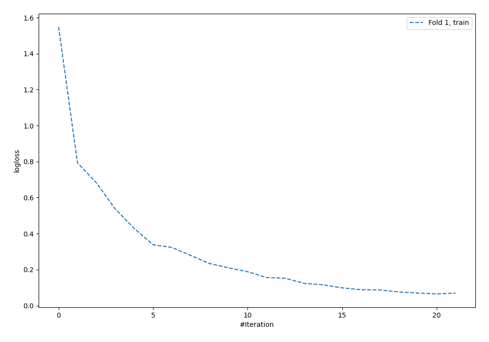

# Summary of 5_Default_NeuralNetwork

[<< Go back](../README.md)

## Neural Network
- **dense_1_size**: 32
- **dense_2_size**: 16
- **learning_rate**: 0.05
- **num_class**: 6
- **explain_level**: 2

## Validation
 - **validation_type**: split
 - **train_ratio**: 0.75
 - **shuffle**: True
 - **stratify**: True

## Optimized metric
logloss

## Training time

0.4 seconds

### Metric details
|           |        C1 |        C2 |       C3 |       C4 |   C5 |   nan |   accuracy |   macro avg |   weighted avg |   logloss |
|:----------|----------:|----------:|---------:|---------:|-----:|------:|-----------:|------------:|---------------:|----------:|
| precision |  0.880952 |  0.896104 | 0.428571 | 0.666667 |    1 |     1 |   0.866197 |    0.812049 |       0.867706 |  0.372544 |
| recall    |  0.860465 |  0.896104 | 0.428571 | 0.8      |    1 |     1 |   0.866197 |    0.830857 |       0.866197 |  0.372544 |
| f1-score  |  0.870588 |  0.896104 | 0.428571 | 0.727273 |    1 |     1 |   0.866197 |    0.820423 |       0.866702 |  0.372544 |
| support   | 43        | 77        | 7        | 5        |    5 |     5 |   0.866197 |  142        |     142        |  0.372544 |

## Confusion matrix
|                |   Predicted as C1 |   Predicted as C2 |   Predicted as C3 |   Predicted as C4 |   Predicted as C5 |   Predicted as nan |
|:---------------|------------------:|------------------:|------------------:|------------------:|------------------:|-------------------:|
| Labeled as C1  |                37 |                 5 |                 1 |                 0 |                 0 |                  0 |
| Labeled as C2  |                 5 |                69 |                 2 |                 1 |                 0 |                  0 |
| Labeled as C3  |                 0 |                 3 |                 3 |                 1 |                 0 |                  0 |
| Labeled as C4  |                 0 |                 0 |                 1 |                 4 |                 0 |                  0 |
| Labeled as C5  |                 0 |                 0 |                 0 |                 0 |                 5 |                  0 |
| Labeled as nan |                 0 |                 0 |                 0 |                 0 |                 0 |                  5 |

## Learning curves

## Permutation-based Importance

[<< Go back](../README.md)
