# Summary of 6_Default_RandomForest

[<< Go back](../README.md)

## Random Forest
- **criterion**: gini
- **max_features**: 0.9
- **min_samples_split**: 30
- **max_depth**: 4
- **num_class**: 6
- **explain_level**: 2

## Validation
 - **validation_type**: split
 - **train_ratio**: 0.75
 - **shuffle**: True
 - **stratify**: True

## Optimized metric
logloss

## Training time

15.7 seconds

### Metric details
|           |        C1 |        C2 |       C3 |       C4 |       C5 |      nan |   accuracy |   macro avg |   weighted avg |   logloss |
|:----------|----------:|----------:|---------:|---------:|---------:|---------:|-----------:|------------:|---------------:|----------:|
| precision |  0.888889 |  0.818182 | 0.666667 | 0.666667 | 0.625    | 0.75     |   0.816901 |    0.735901 |       0.817586 |  0.448182 |
| recall    |  0.744186 |  0.935065 | 0.285714 | 0.4      | 1        | 0.6      |   0.816901 |    0.660828 |       0.816901 |  0.448182 |
| f1-score  |  0.810127 |  0.872727 | 0.4      | 0.5      | 0.769231 | 0.666667 |   0.816901 |    0.669792 |       0.806443 |  0.448182 |
| support   | 43        | 77        | 7        | 5        | 5        | 5        |   0.816901 |  142        |     142        |  0.448182 |

## Confusion matrix
|                |   Predicted as C1 |   Predicted as C2 |   Predicted as C3 |   Predicted as C4 |   Predicted as C5 |   Predicted as nan |
|:---------------|------------------:|------------------:|------------------:|------------------:|------------------:|-------------------:|
| Labeled as C1  |                32 |                11 |                 0 |                 0 |                 0 |                  0 |
| Labeled as C2  |                 4 |                72 |                 0 |                 0 |                 0 |                  1 |
| Labeled as C3  |                 0 |                 3 |                 2 |                 1 |                 1 |                  0 |
| Labeled as C4  |                 0 |                 0 |                 1 |                 2 |                 2 |                  0 |
| Labeled as C5  |                 0 |                 0 |                 0 |                 0 |                 5 |                  0 |
| Labeled as nan |                 0 |                 2 |                 0 |                 0 |                 0 |                  3 |

## Learning curves
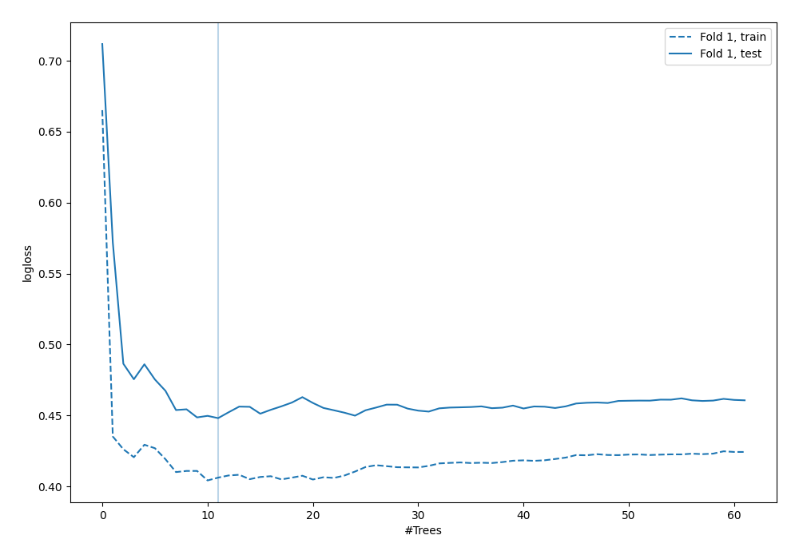

## Permutation-based Importance
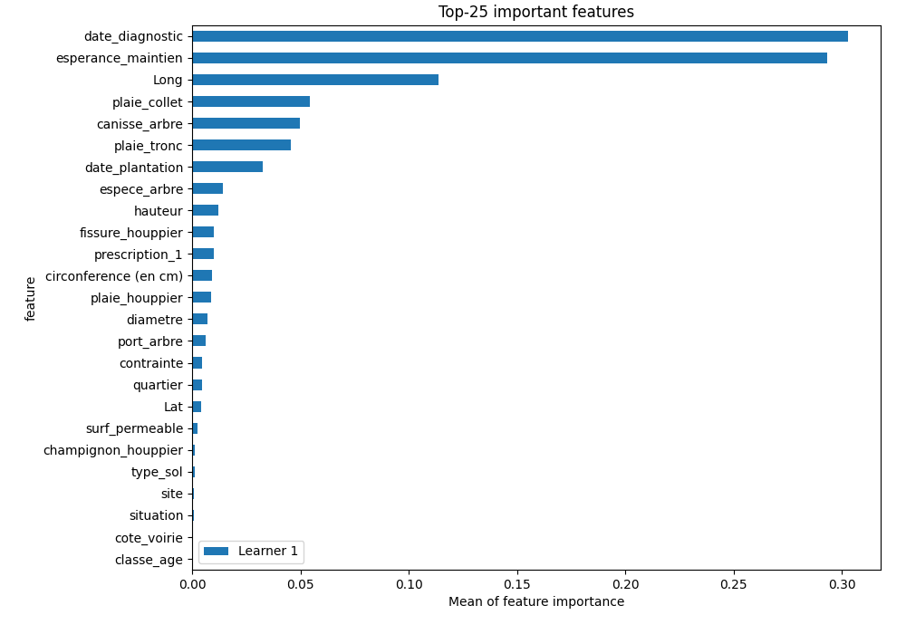

## SHAP Importance
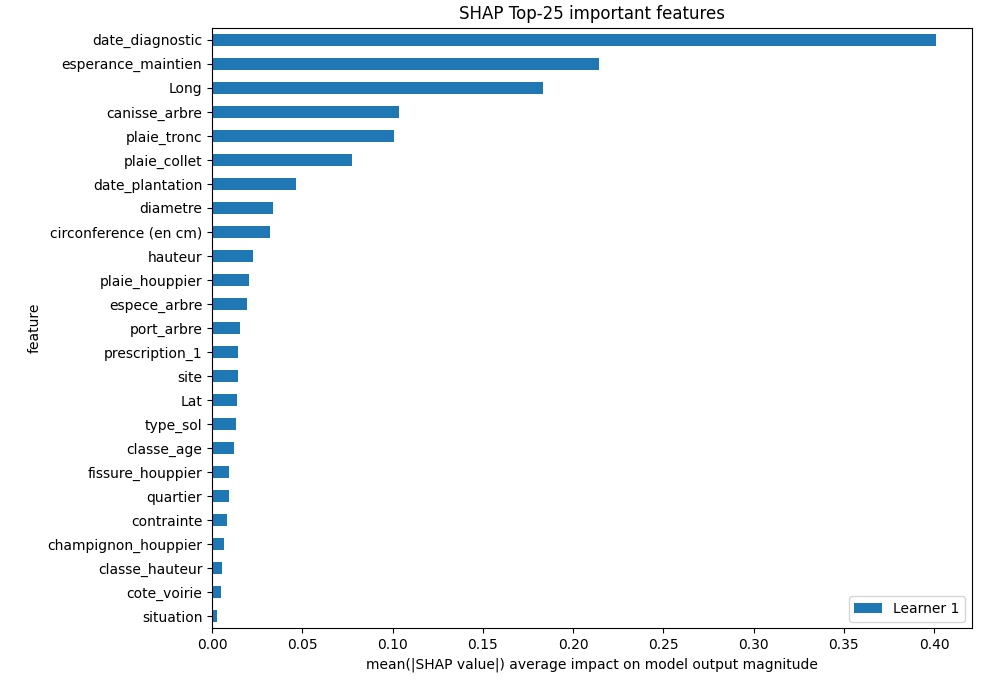

## SHAP Dependence plots

### Dependence C1 (Fold 1)
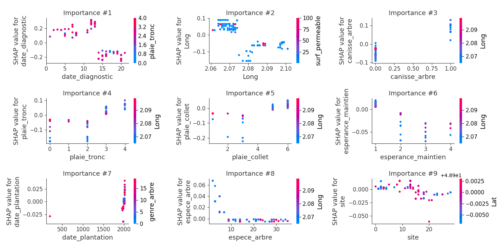
### Dependence C2 (Fold 1)
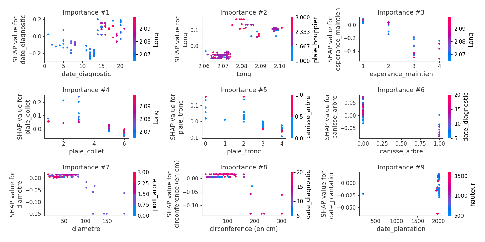
### Dependence C3 (Fold 1)
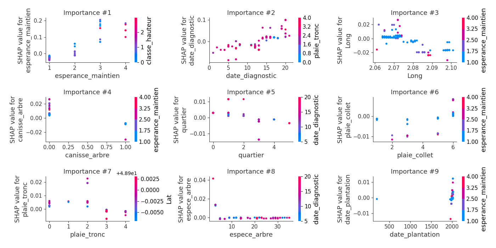
### Dependence C4 (Fold 1)
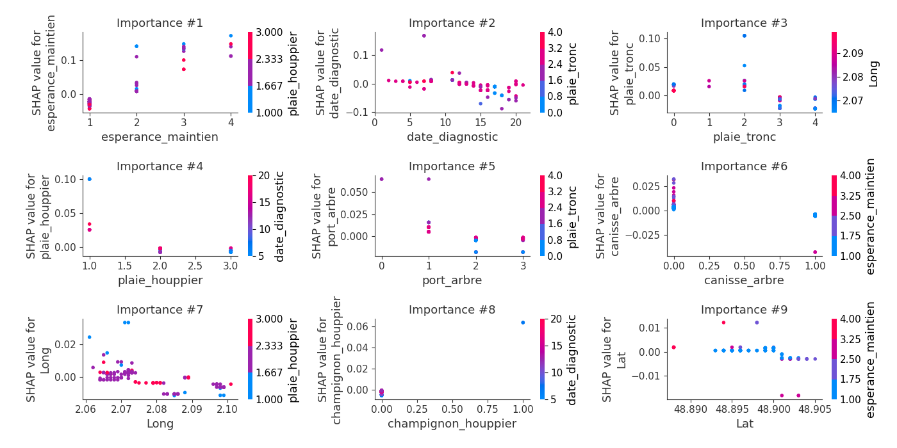
### Dependence C5 (Fold 1)
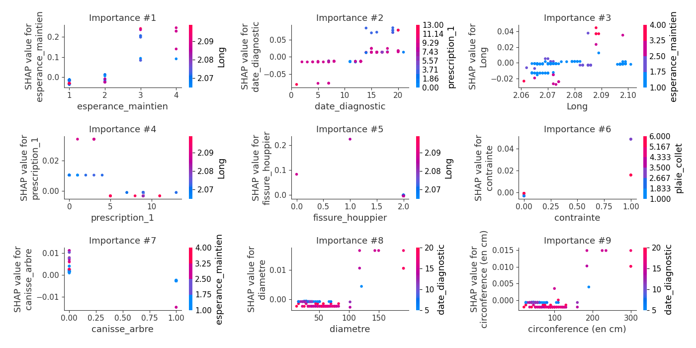
### Dependence nan (Fold 1)
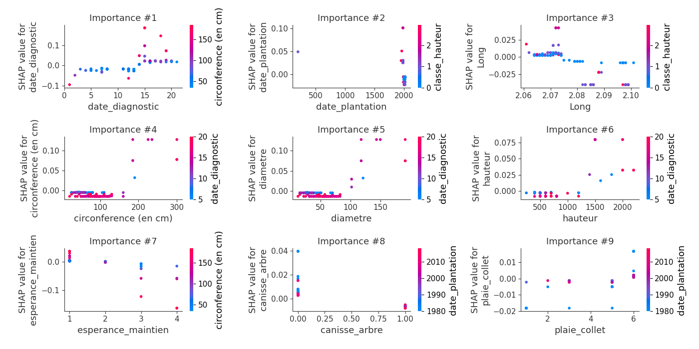

## SHAP Decision plots

### Worst decisions for selected sample 1 (Fold 1)

### Worst decisions for selected sample 2 (Fold 1)
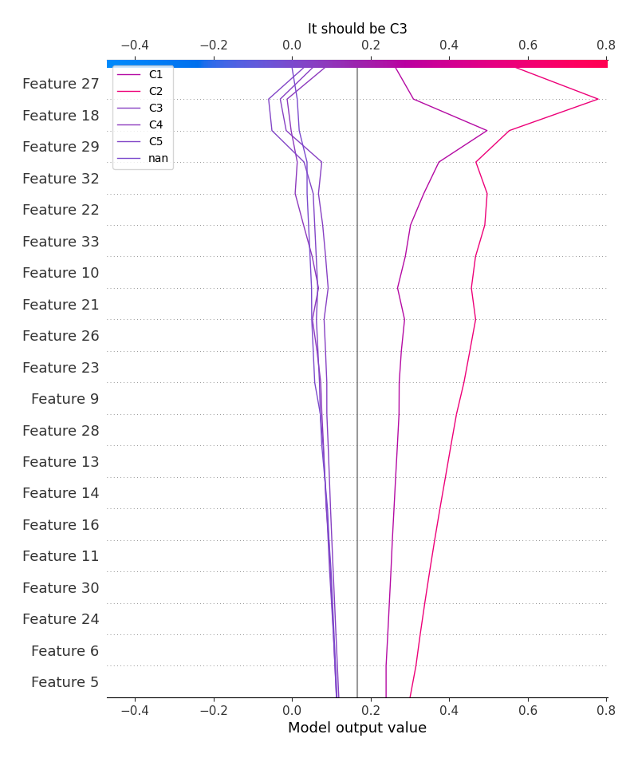
### Worst decisions for selected sample 3 (Fold 1)
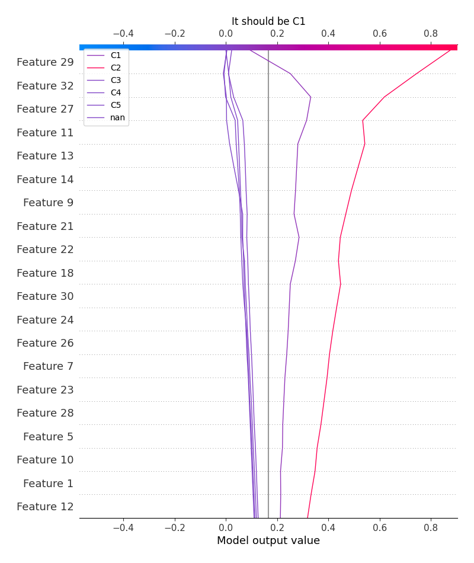
### Worst decisions for selected sample 4 (Fold 1)
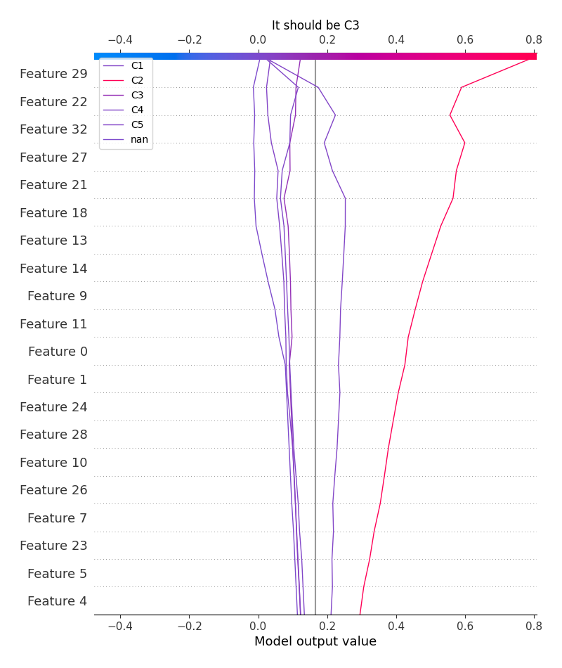
### Best decisions for selected sample 1 (Fold 1)
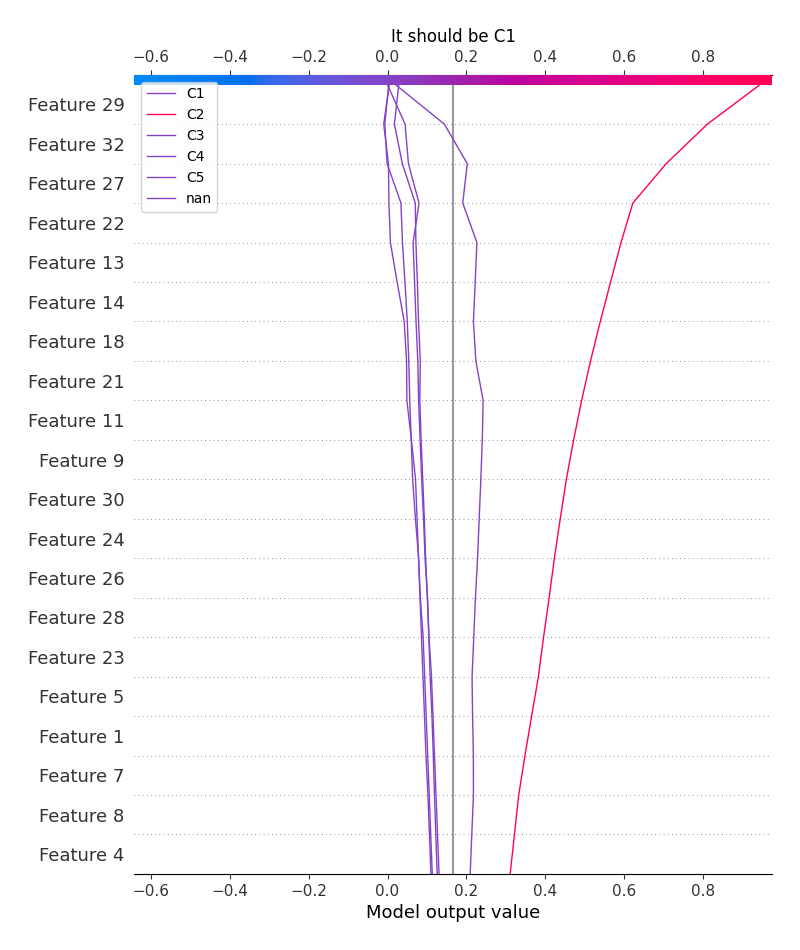
### Best decisions for selected sample 2 (Fold 1)
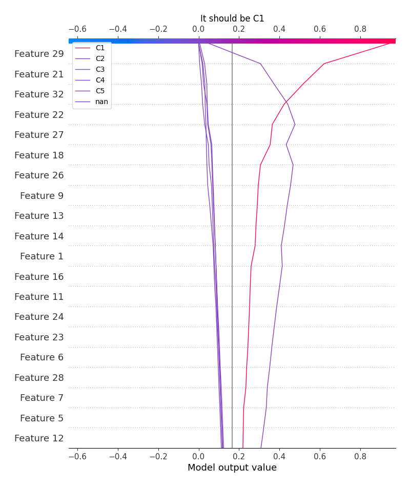
### Best decisions for selected sample 3 (Fold 1)

### Best decisions for selected sample 4 (Fold 1)

[<< Go back](../README.md)
