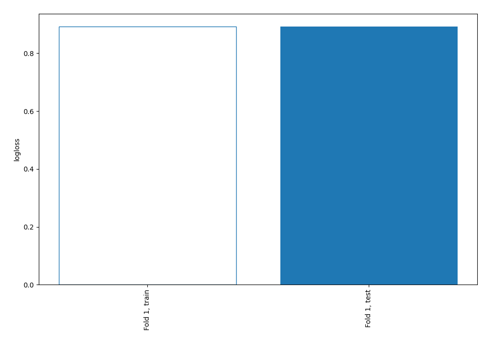

# Summary of 2_DecisionTree

[<< Go back](../README.md)

## Decision Tree
- **criterion**: entropy
- **max_depth**: 4
- **num_class**: 4
- **explain_level**: 0

## Validation
 - **validation_type**: split
 - **train_ratio**: 0.75
 - **shuffle**: True
 - **stratify**: True

## Optimized metric
logloss

## Training time

2.3 seconds

### Metric details
|           |            1 |    2 |           3 |            4 |   accuracy |    macro avg |   weighted avg |   logloss |
|:----------|-------------:|-----:|------------:|-------------:|-----------:|-------------:|---------------:|----------:|
| precision |     0.613517 |    0 |    0.432335 |     0.610634 |   0.597846 |     0.414122 |       0.575007 |  0.892098 |
| recall    |     0.821178 |    0 |    0.264205 |     0.488631 |   0.597846 |     0.393503 |       0.597846 |  0.892098 |
| f1-score  |     0.702319 |    0 |    0.327978 |     0.542862 |   0.597846 |     0.39329  |       0.574283 |  0.892098 |
| support   | 21390        | 1024 | 6336        | 18779        |   0.597846 | 47529        |   47529        |  0.892098 |

## Confusion matrix
|              |   Predicted as 1 |   Predicted as 2 |   Predicted as 3 |   Predicted as 4 |
|:-------------|-----------------:|-----------------:|-----------------:|-----------------:|
| Labeled as 1 |            17565 |                0 |              417 |             3408 |
| Labeled as 2 |              444 |                0 |              293 |              287 |
| Labeled as 3 |             2506 |                0 |             1674 |             2156 |
| Labeled as 4 |             8115 |                0 |             1488 |             9176 |

## Learning curves

[<< Go back](../README.md)
