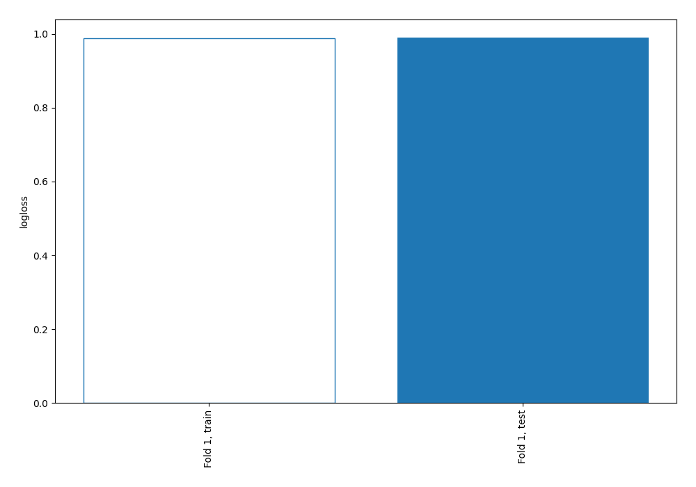

# Summary of 3_Linear

[<< Go back](../README.md)

## Logistic Regression (Linear)
- **num_class**: 4
- **explain_level**: 0

## Validation
 - **validation_type**: split
 - **train_ratio**: 0.75
 - **shuffle**: True
 - **stratify**: True

## Optimized metric
logloss

## Training time

19.4 seconds

### Metric details
|           |            1 |    2 |            3 |            4 |   accuracy |    macro avg |   weighted avg |   logloss |
|:----------|-------------:|-----:|-------------:|-------------:|-----------:|-------------:|---------------:|----------:|
| precision |     0.552323 |    0 |    0.407182  |     0.517663 |   0.534663 |     0.369292 |       0.50738  |  0.990101 |
| recall    |     0.724217 |    0 |    0.0948548 |     0.496299 |   0.534663 |     0.328843 |       0.534663 |  0.990101 |
| f1-score  |     0.626697 |    0 |    0.153866  |     0.506756 |   0.534663 |     0.32183  |       0.502773 |  0.990101 |
| support   | 21390        | 1024 | 6336         | 18779        |   0.534663 | 47529        |   47529        |  0.990101 |

## Confusion matrix
|              |   Predicted as 1 |   Predicted as 2 |   Predicted as 3 |   Predicted as 4 |
|:-------------|-----------------:|-----------------:|-----------------:|-----------------:|
| Labeled as 1 |            15491 |                1 |              272 |             5626 |
| Labeled as 2 |              493 |                0 |              172 |              359 |
| Labeled as 3 |             3036 |                0 |              601 |             2699 |
| Labeled as 4 |             9027 |                1 |              431 |             9320 |

## Learning curves

[<< Go back](../README.md)
