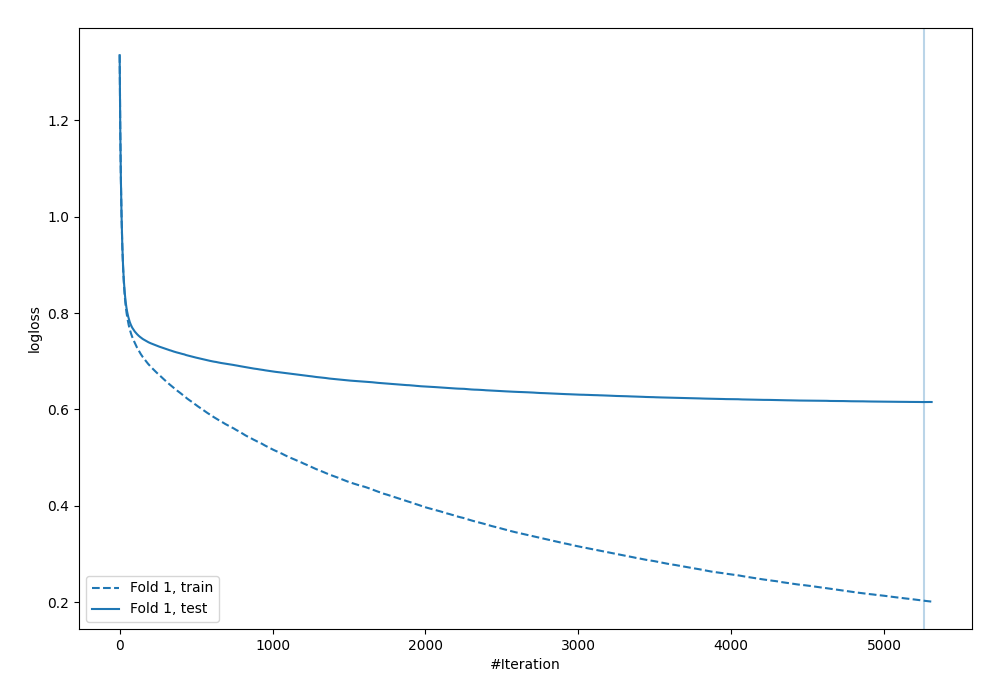

# Summary of 4_Default_Xgboost

[<< Go back](../README.md)

## Extreme Gradient Boosting (Xgboost)
- **objective**: multi:softprob
- **eval_metric**: mlogloss
- **eta**: 0.075
- **max_depth**: 6
- **min_child_weight**: 1
- **subsample**: 1.0
- **colsample_bytree**: 1.0
- **num_class**: 4
- **explain_level**: 0

## Validation
 - **validation_type**: split
 - **train_ratio**: 0.75
 - **shuffle**: True
 - **stratify**: True

## Optimized metric
logloss

## Training time

450.3 seconds

### Metric details
|           |            1 |           2 |           3 |            4 |   accuracy |    macro avg |   weighted avg |   logloss |
|:----------|-------------:|------------:|------------:|-------------:|-----------:|-------------:|---------------:|----------:|
| precision |     0.809543 |    0.707635 |    0.65814  |     0.751014 |   0.767573 |     0.731583 |       0.764039 |  0.615246 |
| recall    |     0.852688 |    0.371094 |    0.568497 |     0.759412 |   0.767573 |     0.637923 |       0.767573 |  0.615246 |
| f1-score  |     0.830556 |    0.486867 |    0.610043 |     0.75519  |   0.767573 |     0.670664 |       0.763977 |  0.615246 |
| support   | 21390        | 1024        | 6336        | 18779        |   0.767573 | 47529        |   47529        |  0.615246 |

## Confusion matrix
|              |   Predicted as 1 |   Predicted as 2 |   Predicted as 3 |   Predicted as 4 |
|:-------------|-----------------:|-----------------:|-----------------:|-----------------:|
| Labeled as 1 |            18239 |               35 |              447 |             2669 |
| Labeled as 2 |               98 |              380 |              338 |              208 |
| Labeled as 3 |              789 |               94 |             3602 |             1851 |
| Labeled as 4 |             3404 |               28 |             1086 |            14261 |

## Learning curves

[<< Go back](../README.md)
