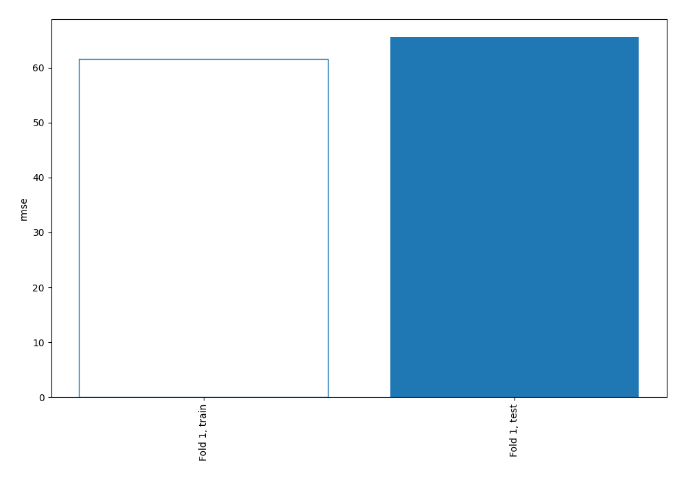

# Summary of 1_Baseline

[<< Go back](../README.md)

## Baseline Regressor (Baseline)
- **explain_level**: 2

## Validation
 - **validation_type**: split
 - **train_ratio**: 0.75
 - **shuffle**: True

## Optimized metric
rmse

## Training time

0.1 seconds

### Metric details:
| Metric   |         Score |
|:---------|--------------:|
| MAE      |   37.8211     |
| MSE      | 4300.86       |
| RMSE     |   65.581      |
| R2       |   -0.00118177 |

## Learning curves

[<< Go back](../README.md)
