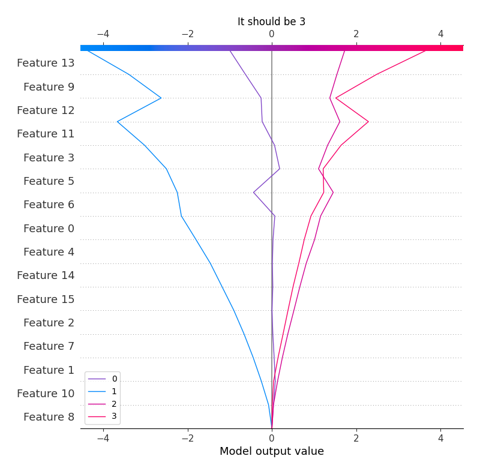

# Summary of 3_Linear

[<< Go back](../README.md)

## Logistic Regression (Linear)
- **num_class**: 4
- **explain_level**: 2

## Validation
 - **validation_type**: split
 - **train_ratio**: 0.75
 - **shuffle**: True
 - **stratify**: True

## Optimized metric
logloss

## Training time

7.8 seconds

### Metric details
|           |   0 |   1 |           2 |           3 |   accuracy |   macro avg |   weighted avg |   logloss |
|:----------|----:|----:|------------:|------------:|-----------:|------------:|---------------:|----------:|
| precision |   0 |   0 |    0.618321 |    0.630389 |   0.623658 |    0.312177 |       0.589272 |  0.801042 |
| recall    |   0 |   0 |    0.694631 |    0.622571 |   0.623658 |    0.329301 |       0.623658 |  0.801042 |
| f1-score  |   0 |   0 |    0.654258 |    0.626456 |   0.623658 |    0.320179 |       0.605353 |  0.801042 |
| support   | 282 |  19 | 2682        | 2419        |   0.623658 | 5402        |    5402        |  0.801042 |

## Confusion matrix
|              |   Predicted as 0 |   Predicted as 1 |   Predicted as 2 |   Predicted as 3 |
|:-------------|-----------------:|-----------------:|-----------------:|-----------------:|
| Labeled as 0 |                0 |                0 |              222 |               60 |
| Labeled as 1 |                0 |                0 |               15 |                4 |
| Labeled as 2 |                0 |                0 |             1863 |              819 |
| Labeled as 3 |                0 |                0 |              913 |             1506 |

## Learning curves

## Coefficients

### Coefficients learner #1
|                         |           0 |          1 |           2 |            3 |
|:------------------------|------------:|-----------:|------------:|-------------:|
| intercept               | -0.446662   | -3.34533   |  2.02469    |  1.7673      |
| filtre                  | -0.0888187  |  0.154754  | -0.0178255  | -0.0481096   |
| latitude                | -0.0141252  | -0.0735754 |  0.0444655  |  0.043235    |
| longitude               |  0.0300214  | -0.0624727 |  0.0400118  | -0.00756055  |
| has_agrement            | -0.134032   | -0.441637  |  0.126474   |  0.449195    |
| dept                    | -0.0291757  |  0.0783951 | -0.0435639  | -0.00565552  |
| year                    |  0.254794   | -0.0158806 | -0.186856   | -0.0520575   |
| month                   |  0.282456   | -0.071908  | -0.101168   | -0.10938     |
| weekday                 | -0.0993311  |  0.106422  | -0.00852444 |  0.00143376  |
| count_controls_dept     | -0.175346   | -0.359413  |  0.243545   |  0.291214    |
| score_controls_dept     | -0.232151   | -0.375072  |  0.0273233  |  0.5799      |
| count_controls_filtre   |  0.0762235  |  0.049562  | -0.0335539  | -0.0922316   |
| score_controls_filtre   | -0.261644   | -0.427335  |  0.161154   |  0.527825    |
| count_controls_activite | -0.00271059 | -0.75941   |  0.22235    |  0.539771    |
| score_controls_activite | -0.136814   | -0.30772   |  0.0218038  |  0.42273     |
| count_controls_wday     | -0.0903018  |  0.269135  | -0.102005   | -0.0768278   |
| score_controls_wday     | -0.0495039  |  0.0616961 | -0.0118467  | -0.000345442 |

## Permutation-based Importance

## SHAP Importance

## SHAP Dependence plots

### Dependence 0 (Fold 1)

### Dependence 1 (Fold 1)

### Dependence 2 (Fold 1)

### Dependence 3 (Fold 1)

## SHAP Decision plots

### Worst decisions for selected sample 1 (Fold 1)

### Worst decisions for selected sample 2 (Fold 1)

### Worst decisions for selected sample 3 (Fold 1)

### Worst decisions for selected sample 4 (Fold 1)

### Best decisions for selected sample 1 (Fold 1)

### Best decisions for selected sample 2 (Fold 1)

### Best decisions for selected sample 3 (Fold 1)

### Best decisions for selected sample 4 (Fold 1)

[<< Go back](../README.md)
