# Summary of 6_Default_RandomForest

[<< Go back](../README.md)

## Random Forest
- **criterion**: gini
- **max_features**: 0.9
- **min_samples_split**: 30
- **max_depth**: 4
- **num_class**: 4
- **explain_level**: 2

## Validation
 - **validation_type**: split
 - **train_ratio**: 0.75
 - **shuffle**: True
 - **stratify**: True

## Optimized metric
logloss

## Training time

9.9 seconds

### Metric details
|           |   0 |   1 |           2 |           3 |   accuracy |   macro avg |   weighted avg |   logloss |
|:----------|----:|----:|------------:|------------:|-----------:|------------:|---------------:|----------:|
| precision |   0 |   0 |    0.617685 |    0.639295 |    0.62699 |    0.314245 |       0.592945 |   0.79978 |
| recall    |   0 |   0 |    0.708427 |    0.614717 |    0.62699 |    0.330786 |       0.62699  |   0.79978 |
| f1-score  |   0 |   0 |    0.659951 |    0.626765 |    0.62699 |    0.321679 |       0.608318 |   0.79978 |
| support   | 282 |  19 | 2682        | 2419        |    0.62699 | 5402        |    5402        |   0.79978 |

## Confusion matrix
|              |   Predicted as 0 |   Predicted as 1 |   Predicted as 2 |   Predicted as 3 |
|:-------------|-----------------:|-----------------:|-----------------:|-----------------:|
| Labeled as 0 |                0 |                0 |              229 |               53 |
| Labeled as 1 |                0 |                0 |               15 |                4 |
| Labeled as 2 |                0 |                0 |             1900 |              782 |
| Labeled as 3 |                0 |                0 |              932 |             1487 |

## Learning curves
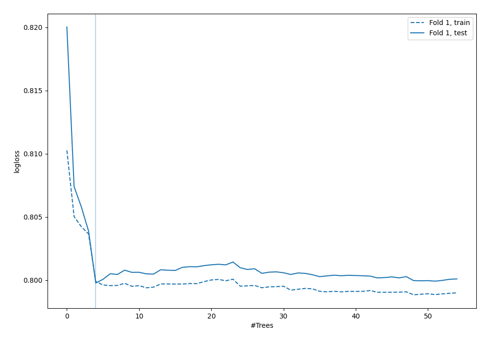

## Permutation-based Importance
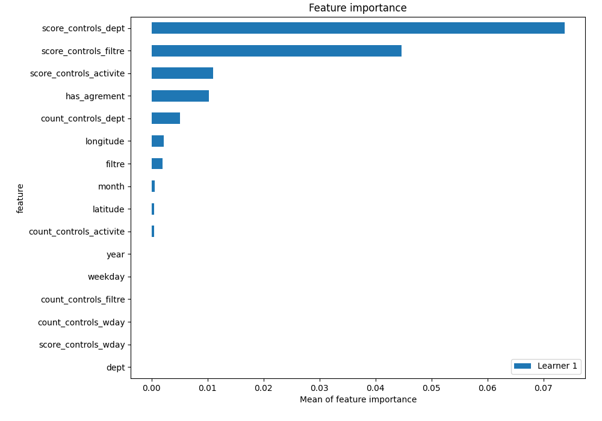

## SHAP Importance
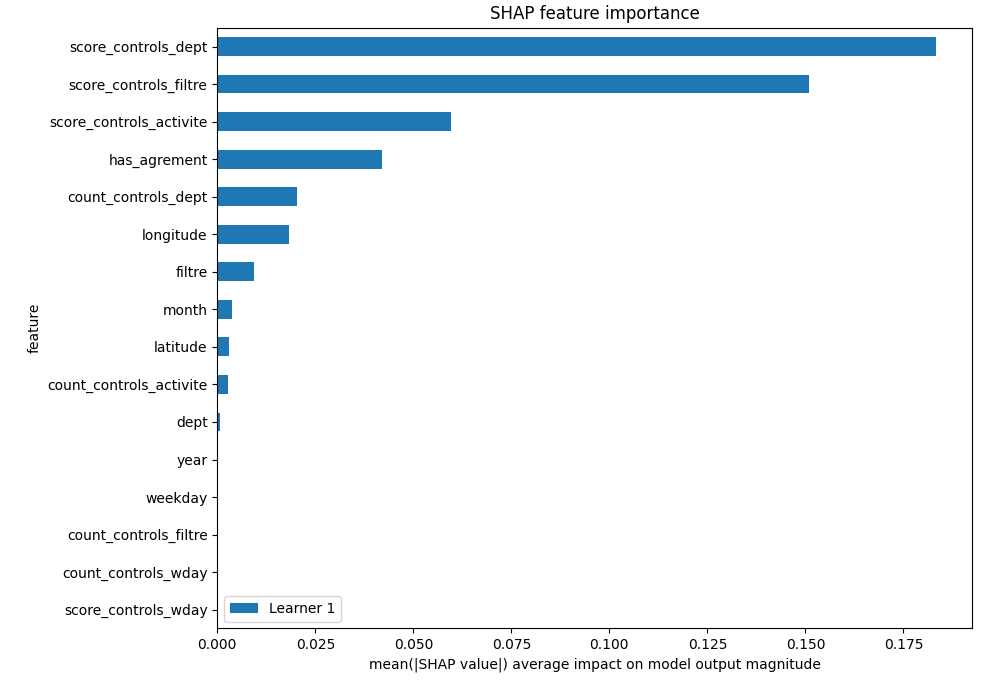

## SHAP Dependence plots

### Dependence 0 (Fold 1)
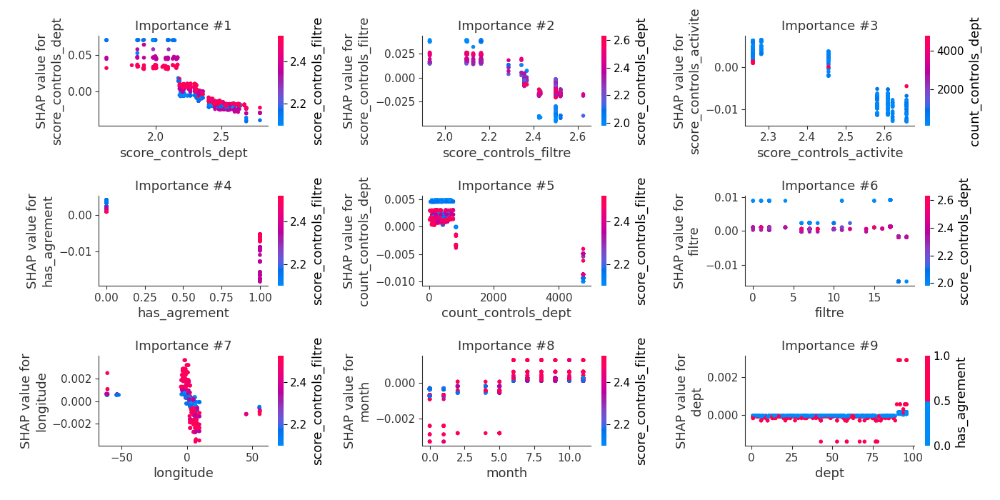
### Dependence 1 (Fold 1)
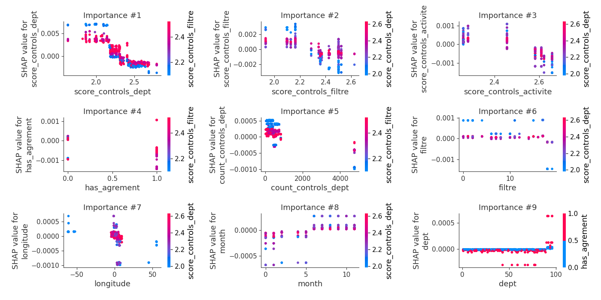
### Dependence 2 (Fold 1)
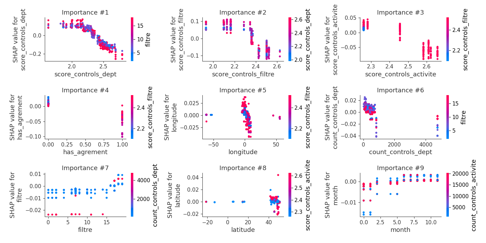
### Dependence 3 (Fold 1)
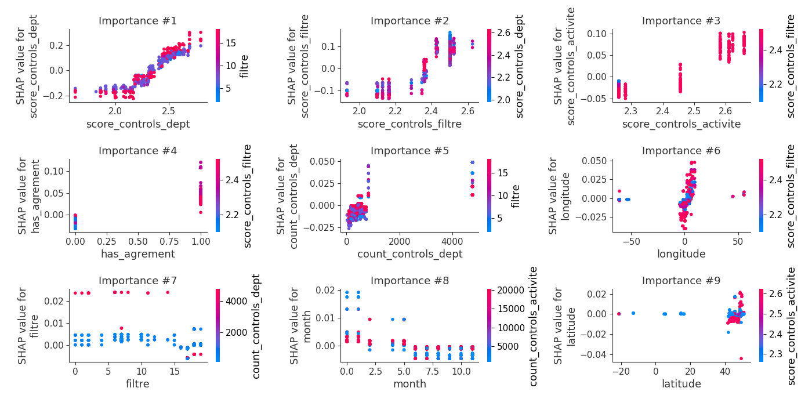

## SHAP Decision plots

### Worst decisions for selected sample 1 (Fold 1)
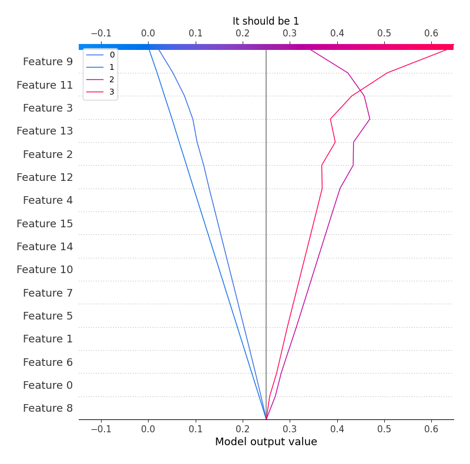
### Worst decisions for selected sample 2 (Fold 1)
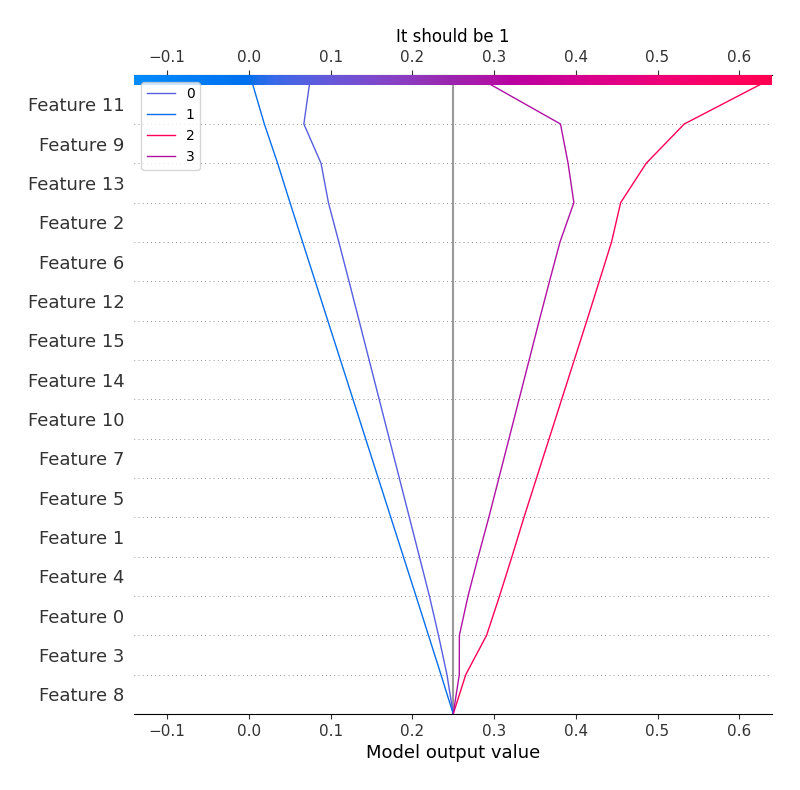
### Worst decisions for selected sample 3 (Fold 1)
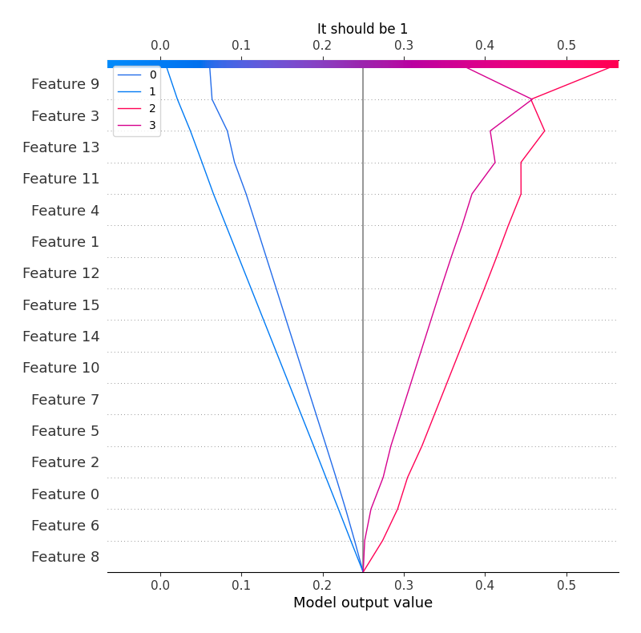
### Worst decisions for selected sample 4 (Fold 1)

### Best decisions for selected sample 1 (Fold 1)

### Best decisions for selected sample 2 (Fold 1)
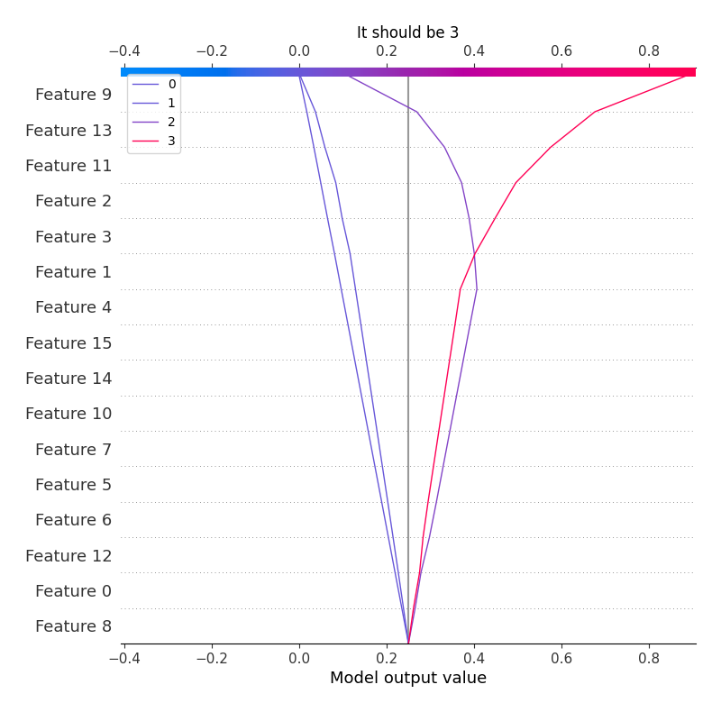
### Best decisions for selected sample 3 (Fold 1)
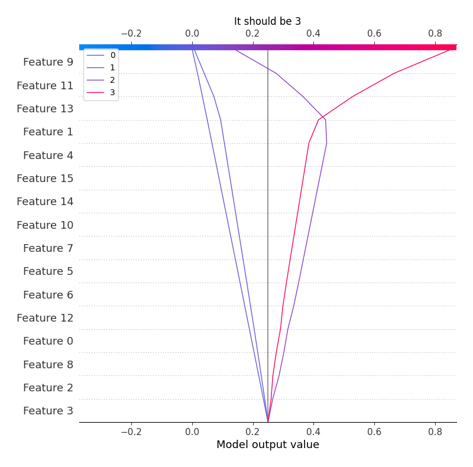
### Best decisions for selected sample 4 (Fold 1)
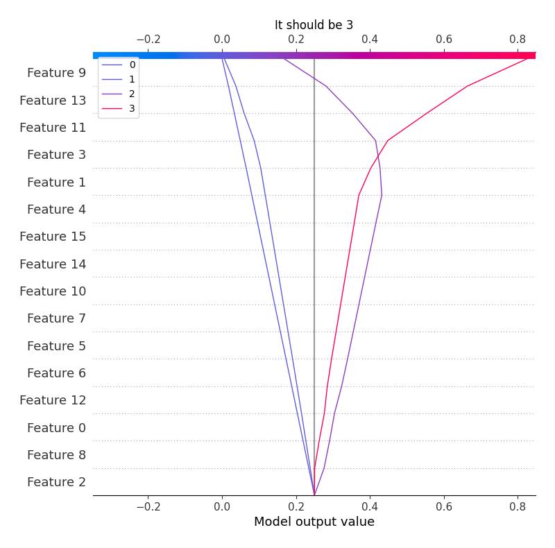

[<< Go back](../README.md)
