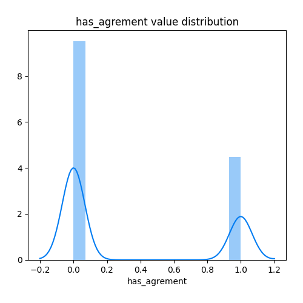
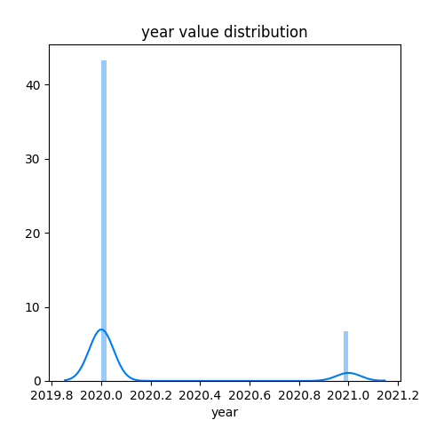

# Exploratory Data Analysis

[<< Go back](../README.md)
## Feature : target
- **Feature type** : discrete
- **Missing** : 0.0%
- **Unique** : 4
- **Count** :21606.0
- **Mean** :2.3399518652226234
- **Std** :0.7380319830812934
- **Min** :0.0
- **25%th Percentile** : 2.0
- **50%th Percentile** : 2.0
- **75%th Percentile** : 3.0
- **Max** :3.0

## Feature : filtre
- **Feature type** : discrete
- **Missing** : 0.0%
- **Unique** : 20
- **Count** :21606.0
- **Mean** :11.784087753401833
- **Std** :5.819898868184911
- **Min** :0.0
- **25%th Percentile** : 7.0
- **50%th Percentile** : 11.0
- **75%th Percentile** : 17.0
- **Max** :19.0

## Feature : latitude
- **Feature type** : continous
- **Missing** : 2.4715356845320744%
- **Unique** : 18216
- **Count** :21072.0
- **Mean** :45.94928890942482
- **Std** :7.760093289264238
- **Min** :-21.383353
- **25%th Percentile** : 45.133563
- **50%th Percentile** : 47.6894995
- **75%th Percentile** : 48.86117125
- **Max** :51.078994

## Feature : longitude
- **Feature type** : continous
- **Missing** : 2.4715356845320744%
- **Unique** : 18253
- **Count** :21072.0
- **Mean** :1.801410175920653
- **Std** :9.391063240668975
- **Min** :-63.085432
- **25%th Percentile** : 0.6367407500000001
- **50%th Percentile** : 2.3494669999999998
- **75%th Percentile** : 4.157437
- **Max** :55.791227

## Feature : has_agrement
- **Feature type** : discrete
- **Missing** : 0.0%
- **Unique** : 2
- **Count** :21606.0
- **Mean** :0.32037397019346475
- **Std** :0.4666310827447254
- **Min** :0.0
- **25%th Percentile** : 0.0
- **50%th Percentile** : 0.0
- **75%th Percentile** : 1.0
- **Max** :1.0

## Feature : dept
- **Feature type** : discrete
- **Missing** : 0.0%
- **Unique** : 97
- **Count** :21606.0
- **Mean** :55.441729149310376
- **Std** :27.37644532647023
- **Min** :0.0
- **25%th Percentile** : 32.0
- **50%th Percentile** : 62.0
- **75%th Percentile** : 75.0
- **Max** :96.0

## Feature : year
- **Feature type** : discrete
- **Missing** : 0.0%
- **Unique** : 2
- **Count** :21606.0
- **Mean** :2020.1345459594556
- **Std** :0.3412458555027643
- **Min** :2020.0
- **25%th Percentile** : 2020.0
- **50%th Percentile** : 2020.0
- **75%th Percentile** : 2020.0
- **Max** :2021.0

## Feature : month
- **Feature type** : discrete
- **Missing** : 0.0%
- **Unique** : 12
- **Count** :21606.0
- **Mean** :6.604091456077016
- **Std** :3.345446312610856
- **Min** :0.0
- **25%th Percentile** : 5.0
- **50%th Percentile** : 7.0
- **75%th Percentile** : 9.0
- **Max** :11.0

## Feature : weekday
- **Feature type** : discrete
- **Missing** : 0.0%
- **Unique** : 7
- **Count** :21606.0
- **Mean** :1.9918541145977968
- **Std** :1.2884146564554377
- **Min** :0.0
- **25%th Percentile** : 1.0
- **50%th Percentile** : 2.0
- **75%th Percentile** : 3.0
- **Max** :6.0

## Feature : count_controls_dept
- **Feature type** : discrete
- **Missing** : 0.0%
- **Unique** : 92
- **Count** :21606.0
- **Mean** :1083.8292141071925
- **Std** :1641.8635605283664
- **Min** :17.0
- **25%th Percentile** : 232.0
- **50%th Percentile** : 372.0
- **75%th Percentile** : 637.0
- **Max** :4760.0

## Feature : score_controls_dept
- **Feature type** : continous
- **Missing** : 0.0%
- **Unique** : 97
- **Count** :21606.0
- **Mean** :2.336828435431701
- **Std** :0.19963573851113006
- **Min** :1.626865671641791
- **25%th Percentile** : 2.264367816091954
- **50%th Percentile** : 2.3283613445378153
- **75%th Percentile** : 2.4829545454545454
- **Max** :2.7955801104972378

## Feature : count_controls_filtre
- **Feature type** : discrete
- **Missing** : 0.0%
- **Unique** : 20
- **Count** :21606.0
- **Mean** :6143.249745441081
- **Std** :3101.004863738982
- **Min** :12.0
- **25%th Percentile** : 5613.0
- **50%th Percentile** : 7540.0
- **75%th Percentile** : 9095.0
- **Max** :9095.0

## Feature : score_controls_filtre
- **Feature type** : continous
- **Missing** : 0.0%
- **Unique** : 20
- **Count** :21606.0
- **Mean** :2.336000632870056
- **Std** :0.16575757073729716
- **Min** :1.7692307692307692
- **25%th Percentile** : 2.163660477453581
- **50%th Percentile** : 2.359166221272047
- **75%th Percentile** : 2.500934579439252
- **Max** :2.625

## Feature : count_controls_activite
- **Feature type** : discrete
- **Missing** : 0.0%
- **Unique** : 7
- **Count** :21606.0
- **Mean** :14776.863232435435
- **Std** :8456.663623895276
- **Min** :405.0
- **25%th Percentile** : 2508.0
- **50%th Percentile** : 20257.0
- **75%th Percentile** : 20257.0
- **Max** :20257.0

## Feature : score_controls_activite
- **Feature type** : continous
- **Missing** : 0.0%
- **Unique** : 7
- **Count** :21606.0
- **Mean** :2.335601108939521
- **Std** :0.13315211521442855
- **Min** :2.2606012736338057
- **25%th Percentile** : 2.2606012736338057
- **50%th Percentile** : 2.2606012736338057
- **75%th Percentile** : 2.456140350877193
- **Max** :2.658333333333333

## Feature : count_controls_wday
- **Feature type** : discrete
- **Missing** : 0.0%
- **Unique** : 7
- **Count** :21606.0
- **Mean** :6170.645931685643
- **Std** :1602.2933419299443
- **Min** :38.0
- **25%th Percentile** : 3941.0
- **50%th Percentile** : 7271.0
- **75%th Percentile** : 7781.0
- **Max** :7781.0

## Feature : score_controls_wday
- **Feature type** : continous
- **Missing** : 0.0%
- **Unique** : 7
- **Count** :21606.0
- **Mean** :2.3360465320500445
- **Std** :0.015112262409993957
- **Min** :2.1627906976744184
- **25%th Percentile** : 2.3314534734683416
- **50%th Percentile** : 2.332605063616502
- **75%th Percentile** : 2.3424563333791775
- **Max** :2.4210526315789473

[<< Go back](../README.md)
