# Summary of 2_DecisionTree

[<< Go back](../README.md)

## Decision Tree
- **criterion**: entropy
- **max_depth**: 4
- **num_class**: 5
- **explain_level**: 2

## Validation
 - **validation_type**: split
 - **train_ratio**: 0.75
 - **shuffle**: True
 - **stratify**: True

## Optimized metric
logloss

## Training time

15.6 seconds

### Metric details
|           |         0 |         1 |         2 |         3 |         4 |   accuracy |   macro avg |   weighted avg |   logloss |
|:----------|----------:|----------:|----------:|----------:|----------:|-----------:|------------:|---------------:|----------:|
| precision |  0.923077 |  0.375    |  1        |  0.392857 |  0.5      |       0.56 |    0.638187 |       0.639953 |  0.919744 |
| recall    |  0.765957 |  0.54     |  0.413793 |  0.323529 |  0.8      |       0.56 |    0.568656 |       0.56     |  0.919744 |
| f1-score  |  0.837209 |  0.442623 |  0.585366 |  0.354839 |  0.615385 |       0.56 |    0.567084 |       0.570005 |  0.919744 |
| support   | 47        | 50        | 29        | 34        | 15        |       0.56 |  175        |     175        |  0.919744 |

## Confusion matrix
|              |   Predicted as 0 |   Predicted as 1 |   Predicted as 2 |   Predicted as 3 |   Predicted as 4 |
|:-------------|-----------------:|-----------------:|-----------------:|-----------------:|-----------------:|
| Labeled as 0 |               36 |                5 |                0 |                6 |                0 |
| Labeled as 1 |                0 |               27 |                0 |               11 |               12 |
| Labeled as 2 |                1 |               16 |               12 |                0 |                0 |
| Labeled as 3 |                1 |               22 |                0 |               11 |                0 |
| Labeled as 4 |                1 |                2 |                0 |                0 |               12 |

## Learning curves
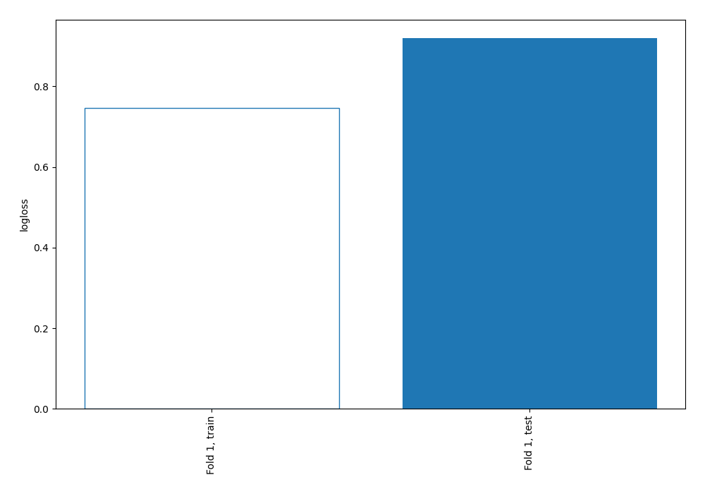

## Permutation-based Importance
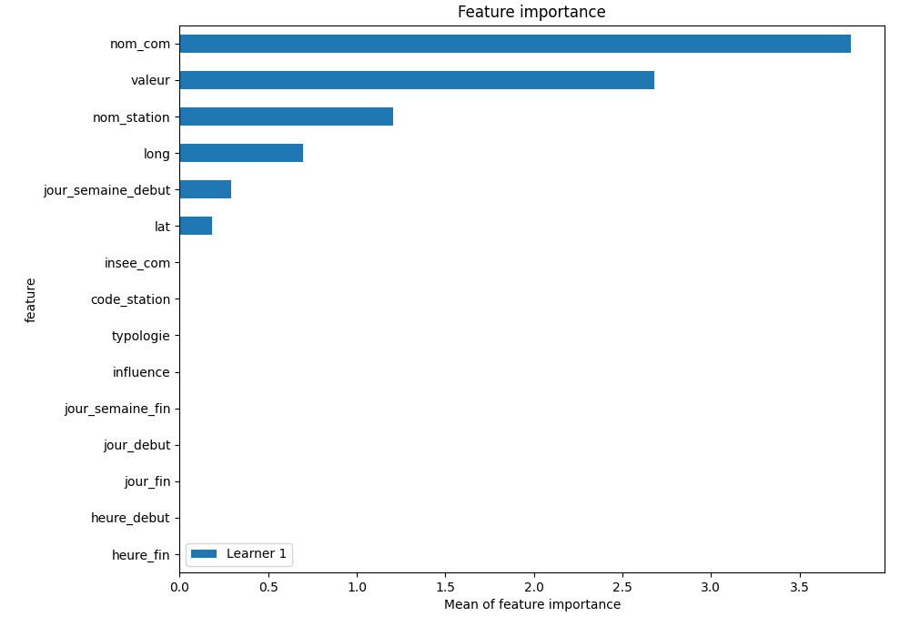

## SHAP Importance
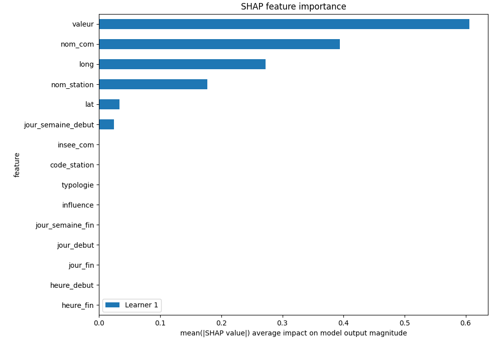

## SHAP Dependence plots

### Dependence 0 (Fold 1)
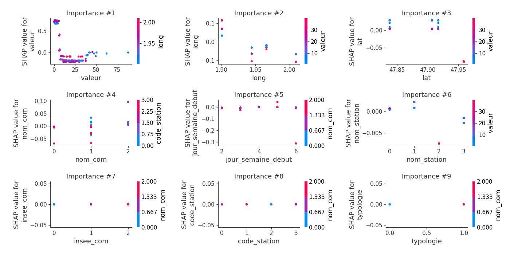
### Dependence 1 (Fold 1)
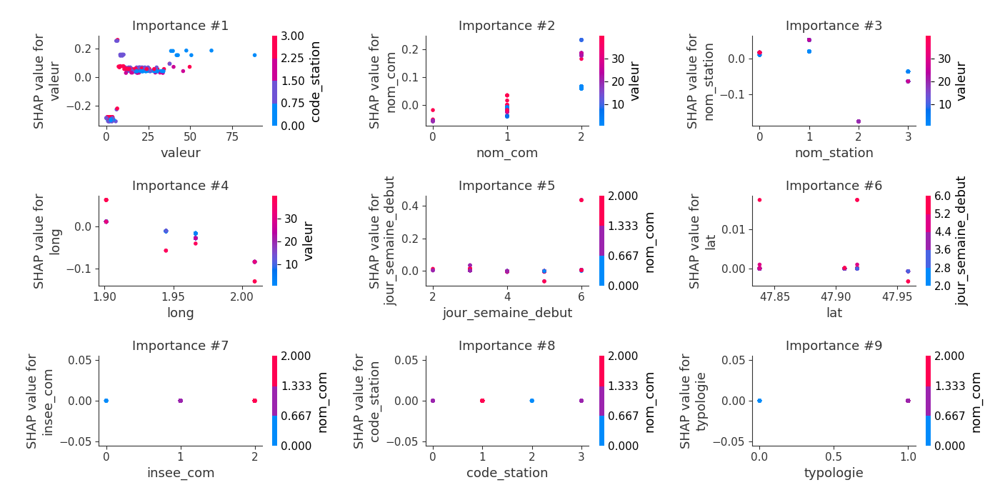
### Dependence 2 (Fold 1)
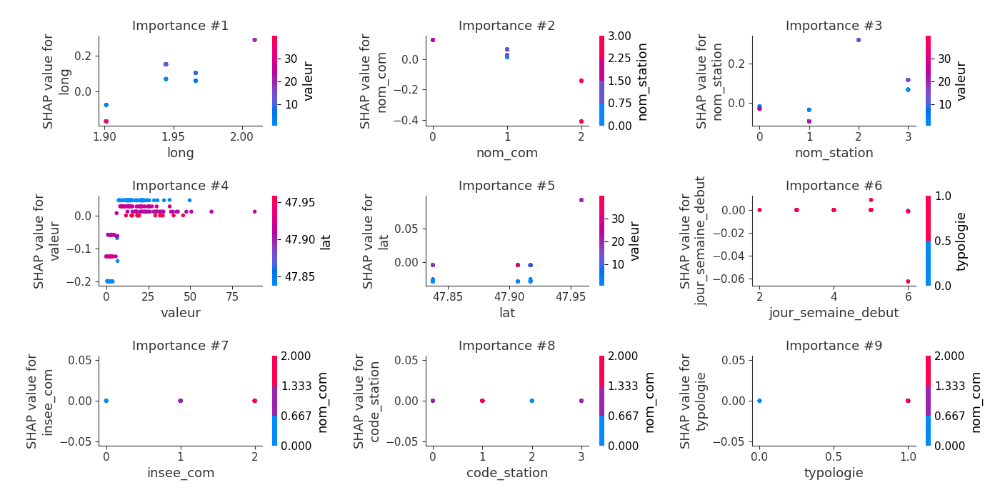
### Dependence 3 (Fold 1)
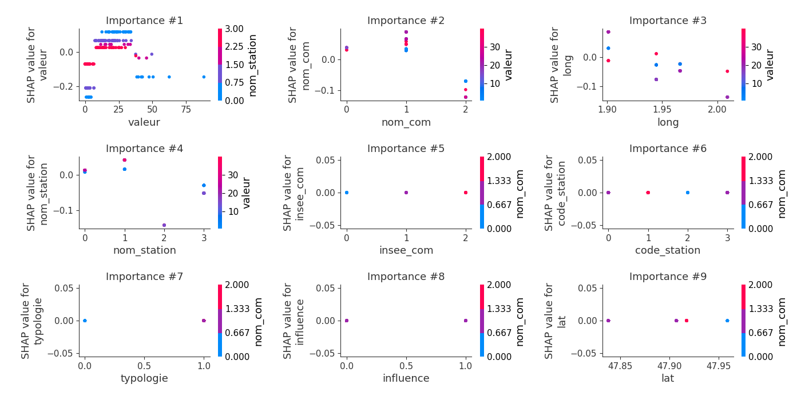
### Dependence 4 (Fold 1)
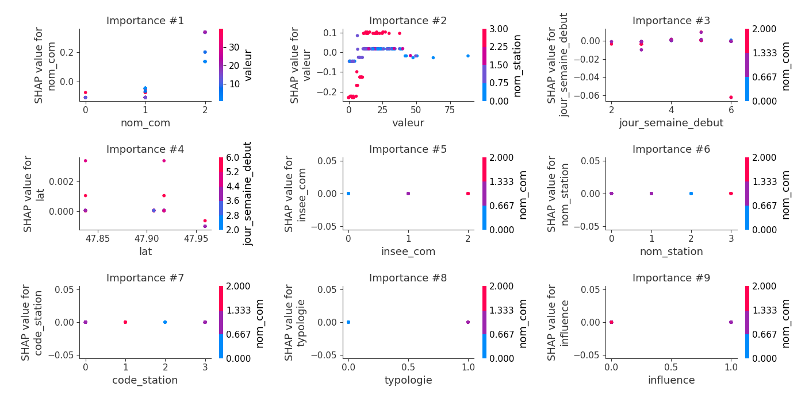

## SHAP Decision plots

### Worst decisions for selected sample 1 (Fold 1)
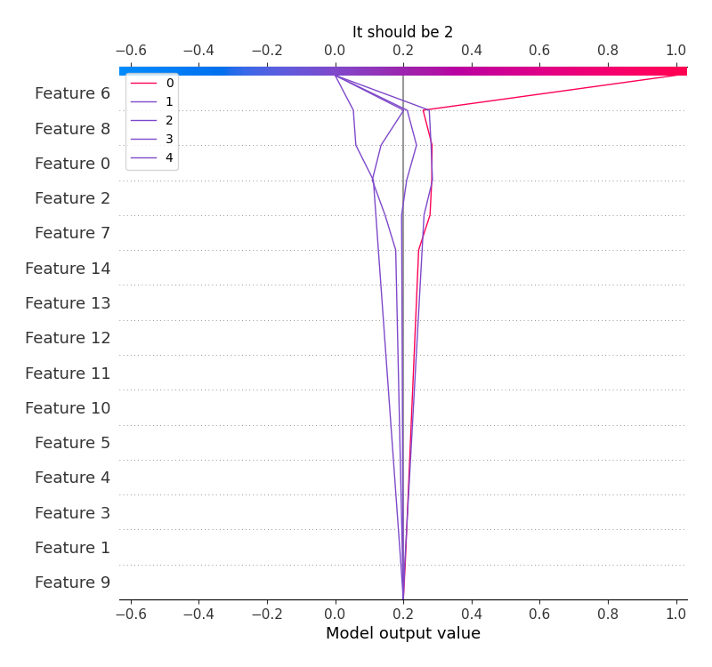
### Worst decisions for selected sample 2 (Fold 1)
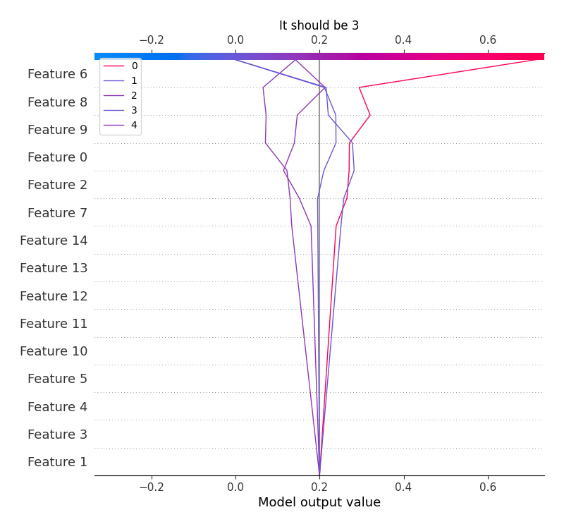
### Worst decisions for selected sample 3 (Fold 1)
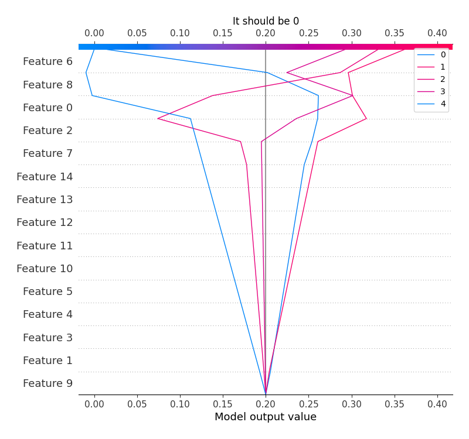
### Worst decisions for selected sample 4 (Fold 1)
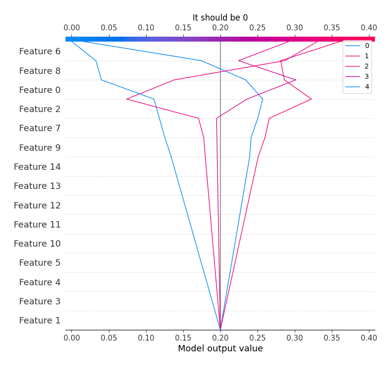
### Best decisions for selected sample 1 (Fold 1)

### Best decisions for selected sample 2 (Fold 1)
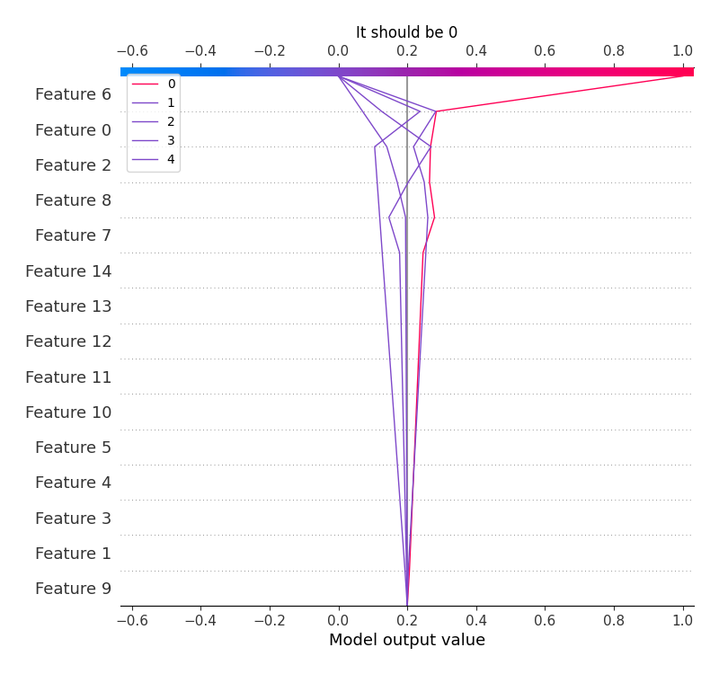
### Best decisions for selected sample 3 (Fold 1)
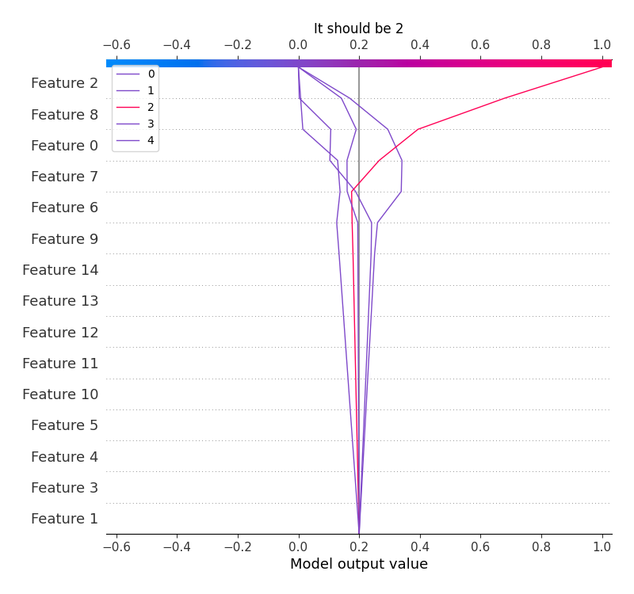
### Best decisions for selected sample 4 (Fold 1)
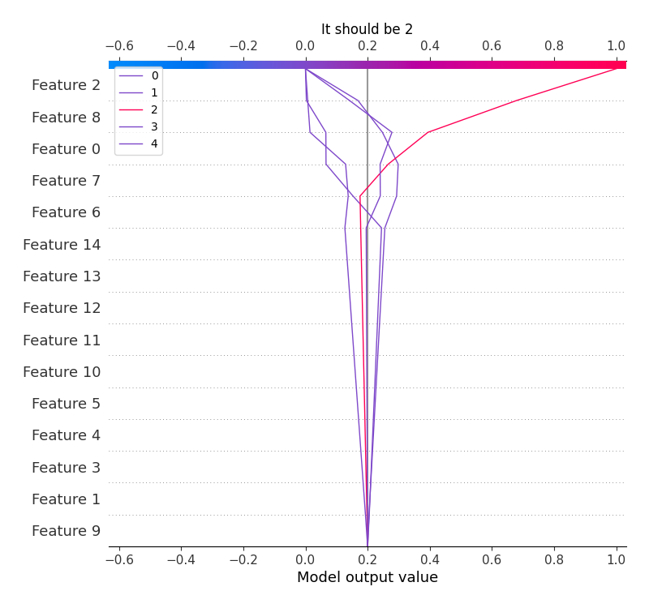

[<< Go back](../README.md)
