# Summary of 4_Default_Xgboost

[<< Go back](../README.md)

## Extreme Gradient Boosting (Xgboost)
- **objective**: multi:softprob
- **eval_metric**: mlogloss
- **eta**: 0.075
- **max_depth**: 6
- **min_child_weight**: 1
- **subsample**: 1.0
- **colsample_bytree**: 1.0
- **num_class**: 5
- **explain_level**: 2

## Validation
 - **validation_type**: split
 - **train_ratio**: 0.75
 - **shuffle**: True
 - **stratify**: True

## Optimized metric
logloss

## Training time

9.0 seconds

### Metric details
|           |         0 |    1 |         2 |         3 |         4 |   accuracy |   macro avg |   weighted avg |   logloss |
|:----------|----------:|-----:|----------:|----------:|----------:|-----------:|------------:|---------------:|----------:|
| precision |  0.886364 |  0.5 |  0.62963  |  0.485714 |  0.526316 |   0.617143 |    0.605605 |       0.624728 |  0.796518 |
| recall    |  0.829787 |  0.5 |  0.586207 |  0.5      |  0.666667 |   0.617143 |    0.616532 |       0.617143 |  0.796518 |
| f1-score  |  0.857143 |  0.5 |  0.607143 |  0.492754 |  0.588235 |   0.617143 |    0.609055 |       0.619829 |  0.796518 |
| support   | 47        | 50   | 29        | 34        | 15        |   0.617143 |  175        |     175        |  0.796518 |

## Confusion matrix
|              |   Predicted as 0 |   Predicted as 1 |   Predicted as 2 |   Predicted as 3 |   Predicted as 4 |
|:-------------|-----------------:|-----------------:|-----------------:|-----------------:|-----------------:|
| Labeled as 0 |               39 |                4 |                0 |                4 |                0 |
| Labeled as 1 |                1 |               25 |                2 |               13 |                9 |
| Labeled as 2 |                3 |                8 |               17 |                1 |                0 |
| Labeled as 3 |                1 |                8 |                8 |               17 |                0 |
| Labeled as 4 |                0 |                5 |                0 |                0 |               10 |

## Learning curves
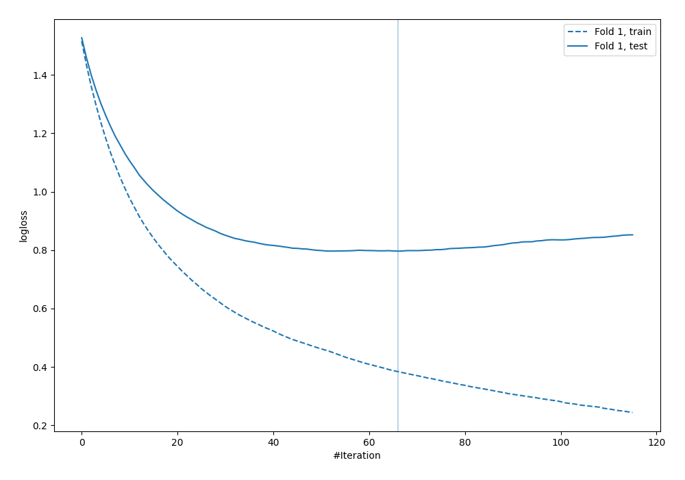

## Permutation-based Importance
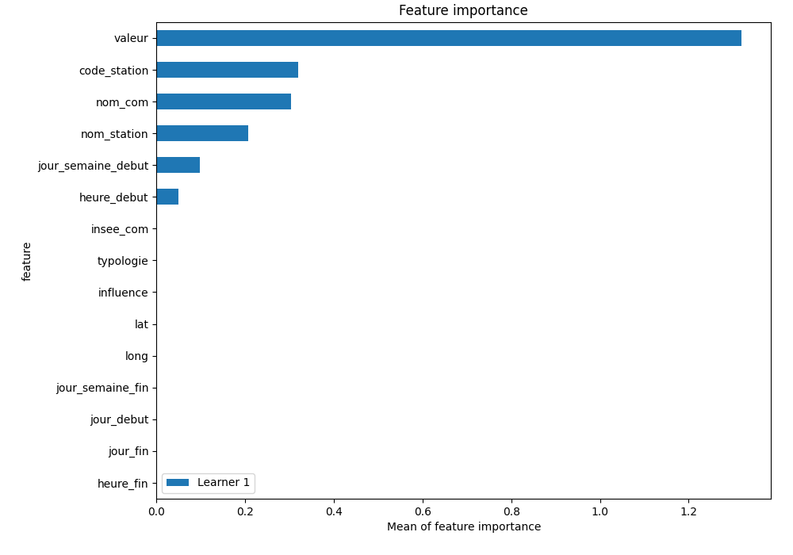

## SHAP Importance
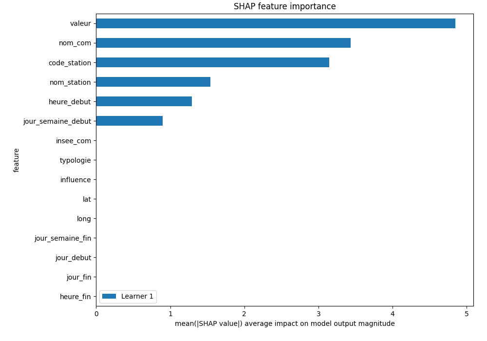

## SHAP Dependence plots

### Dependence 0 (Fold 1)
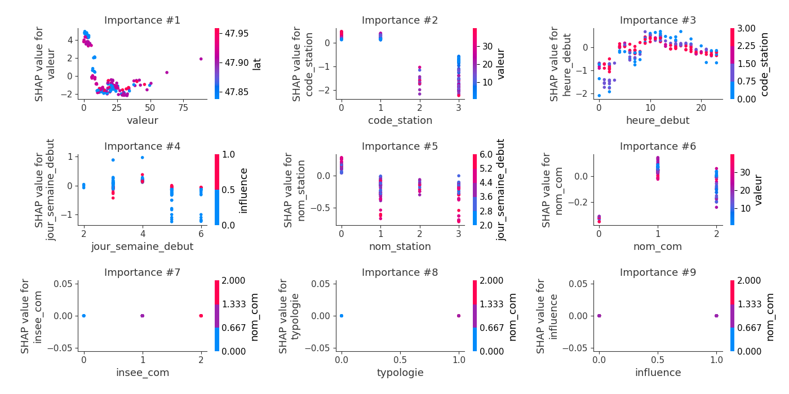
### Dependence 1 (Fold 1)
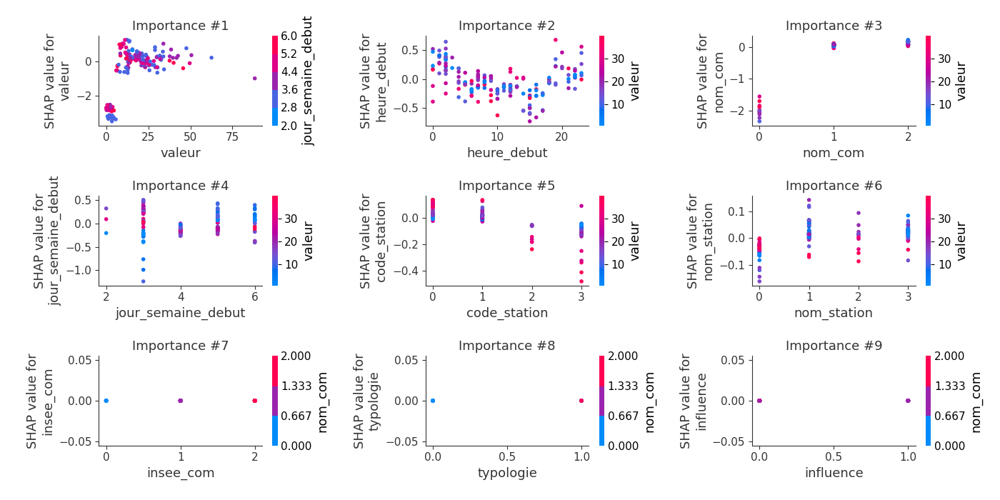
### Dependence 2 (Fold 1)
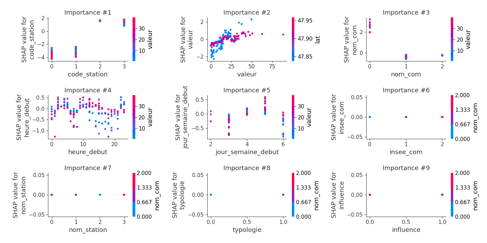
### Dependence 3 (Fold 1)
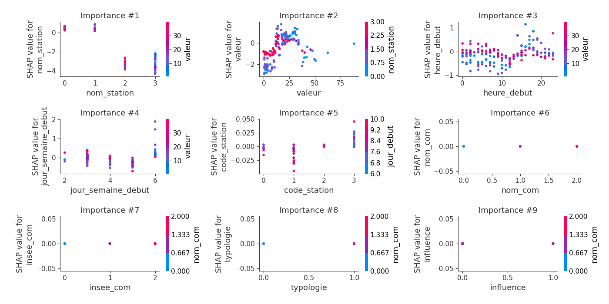
### Dependence 4 (Fold 1)
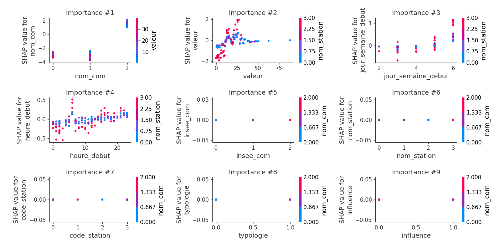

## SHAP Decision plots

### Worst decisions for selected sample 1 (Fold 1)

### Worst decisions for selected sample 2 (Fold 1)
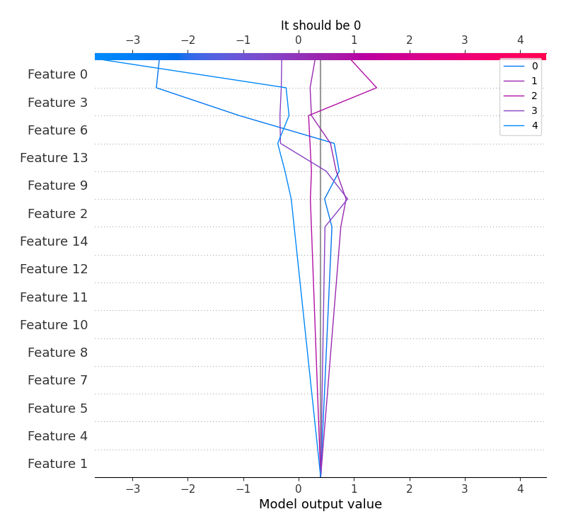
### Worst decisions for selected sample 3 (Fold 1)
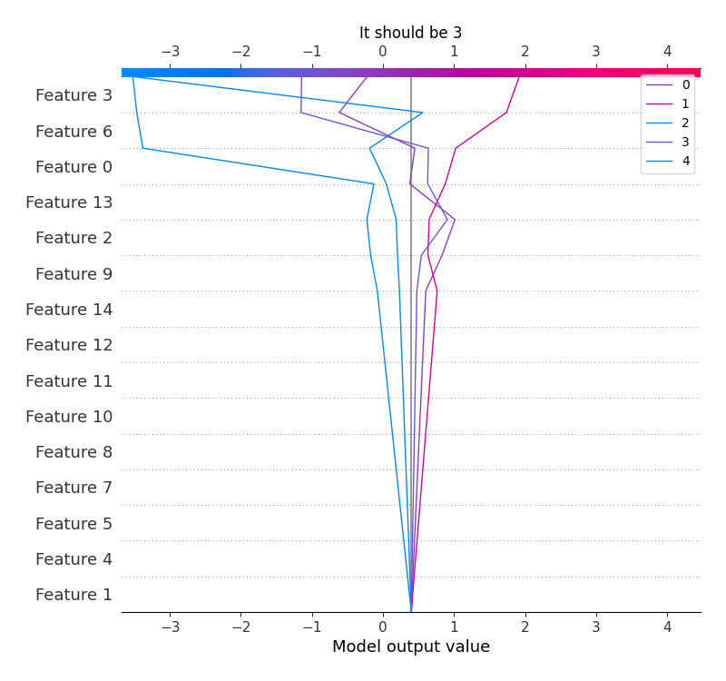
### Worst decisions for selected sample 4 (Fold 1)
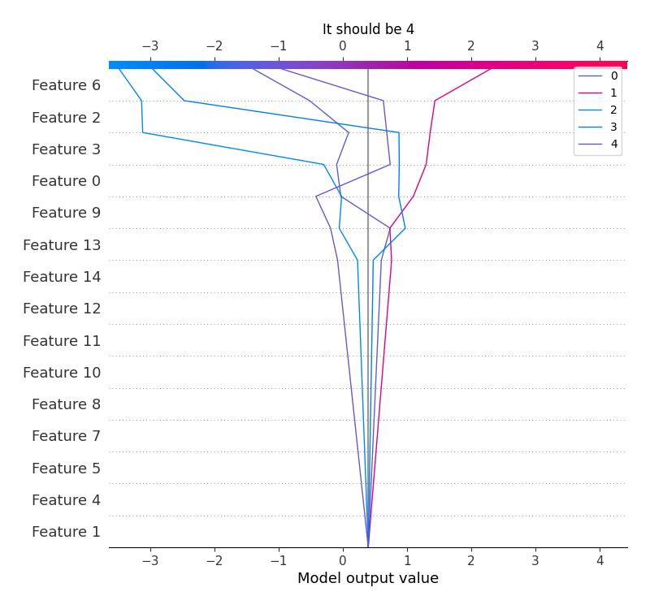
### Best decisions for selected sample 1 (Fold 1)
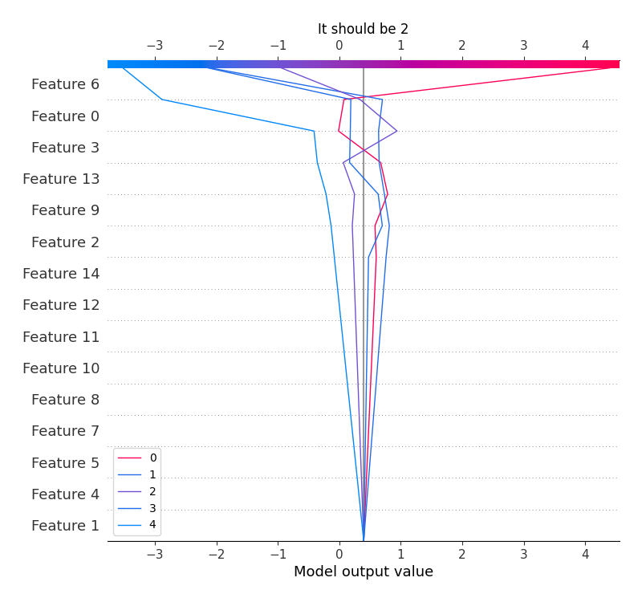
### Best decisions for selected sample 2 (Fold 1)
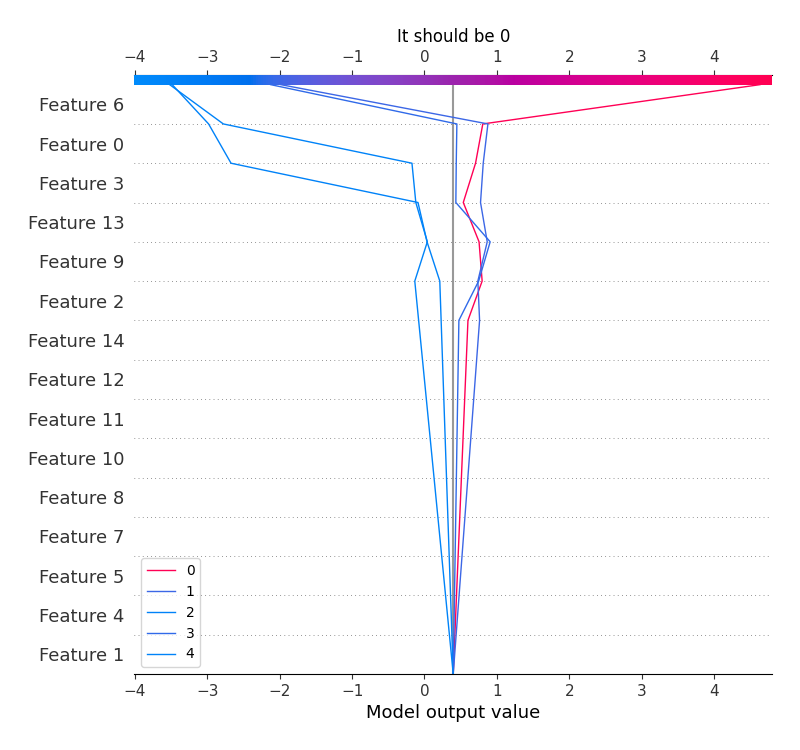
### Best decisions for selected sample 3 (Fold 1)

### Best decisions for selected sample 4 (Fold 1)
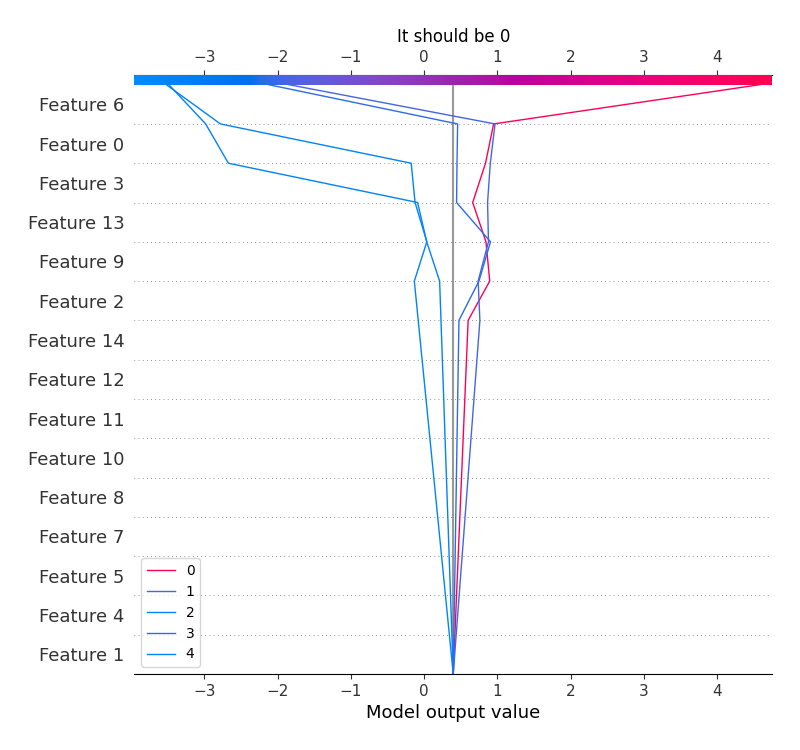

[<< Go back](../README.md)
