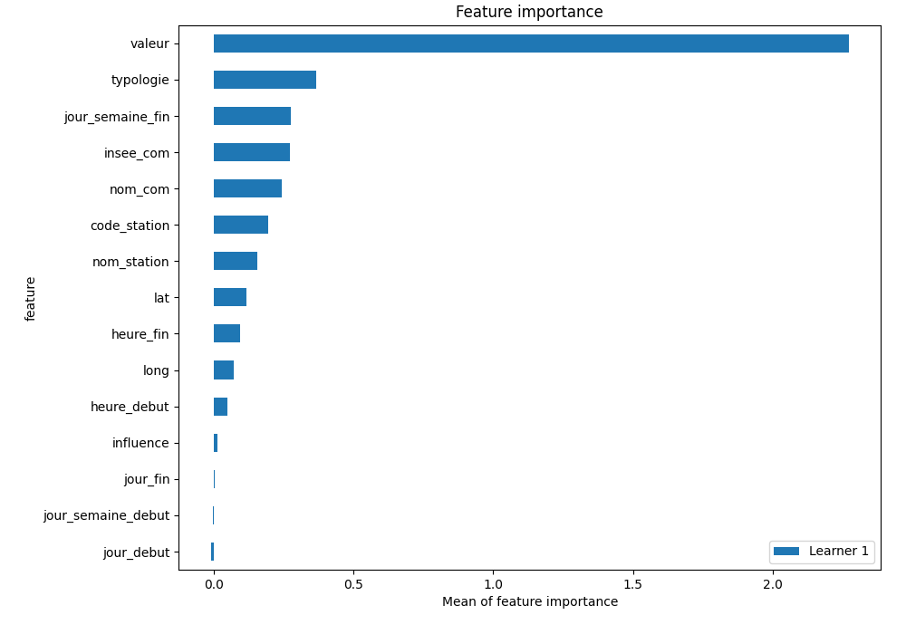

# Summary of 5_Default_NeuralNetwork

[<< Go back](../README.md)

## Neural Network
- **dense_1_size**: 32
- **dense_2_size**: 16
- **learning_rate**: 0.05
- **num_class**: 5
- **explain_level**: 2

## Validation
 - **validation_type**: split
 - **train_ratio**: 0.75
 - **shuffle**: True
 - **stratify**: True

## Optimized metric
logloss

## Training time

0.3 seconds

### Metric details
|           |         0 |         1 |         2 |         3 |         4 |   accuracy |   macro avg |   weighted avg |   logloss |
|:----------|----------:|----------:|----------:|----------:|----------:|-----------:|------------:|---------------:|----------:|
| precision |  0.886364 |  0.5      |  0.714286 |  0.522727 |  0.5      |   0.628571 |    0.624675 |       0.643692 |  0.874461 |
| recall    |  0.829787 |  0.42     |  0.517241 |  0.676471 |  0.8      |   0.628571 |    0.6487   |       0.628571 |  0.874461 |
| f1-score  |  0.857143 |  0.456522 |  0.6      |  0.589744 |  0.615385 |   0.628571 |    0.623759 |       0.627393 |  0.874461 |
| support   | 47        | 50        | 29        | 34        | 15        |   0.628571 |  175        |     175        |  0.874461 |

## Confusion matrix
|              |   Predicted as 0 |   Predicted as 1 |   Predicted as 2 |   Predicted as 3 |   Predicted as 4 |
|:-------------|-----------------:|-----------------:|-----------------:|-----------------:|-----------------:|
| Labeled as 0 |               39 |                3 |                0 |                5 |                0 |
| Labeled as 1 |                1 |               21 |                2 |               14 |               12 |
| Labeled as 2 |                3 |                9 |               15 |                2 |                0 |
| Labeled as 3 |                0 |                7 |                4 |               23 |                0 |
| Labeled as 4 |                1 |                2 |                0 |                0 |               12 |

## Learning curves

## Permutation-based Importance

[<< Go back](../README.md)
