# Exploratory Data Analysis

[<< Go back](../README.md)
## Feature : target
- **Feature type** : continous
- **Missing** : 0.0%
- **Unique** : 2046
- **Count** :107190.0
- **Mean** :30.021256647075283
- **Std** :163.79550034259555
- **Min** :0.0
- **25%th Percentile** : 0.0
- **50%th Percentile** : 0.0
- **75%th Percentile** : 4.9
- **Max** :14951.8

## Feature : Id_carr_n
- **Feature type** : text
- **Missing** : 0.0%
- **Unique** : 107190
- **Count** :107190
- **Unique** :107190
- **Top** :CRS3035RES2000mN2950000E3870000
- **Freq** :1

## Feature : Ind
- **Feature type** : continous
- **Missing** : 0.0%
- **Unique** : 6986
- **Count** :107190.0
- **Mean** :439.4705056441832
- **Std** :1351.3627939237567
- **Min** :12.0
- **25%th Percentile** : 71.5
- **50%th Percentile** : 155.0
- **75%th Percentile** : 381.5
- **Max** :191932.5

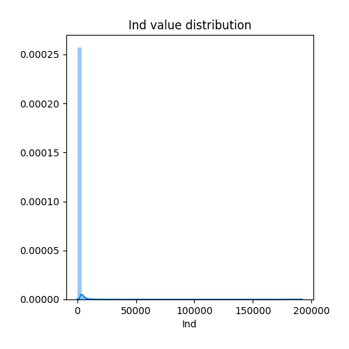
## Feature : Men
- **Feature type** : continous
- **Missing** : 0.0%
- **Unique** : 8209
- **Count** :107190.0
- **Mean** :189.60562086015486
- **Std** :611.24398096379
- **Min** :10.5
- **25%th Percentile** : 29.4
- **50%th Percentile** : 64.0
- **75%th Percentile** : 161.9
- **Max** :89976.8

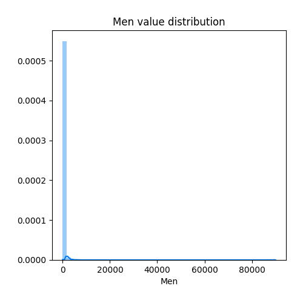
## Feature : Men_pauv
- **Feature type** : continous
- **Missing** : 0.0%
- **Unique** : 2615
- **Count** :107190.0
- **Mean** :26.562544080604532
- **Std** :100.61583931725896
- **Min** :0.0
- **25%th Percentile** : 3.0
- **50%th Percentile** : 7.0
- **75%th Percentile** : 18.1
- **Max** :11101.9

## Feature : Men_1ind
- **Feature type** : continous
- **Missing** : 0.0%
- **Unique** : 4380
- **Count** :107190.0
- **Mean** :63.813320272413485
- **Std** :243.00063672305487
- **Min** :0.0
- **25%th Percentile** : 7.0
- **50%th Percentile** : 16.1
- **75%th Percentile** : 47.0
- **Max** :35064.5

## Feature : Men_5ind
- **Feature type** : continous
- **Missing** : 0.0%
- **Unique** : 1654
- **Count** :107190.0
- **Mean** :13.535938986845789
- **Std** :45.326913134562716
- **Min** :0.0
- **25%th Percentile** : 1.9
- **50%th Percentile** : 4.1
- **75%th Percentile** : 11.0
- **Max** :4819.3

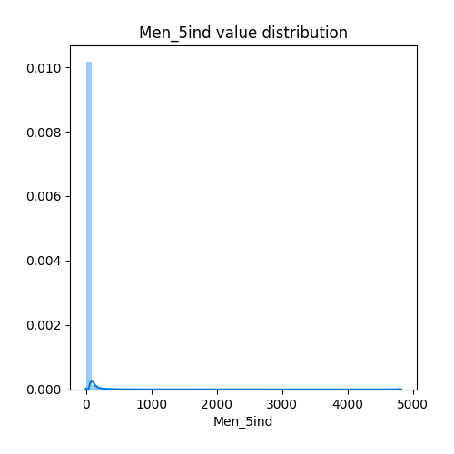
## Feature : Men_prop
- **Feature type** : continous
- **Missing** : 0.0%
- **Unique** : 6020
- **Count** :107190.0
- **Mean** :111.557513760612
- **Std** :325.30697796225786
- **Min** :0.0
- **25%th Percentile** : 22.1
- **50%th Percentile** : 46.2
- **75%th Percentile** : 106.0
- **Max** :57953.4

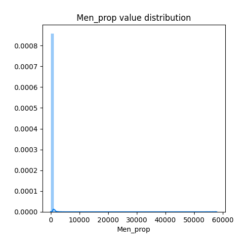
## Feature : Men_fmp
- **Feature type** : continous
- **Missing** : 0.0%
- **Unique** : 2151
- **Count** :107190.0
- **Mean** :20.062155984700066
- **Std** :71.62882217964473
- **Min** :0.0
- **25%th Percentile** : 2.0
- **50%th Percentile** : 5.0
- **75%th Percentile** : 15.0
- **Max** :9093.1

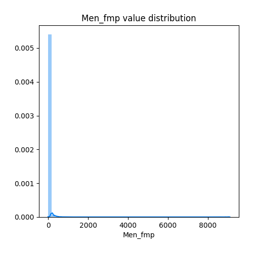
## Feature : Ind_snv
- **Feature type** : continous
- **Missing** : 0.0%
- **Unique** : 107114
- **Count** :107190.0
- **Mean** :9898530.661196006
- **Std** :30392301.40076306
- **Min** :175061.4
- **25%th Percentile** : 1548310.9000000001
- **50%th Percentile** : 3440988.0
- **75%th Percentile** : 8657147.075
- **Max** :4203146541.0

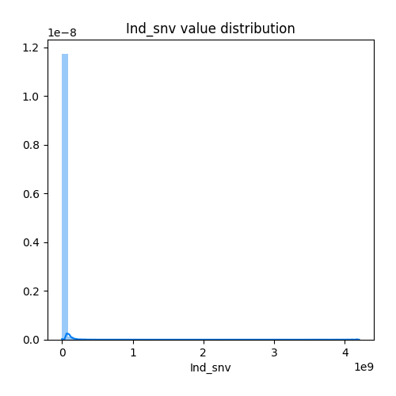
## Feature : Men_surf
- **Feature type** : continous
- **Missing** : 0.0%
- **Unique** : 64395
- **Count** :107190.0
- **Mean** :16488.192348166805
- **Std** :49236.76472160966
- **Min** :339.9
- **25%th Percentile** : 3159.1
- **50%th Percentile** : 6507.05
- **75%th Percentile** : 15042.85
- **Max** :8228394.1

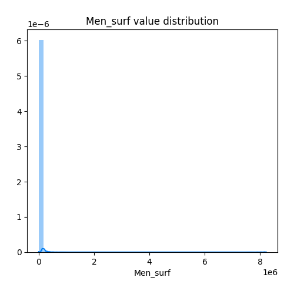
## Feature : Men_coll
- **Feature type** : continous
- **Missing** : 0.0%
- **Unique** : 4807
- **Count** :107190.0
- **Mean** :81.1451142830488
- **Std** :402.92792729469716
- **Min** :0.0
- **25%th Percentile** : 0.0
- **50%th Percentile** : 2.7
- **75%th Percentile** : 27.0
- **Max** :35958.0

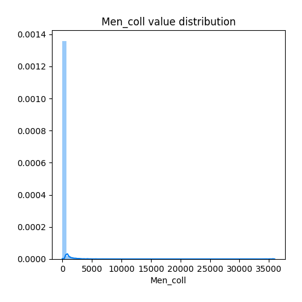
## Feature : Men_mais
- **Feature type** : continous
- **Missing** : 0.0%
- **Unique** : 6139
- **Count** :107190.0
- **Mean** :108.46050657710609
- **Std** :296.6985695064199
- **Min** :0.0
- **25%th Percentile** : 22.7
- **50%th Percentile** : 45.9
- **75%th Percentile** : 107.1
- **Max** :56887.7

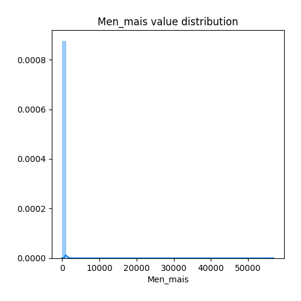
## Feature : Log_av45
- **Feature type** : continous
- **Missing** : 0.0%
- **Unique** : 4066
- **Count** :107190.0
- **Mean** :52.895020990764074
- **Std** :169.8770255997866
- **Min** :0.0
- **25%th Percentile** : 9.0
- **50%th Percentile** : 19.8
- **75%th Percentile** : 45.0
- **Max** :13630.9

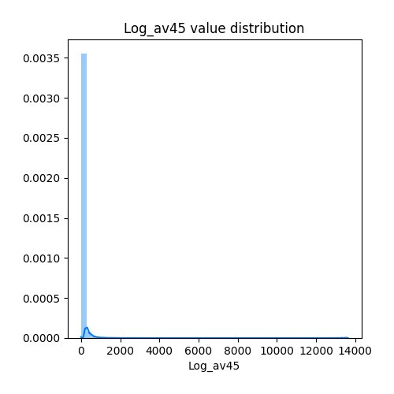
## Feature : Log_45_70
- **Feature type** : continous
- **Missing** : 0.0%
- **Unique** : 3149
- **Count** :107190.0
- **Mean** :31.590920794850263
- **Std** :157.56027873092765
- **Min** :0.0
- **25%th Percentile** : 1.0
- **50%th Percentile** : 4.0
- **75%th Percentile** : 15.0
- **Max** :24177.4

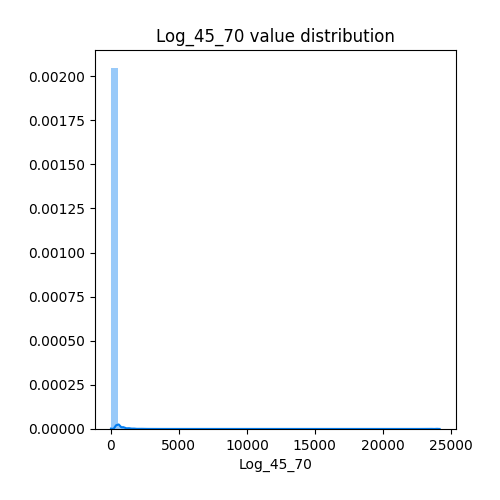
## Feature : Log_70_90
- **Feature type** : continous
- **Missing** : 0.0%
- **Unique** : 4134
- **Count** :107190.0
- **Mean** :49.014724321298615
- **Std** :186.02167607792967
- **Min** :0.0
- **25%th Percentile** : 4.1
- **50%th Percentile** : 11.9
- **75%th Percentile** : 36.4
- **Max** :30639.3

## Feature : Log_ap90
- **Feature type** : continous
- **Missing** : 0.0%
- **Unique** : 4410
- **Count** :107190.0
- **Mean** :55.61113256833659
- **Std** :191.9050579380712
- **Min** :0.0
- **25%th Percentile** : 5.0
- **50%th Percentile** : 14.2
- **75%th Percentile** : 46.0
- **Max** :25544.7

## Feature : Ind_0_3
- **Feature type** : continous
- **Missing** : 0.0%
- **Unique** : 2653
- **Count** :107190.0
- **Mean** :20.64468607146189
- **Std** :66.41797120868992
- **Min** :0.0
- **25%th Percentile** : 2.1
- **50%th Percentile** : 6.1
- **75%th Percentile** : 17.0
- **Max** :7172.3

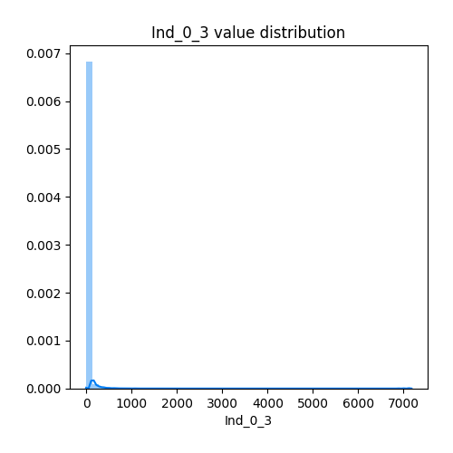
## Feature : Ind_4_5
- **Feature type** : continous
- **Missing** : 0.0%
- **Unique** : 1733
- **Count** :107190.0
- **Mean** :10.99895699225674
- **Std** :34.38793573088765
- **Min** :0.0
- **25%th Percentile** : 1.0
- **50%th Percentile** : 3.6
- **75%th Percentile** : 9.6
- **Max** :3904.5

## Feature : Ind_6_10
- **Feature type** : continous
- **Missing** : 0.0%
- **Unique** : 3130
- **Count** :107190.0
- **Mean** :27.59822837951302
- **Std** :83.74041697598103
- **Min** :0.0
- **25%th Percentile** : 3.9
- **50%th Percentile** : 9.1
- **75%th Percentile** : 24.0
- **Max** :10300.4

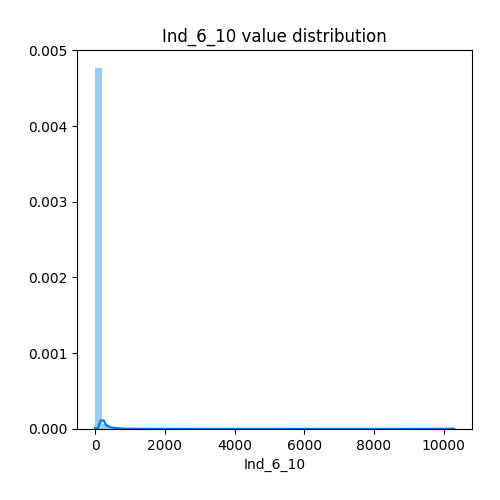
## Feature : Ind_11_17
- **Feature type** : continous
- **Missing** : 0.0%
- **Unique** : 3854
- **Count** :107190.0
- **Mean** :38.16180427278664
- **Std** :114.9551733248981
- **Min** :0.0
- **25%th Percentile** : 5.8
- **50%th Percentile** : 13.2
- **75%th Percentile** : 33.5
- **Max** :15722.7

## Feature : Ind_18_24
- **Feature type** : continous
- **Missing** : 0.0%
- **Unique** : 2959
- **Count** :107190.0
- **Mean** :24.4836719843269
- **Std** :79.38878911845906
- **Min** :0.0
- **25%th Percentile** : 3.0
- **50%th Percentile** : 7.9
- **75%th Percentile** : 20.5
- **Max** :10387.3

## Feature : Ind_25_39
- **Feature type** : continous
- **Missing** : 0.0%
- **Unique** : 5346
- **Count** :107190.0
- **Mean** :80.6208125758
- **Std** :260.3205701298878
- **Min** :0.0
- **25%th Percentile** : 10.1
- **50%th Percentile** : 24.8
- **75%th Percentile** : 67.0
- **Max** :29667.6

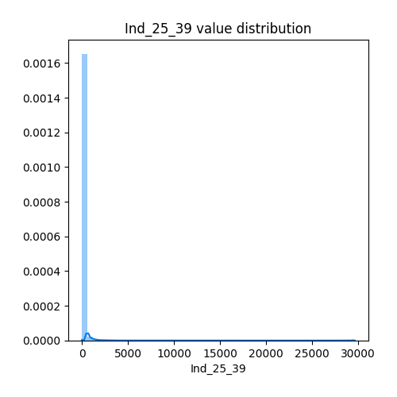
## Feature : Ind_40_54
- **Feature type** : continous
- **Missing** : 0.0%
- **Unique** : 5620
- **Count** :107190.0
- **Mean** :89.72788786267377
- **Std** :270.53186518859985
- **Min** :0.0
- **25%th Percentile** : 14.9
- **50%th Percentile** : 32.9
- **75%th Percentile** : 79.3
- **Max** :38211.6

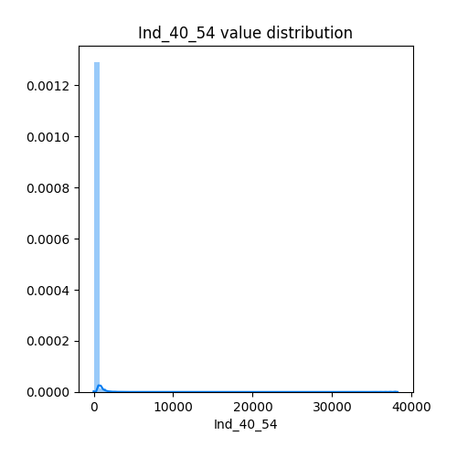
## Feature : Ind_55_64
- **Feature type** : continous
- **Missing** : 0.0%
- **Unique** : 4060
- **Count** :107190.0
- **Mean** :55.50638025935255
- **Std** :171.4354821415151
- **Min** :0.0
- **25%th Percentile** : 10.0
- **50%th Percentile** : 21.1
- **75%th Percentile** : 49.0
- **Max** :27065.9

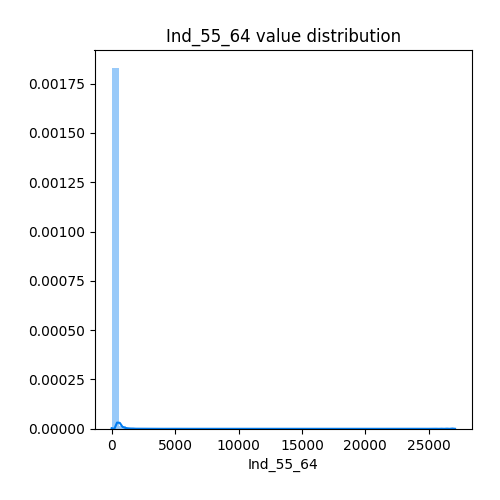
## Feature : Ind_65_79
- **Feature type** : continous
- **Missing** : 0.0%
- **Unique** : 4191
- **Count** :107190.0
- **Mean** :57.698016606026684
- **Std** :189.5149248044125
- **Min** :0.0
- **25%th Percentile** : 10.0
- **50%th Percentile** : 21.0
- **75%th Percentile** : 49.9
- **Max** :31131.2

## Feature : Ind_80p
- **Feature type** : continous
- **Missing** : 0.0%
- **Unique** : 2457
- **Count** :107190.0
- **Mean** :24.225630189383335
- **Std** :84.52040955345184
- **Min** :0.0
- **25%th Percentile** : 3.8
- **50%th Percentile** : 8.1
- **75%th Percentile** : 20.0
- **Max** :13562.5

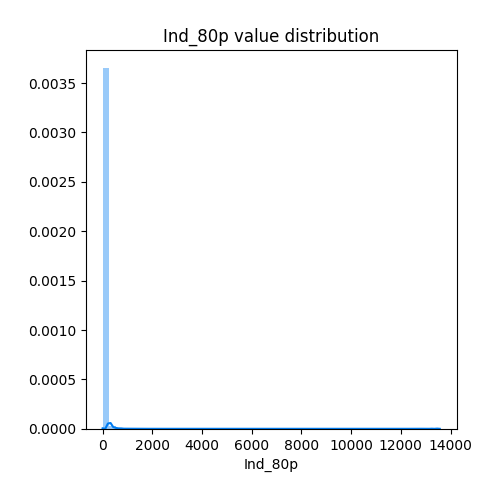
## Feature : I_pauv
- **Feature type** : discrete
- **Missing** : 0.0%
- **Unique** : 4
- **Count** :107190.0
- **Mean** :0.0003265229965481855
- **Std** :0.029768747958380276
- **Min** :0.0
- **25%th Percentile** : 0.0
- **50%th Percentile** : 0.0
- **75%th Percentile** : 0.0
- **Max** :8.0

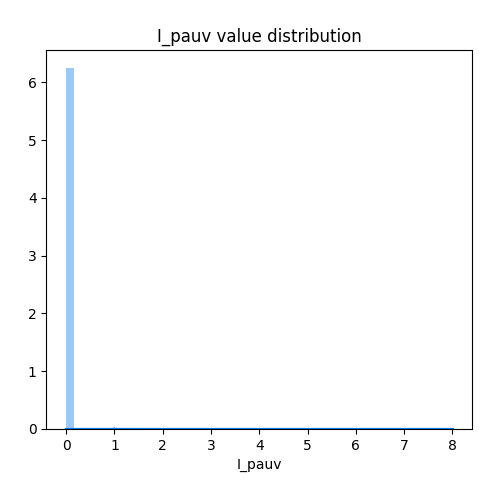
## Feature : t_maille
- **Feature type** : discrete
- **Missing** : 0.0%
- **Unique** : 7
- **Count** :107190.0
- **Mean** :1509.9822744659016
- **Std** :1226.8778497817536
- **Min** :200.0
- **25%th Percentile** : 1000.0
- **50%th Percentile** : 1000.0
- **75%th Percentile** : 2000.0
- **Max** :32000.0

[<< Go back](../README.md)
