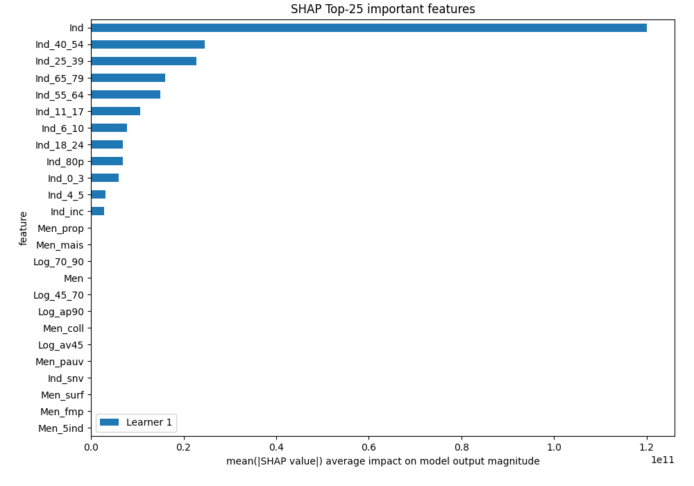
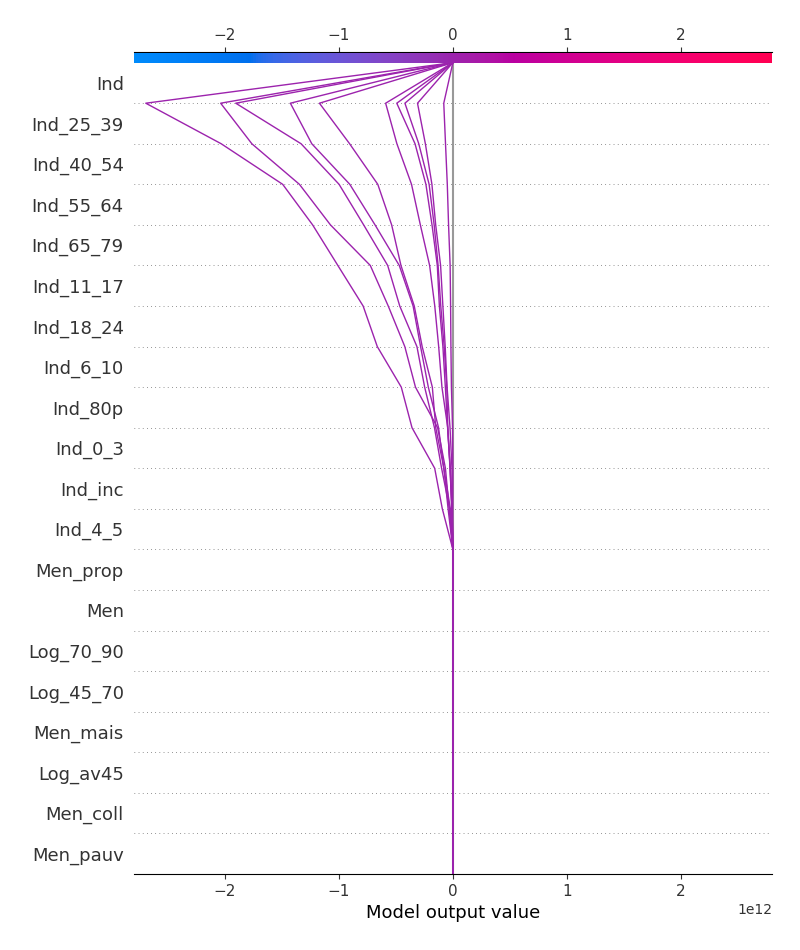

# Summary of 3_Linear

[<< Go back](../README.md)

## Linear Regression (Linear)
- **explain_level**: 2

## Validation
 - **validation_type**: split
 - **train_ratio**: 0.75
 - **shuffle**: True

## Optimized metric
rmse

## Training time

3.7 seconds

### Metric details:
| Metric   |       Score |
|:---------|------------:|
| MAE      |   12.9427   |
| MSE      | 1165.05     |
| RMSE     |   34.1329   |
| R2       |    0.946339 |

## Learning curves

## Coefficients
| feature   |    Learner_1 |
|:----------|-------------:|
| Ind       |  3.84143e+11 |
| Log_70_90 |  0.711794    |
| Men_mais  |  0.709293    |
| Log_45_70 |  0.612752    |
| Men       |  0.605774    |
| Log_ap90  |  0.455164    |
| Men_coll  |  0.399937    |
| Log_av45  |  0.333267    |
| Men_fmp   |  0.0969623   |
| I_pauv    |  0.0347448   |
| Men_1ind  |  0.0149348   |
| t_maille  |  0.0128517   |
| intercept | -1.07085e-05 |
| Log_inc   | -0.0290092   |
| Men_5ind  | -0.0356388   |
| Men_surf  | -0.216941    |
| Ind_snv   | -0.218936    |
| Men_pauv  | -0.356456    |
| Men_prop  | -2.48076     |
| Ind_inc   | -9.06301e+09 |
| Ind_4_5   | -9.56827e+09 |
| Ind_0_3   | -1.84451e+10 |
| Ind_18_24 | -2.23668e+10 |
| Ind_6_10  | -2.33952e+10 |
| Ind_80p   | -2.44123e+10 |
| Ind_11_17 | -3.23746e+10 |
| Ind_55_64 | -4.92238e+10 |
| Ind_65_79 | -5.48036e+10 |
| Ind_25_39 | -7.29627e+10 |
| Ind_40_54 | -7.69848e+10 |

## Permutation-based Importance

## SHAP Importance

## SHAP Dependence plots

### Dependence (Fold 1)

## SHAP Decision plots

### Top-10 Worst decisions (Fold 1)

### Top-10 Best decisions (Fold 1)

[<< Go back](../README.md)
