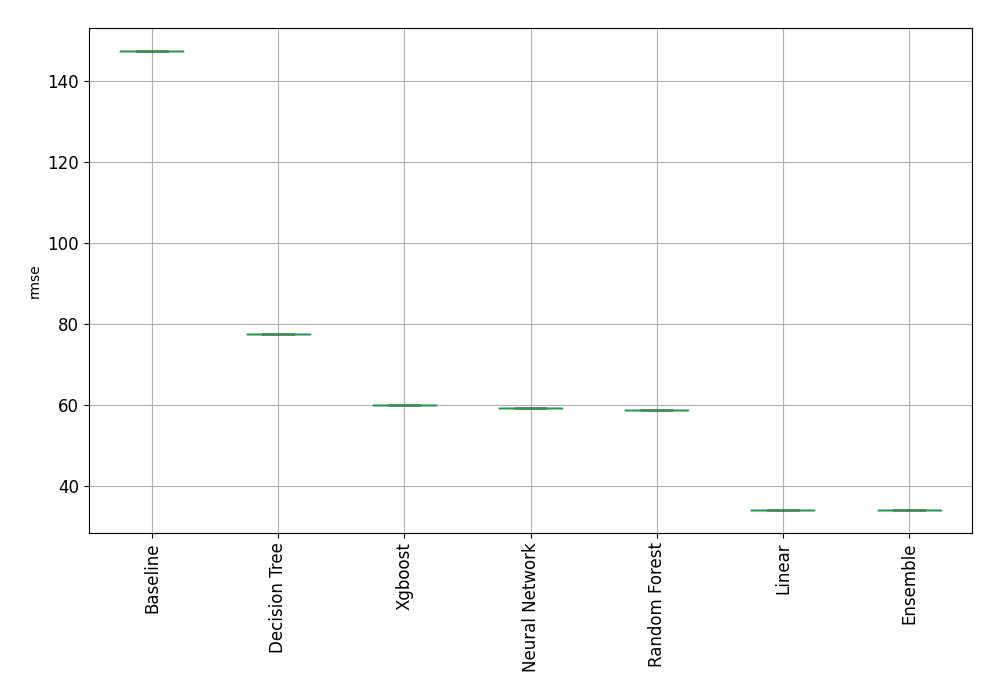

# AutoML Leaderboard

| Best model   | name                                                         | model_type     | metric_type   |   metric_value |   train_time |
|:-------------|:-------------------------------------------------------------|:---------------|:--------------|---------------:|-------------:|
|              | [1_Baseline](1_Baseline/README.md)                           | Baseline       | rmse          |       147.349  |         0.35 |
|              | [2_DecisionTree](2_DecisionTree/README.md)                   | Decision Tree  | rmse          |        77.5376 |        27.62 |
| **the best** | [3_Linear](3_Linear/README.md)                               | Linear         | rmse          |        34.1329 |         4.37 |
|              | [4_Default_Xgboost](4_Default_Xgboost/README.md)             | Xgboost        | rmse          |        59.9339 |        11.73 |
|              | [5_Default_NeuralNetwork](5_Default_NeuralNetwork/README.md) | Neural Network | rmse          |        59.2642 |         8.19 |
|              | [6_Default_RandomForest](6_Default_RandomForest/README.md)   | Random Forest  | rmse          |        58.7515 |        15.2  |
|              | [Ensemble](Ensemble/README.md)                               | Ensemble       | rmse          |        34.1329 |         0.12 |

### AutoML Performance

### AutoML Performance Boxplot
