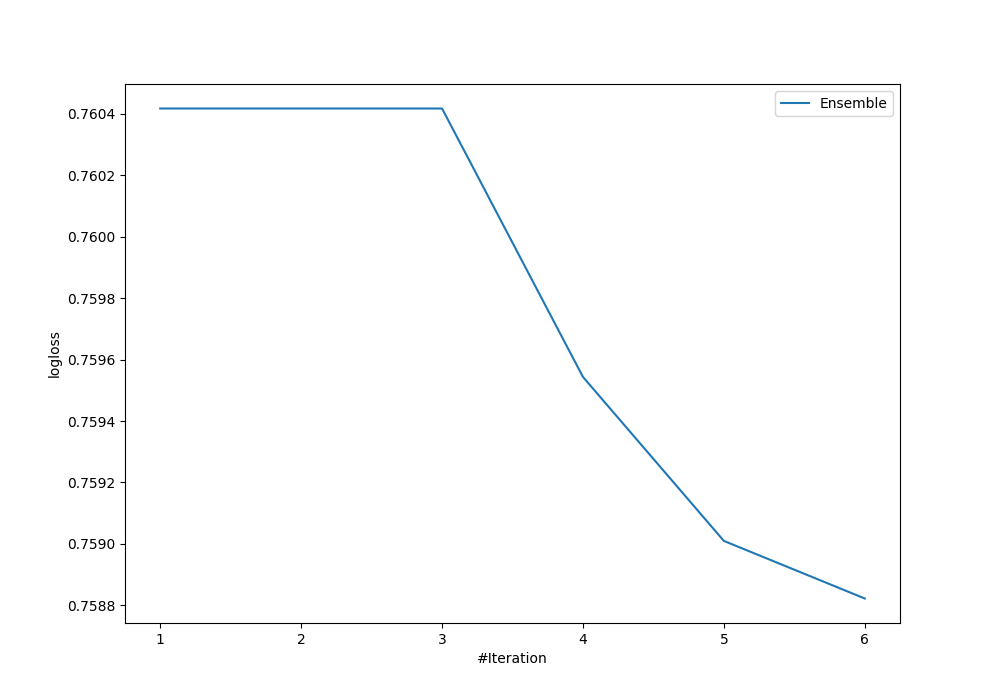

# Summary of Ensemble

[<< Go back](../README.md)

## Ensemble structure
| Model                  |   Weight |
|:-----------------------|---------:|
| 4_Default_Xgboost      |        5 |
| 6_Default_RandomForest |        1 |

### Metric details
|           |           0 |          1 |           2 |           3 |   accuracy |   macro avg |   weighted avg |   logloss |
|:----------|------------:|-----------:|------------:|------------:|-----------:|------------:|---------------:|----------:|
| precision |   0.444444  |  1         |    0.639539 |    0.662692 |   0.649019 |    0.686669 |       0.64099  |  0.758822 |
| recall    |   0.0283688 |  0.0526316 |    0.723714 |    0.643241 |   0.649019 |    0.361989 |       0.649019 |  0.758822 |
| f1-score  |   0.0533333 |  0.1       |    0.679027 |    0.652821 |   0.649019 |    0.371296 |       0.632593 |  0.758822 |
| support   | 282         | 19         | 2682        | 2419        |   0.649019 | 5402        |    5402        |  0.758822 |

## Confusion matrix
|              |   Predicted as 0 |   Predicted as 1 |   Predicted as 2 |   Predicted as 3 |
|:-------------|-----------------:|-----------------:|-----------------:|-----------------:|
| Labeled as 0 |                8 |                0 |              221 |               53 |
| Labeled as 1 |                0 |                1 |               14 |                4 |
| Labeled as 2 |                6 |                0 |             1941 |              735 |
| Labeled as 3 |                4 |                0 |              859 |             1556 |

## Learning curves

[<< Go back](../README.md)
