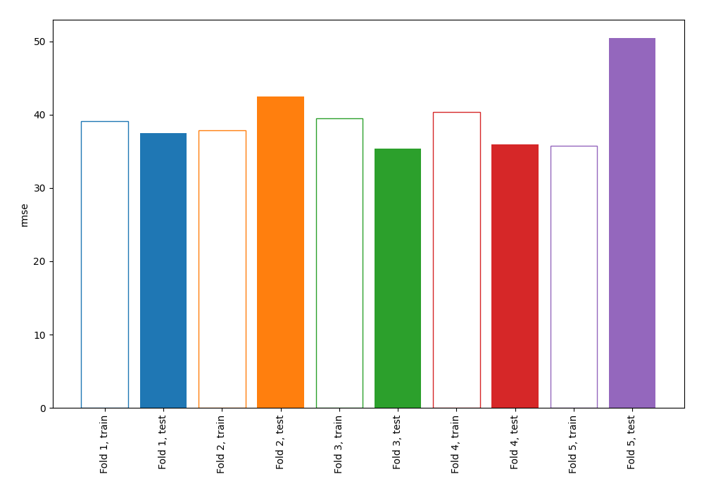

# Summary of 1_Linear_GoldenFeatures

[<< Go back](../README.md)

## Linear Regression (Linear)
- **explain_level**: 1

## Validation
 - **validation_type**: kfold
 - **k_folds**: 5
 - **shuffle**: True

## Optimized metric
rmse

## Training time

7.2 seconds

### Metric details:
| Metric   |       Score |
|:---------|------------:|
| MAE      |   21.99     |
| MSE      | 1656.75     |
| RMSE     |   40.7032   |
| R2       |    0.577492 |

## Learning curves

[<< Go back](../README.md)
