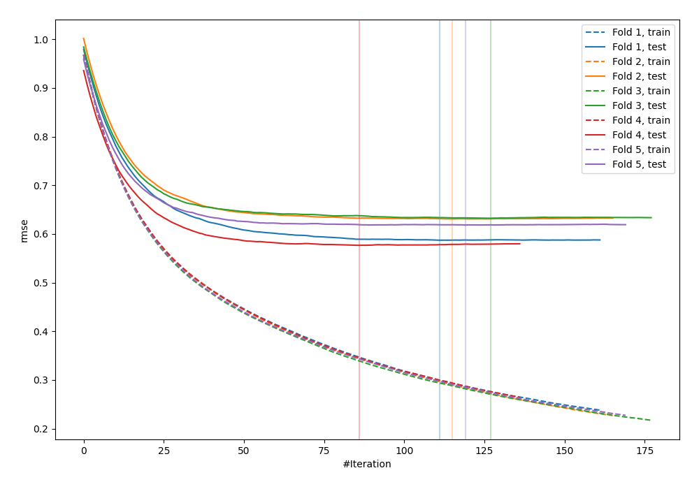
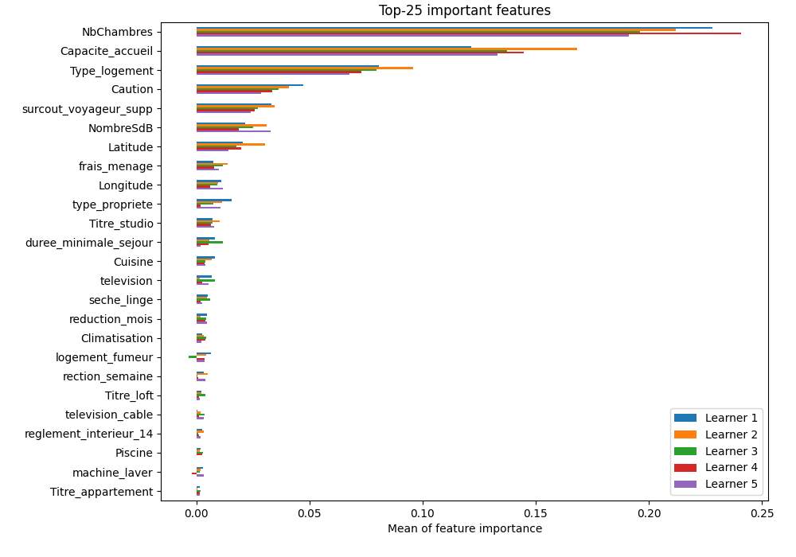

# Summary of 2_Default_LightGBM

[<< Go back](../README.md)

## LightGBM
- **objective**: regression
- **metric**: rmse
- **num_leaves**: 63
- **learning_rate**: 0.05
- **feature_fraction**: 0.9
- **bagging_fraction**: 0.9
- **min_data_in_leaf**: 10
- **explain_level**: 1

## Validation
 - **validation_type**: kfold
 - **k_folds**: 5
 - **shuffle**: True

## Optimized metric
rmse

## Training time

34.7 seconds

### Metric details:
| Metric   |       Score |
|:---------|------------:|
| MAE      |   20.9405   |
| MSE      | 1754.01     |
| RMSE     |   41.8809   |
| R2       |    0.552688 |

## Learning curves

## Permutation-based Importance

[<< Go back](../README.md)
