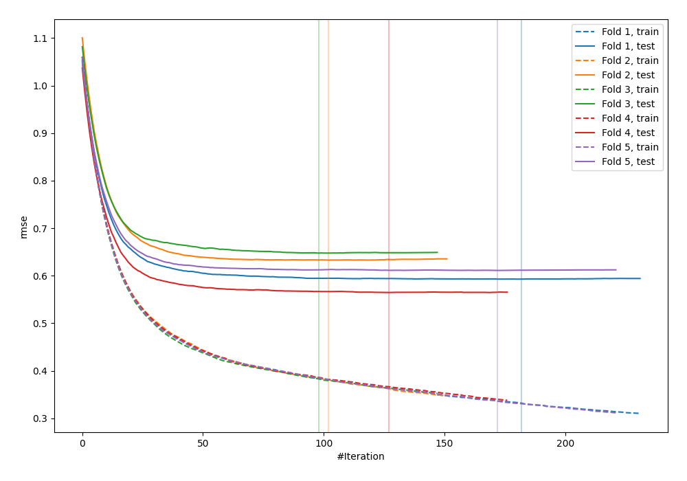
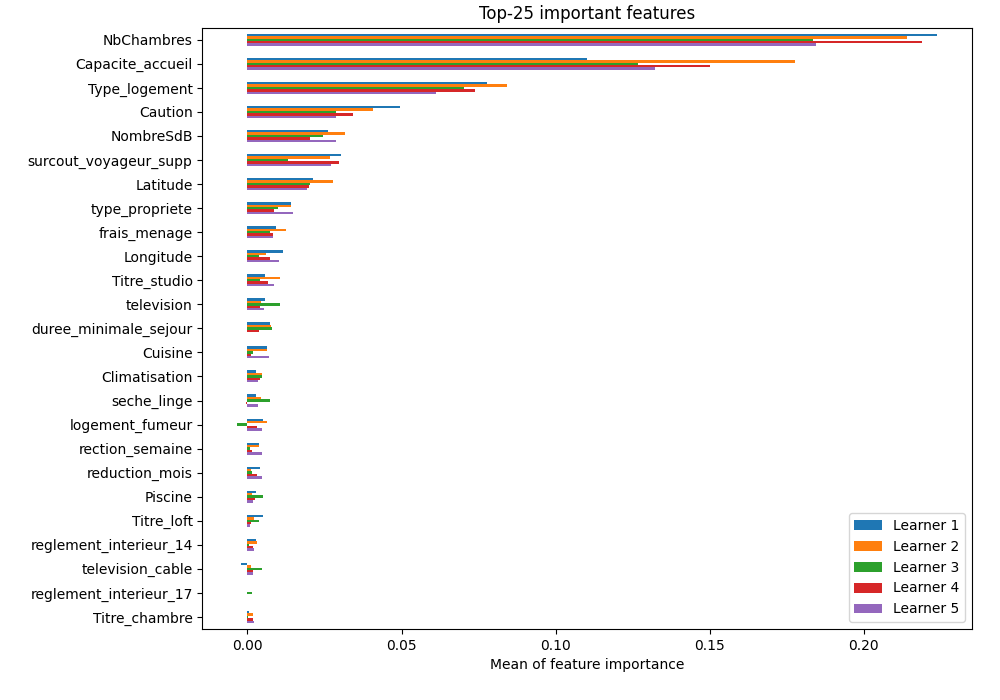

# Summary of 3_Default_Xgboost

[<< Go back](../README.md)

## Extreme Gradient Boosting (Xgboost)
- **objective**: reg:squarederror
- **eval_metric**: rmse
- **eta**: 0.075
- **max_depth**: 6
- **min_child_weight**: 1
- **subsample**: 1.0
- **colsample_bytree**: 1.0
- **explain_level**: 1

## Validation
 - **validation_type**: kfold
 - **k_folds**: 5
 - **shuffle**: True

## Optimized metric
rmse

## Training time

26.9 seconds

### Metric details:
| Metric   |       Score |
|:---------|------------:|
| MAE      |   20.9422   |
| MSE      | 1782.11     |
| RMSE     |   42.2151   |
| R2       |    0.545521 |

## Learning curves

## Permutation-based Importance

[<< Go back](../README.md)
