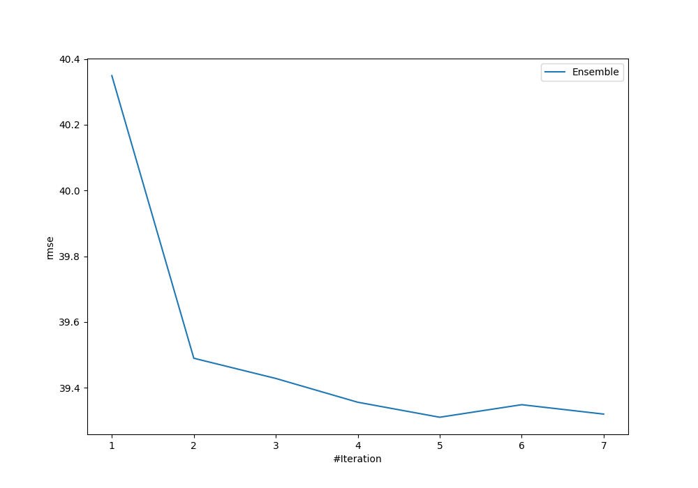

# Summary of Ensemble

[<< Go back](../README.md)

## Ensemble structure
| Model      |   Weight |
|:-----------|---------:|
| 1_Linear   |        3 |
| 5_Xgboost  |        1 |
| 9_LightGBM |        1 |

### Metric details:
| Metric   |       Score |
|:---------|------------:|
| MAE      |   20.746    |
| MSE      | 1545.31     |
| RMSE     |   39.3104   |
| R2       |    0.605911 |

## Learning curves

[<< Go back](../README.md)
