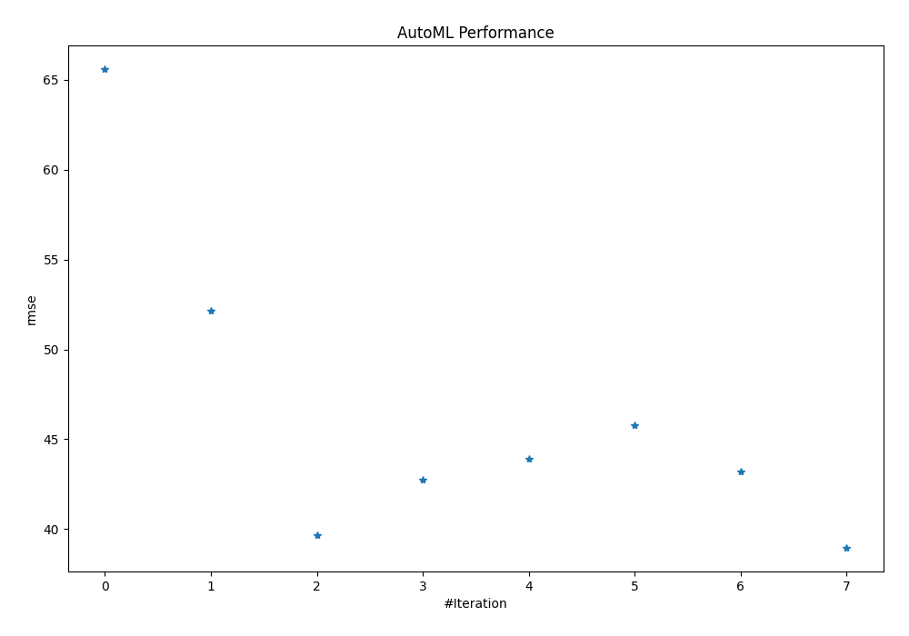
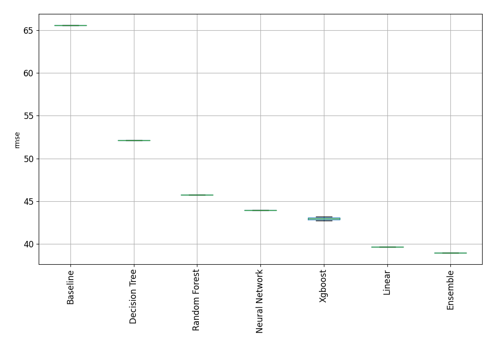

# AutoML Leaderboard

| Best model   | name                                                                             | model_type     | metric_type   |   metric_value |   train_time |
|:-------------|:---------------------------------------------------------------------------------|:---------------|:--------------|---------------:|-------------:|
|              | [1_Baseline](1_Baseline/README.md)                                               | Baseline       | rmse          |        65.581  |         0.21 |
|              | [2_DecisionTree](2_DecisionTree/README.md)                                       | Decision Tree  | rmse          |        52.1432 |        12.51 |
|              | [3_Linear](3_Linear/README.md)                                                   | Linear         | rmse          |        39.6384 |         6.33 |
|              | [4_Default_Xgboost](4_Default_Xgboost/README.md)                                 | Xgboost        | rmse          |        42.7449 |         8.92 |
|              | [5_Default_NeuralNetwork](5_Default_NeuralNetwork/README.md)                     | Neural Network | rmse          |        43.9206 |         2.71 |
|              | [6_Default_RandomForest](6_Default_RandomForest/README.md)                       | Random Forest  | rmse          |        45.7597 |        18.23 |
|              | [4_Default_Xgboost_categorical_mix](4_Default_Xgboost_categorical_mix/README.md) | Xgboost        | rmse          |        43.2199 |         8.65 |
| **the best** | [Ensemble](Ensemble/README.md)                                                   | Ensemble       | rmse          |        38.974  |         0.14 |

### AutoML Performance

### AutoML Performance Boxplot
