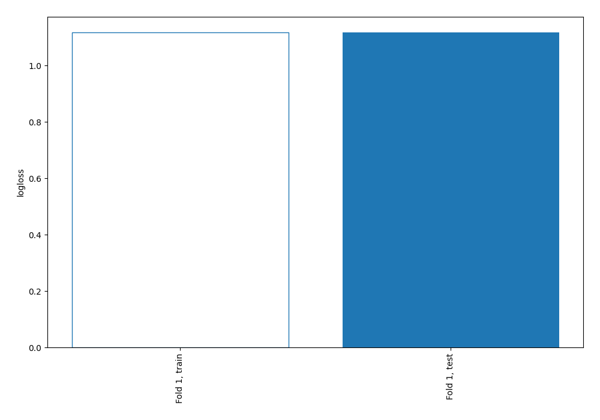

# Summary of 1_Baseline

[<< Go back](../README.md)

## Baseline Classifier (Baseline)
- **n_jobs**: -1
- **num_class**: 4
- **explain_level**: 0

## Validation
 - **validation_type**: split
 - **train_ratio**: 0.75
 - **shuffle**: True
 - **stratify**: True

## Optimized metric
logloss

## Training time

0.8 seconds

### Metric details
|           |            1 |   2 |    3 |    4 |   accuracy |    macro avg |   weighted avg |   logloss |
|:----------|-------------:|----:|-----:|-----:|-----------:|-------------:|---------------:|----------:|
| precision |     0.416757 |   0 |    0 |    0 |   0.416757 |     0.104189 |       0.173686 |   1.11752 |
| recall    |     1        |   0 |    0 |    0 |   0.416757 |     0.25     |       0.416757 |   1.11752 |
| f1-score  |     0.588325 |   0 |    0 |    0 |   0.416757 |     0.147081 |       0.245189 |   1.11752 |
| support   | 10391        | 655 | 3913 | 9974 |   0.416757 | 24933        |   24933        |   1.11752 |

## Confusion matrix
|              |   Predicted as 1 |   Predicted as 2 |   Predicted as 3 |   Predicted as 4 |
|:-------------|-----------------:|-----------------:|-----------------:|-----------------:|
| Labeled as 1 |            10391 |                0 |                0 |                0 |
| Labeled as 2 |              655 |                0 |                0 |                0 |
| Labeled as 3 |             3913 |                0 |                0 |                0 |
| Labeled as 4 |             9974 |                0 |                0 |                0 |

## Learning curves

[<< Go back](../README.md)
