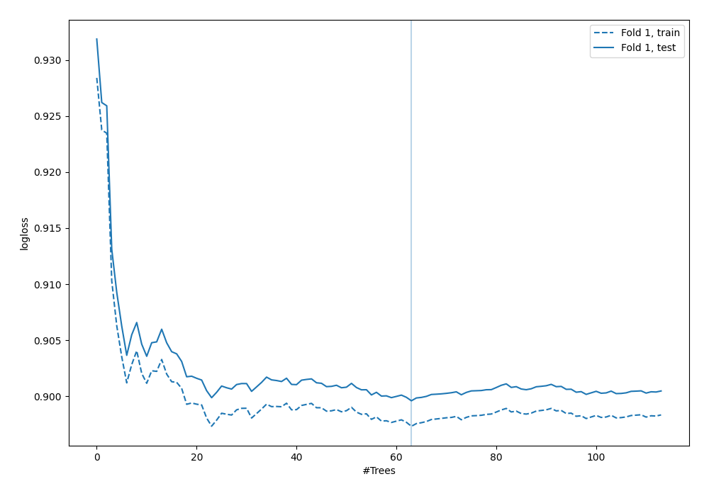

# Summary of 4_Default_RandomForest

[<< Go back](../README.md)

## Random Forest
- **n_jobs**: -1
- **criterion**: gini
- **max_features**: 0.9
- **min_samples_split**: 30
- **max_depth**: 4
- **num_class**: 4
- **explain_level**: 0

## Validation
 - **validation_type**: split
 - **train_ratio**: 0.75
 - **shuffle**: True
 - **stratify**: True

## Optimized metric
logloss

## Training time

15.3 seconds

### Metric details
|           |            1 |   2 |           3 |           4 |   accuracy |    macro avg |   weighted avg |   logloss |
|:----------|-------------:|----:|------------:|------------:|-----------:|-------------:|---------------:|----------:|
| precision |     0.629889 |   0 |    0.474409 |    0.594809 |   0.604099 |     0.424777 |       0.574907 |  0.899588 |
| recall    |     0.82302  |   0 |    0.246358 |    0.556046 |   0.604099 |     0.406356 |       0.604099 |  0.899588 |
| f1-score  |     0.713618 |   0 |    0.324306 |    0.574775 |   0.604099 |     0.403175 |       0.57823  |  0.899588 |
| support   | 10391        | 655 | 3913        | 9974        |   0.604099 | 24933        |   24933        |  0.899588 |

## Confusion matrix
|              |   Predicted as 1 |   Predicted as 2 |   Predicted as 3 |   Predicted as 4 |
|:-------------|-----------------:|-----------------:|-----------------:|-----------------:|
| Labeled as 1 |             8552 |                0 |              250 |             1589 |
| Labeled as 2 |              181 |                0 |              229 |              245 |
| Labeled as 3 |             1005 |                0 |              964 |             1944 |
| Labeled as 4 |             3839 |                0 |              589 |             5546 |

## Learning curves

[<< Go back](../README.md)
