# Exploratory Data Analysis

[<< Go back](../README.md)
## Feature : target
- **Feature type** : continous
- **Missing** : 0.0%
- **Unique** : 43521
- **Count** :613032.0
- **Mean** :625494.5032139431
- **Std** :4669661.413342142
- **Min** :0.15
- **25%th Percentile** : 68932.0
- **50%th Percentile** : 156000.0
- **75%th Percentile** : 275000.0
- **Max** :478090528.0

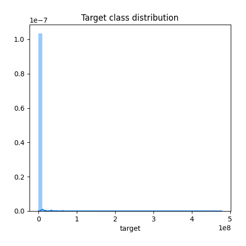
## Feature : No disposition
- **Feature type** : discrete
- **Missing** : 0.0%
- **Unique** : 24
- **Count** :613032.0
- **Mean** :1.0630766420023752
- **Std** :0.521627703216653
- **Min** :1.0
- **25%th Percentile** : 1.0
- **50%th Percentile** : 1.0
- **75%th Percentile** : 1.0
- **Max** :24.0

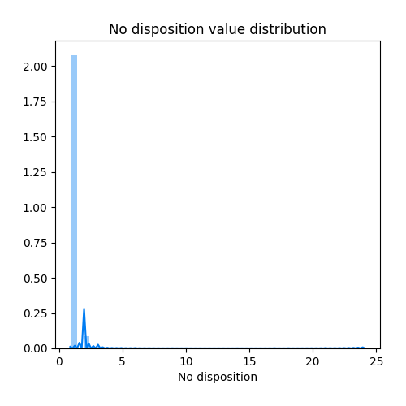
## Feature : Date mutation
- **Feature type** : categorical
- **Missing** : 0.0%
- **Unique** : 175
- **Count** :613032
- **Unique** :175
- **Top** :29/05/2020
- **Freq** :12153

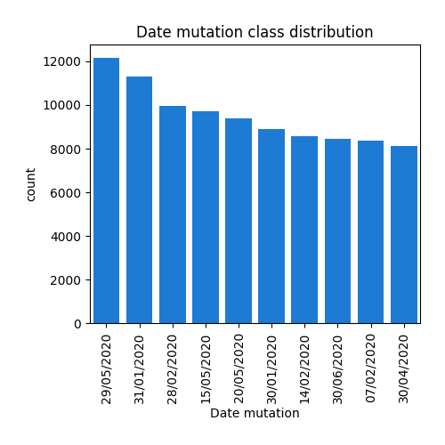
## Feature : Nature mutation
- **Feature type** : discrete
- **Missing** : 0.0%
- **Unique** : 6
- **Count** :613032.0
- **Mean** :3.057298803325112
- **Std** :0.3396854539204841
- **Min** :0.0
- **25%th Percentile** : 3.0
- **50%th Percentile** : 3.0
- **75%th Percentile** : 3.0
- **Max** :5.0

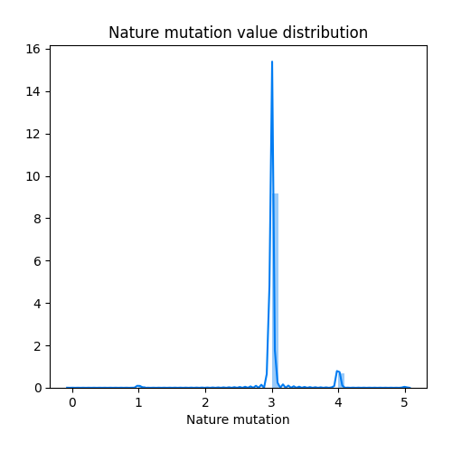
## Feature : No voie
- **Feature type** : continous
- **Missing** : 37.07277923501547%
- **Unique** : 4574
- **Count** :385764.0
- **Mean** :659.3152704762497
- **Std** :1976.3761160065837
- **Min** :1.0
- **25%th Percentile** : 8.0
- **50%th Percentile** : 23.0
- **75%th Percentile** : 82.0
- **Max** :9999.0

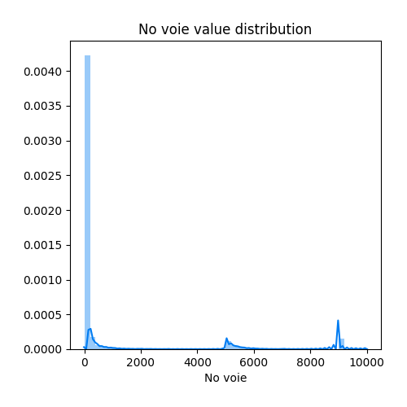
## Feature : Type de voie
- **Feature type** : categorical
- **Missing** : 38.12672095420794%
- **Unique** : 112
- **Count** :379303
- **Unique** :112
- **Top** :RUE
- **Freq** :224690

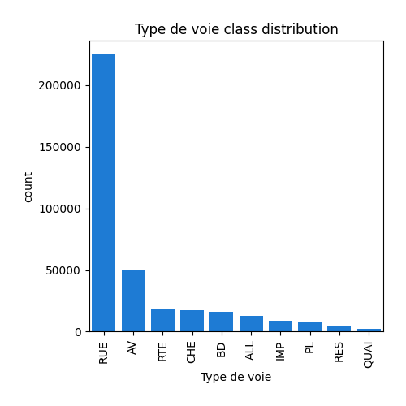
## Feature : Code voie
- **Feature type** : categorical
- **Missing** : 1.1487165433452087%
- **Unique** : 12351
- **Count** :605990
- **Unique** :12351
- **Top** :0020
- **Freq** :3040

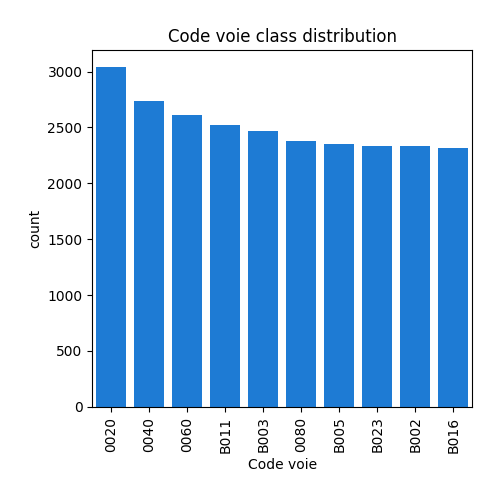
## Feature : Voie
- **Feature type** : categorical
- **Missing** : 1.1557308590742408%
- **Unique** : 139050
- **Count** :605947
- **Unique** :139050
- **Top** :LE VILLAGE
- **Freq** :6078

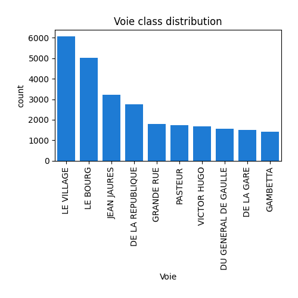
## Feature : Code postal
- **Feature type** : continous
- **Missing** : 1.1495321614532357%
- **Unique** : 5416
- **Count** :605985.0
- **Mean** :54140.85573900344
- **Std** :26710.469129436537
- **Min** :1000.0
- **25%th Percentile** : 33530.0
- **50%th Percentile** : 53140.0
- **75%th Percentile** : 77700.0
- **Max** :97490.0

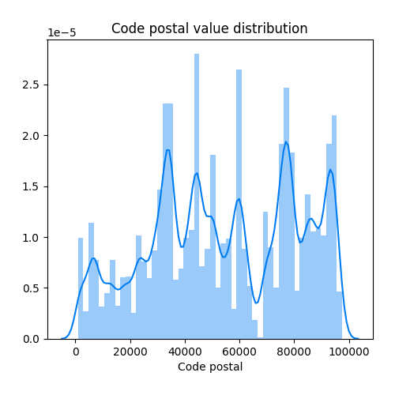
## Feature : Commune
- **Feature type** : categorical
- **Missing** : 0.0%
- **Unique** : 22300
- **Count** :613032
- **Unique** :22300
- **Top** :NICE
- **Freq** :5325

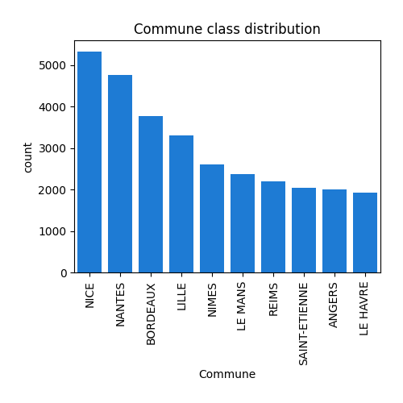
## Feature : Code commune
- **Feature type** : discrete
- **Missing** : 0.0%
- **Unique** : 902
- **Count** :613032.0
- **Mean** :211.71694299808166
- **Std** :170.00861376943504
- **Min** :1.0
- **25%th Percentile** : 79.0
- **50%th Percentile** : 174.0
- **75%th Percentile** : 301.0
- **Max** :909.0

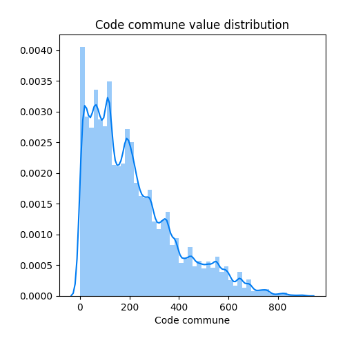
## Feature : Section
- **Feature type** : categorical
- **Missing** : 0.00701431572903209%
- **Unique** : 571
- **Count** :612989
- **Unique** :571
- **Top** :A
- **Freq** :40754

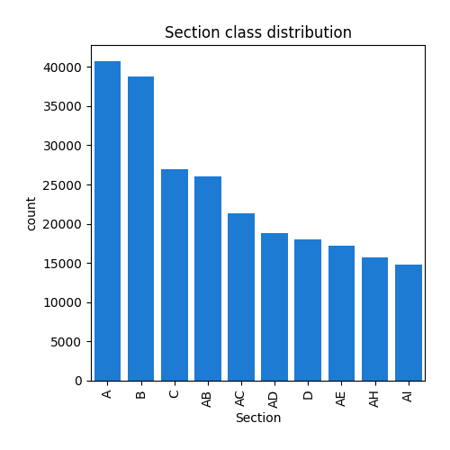
## Feature : No plan
- **Feature type** : discrete
- **Missing** : 0.0%
- **Unique** : 4806
- **Count** :613032.0
- **Mean** :394.6414705920735
- **Std** :556.5971086676831
- **Min** :1.0
- **25%th Percentile** : 84.0
- **50%th Percentile** : 218.0
- **75%th Percentile** : 490.0
- **Max** :9719.0

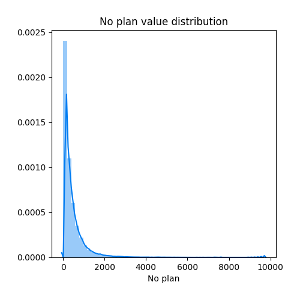
## Feature : Nombre de lots
- **Feature type** : discrete
- **Missing** : 0.0%
- **Unique** : 41
- **Count** :613032.0
- **Mean** :0.4300444348745253
- **Std** :0.7928848219236595
- **Min** :0.0
- **25%th Percentile** : 0.0
- **50%th Percentile** : 0.0
- **75%th Percentile** : 1.0
- **Max** :107.0

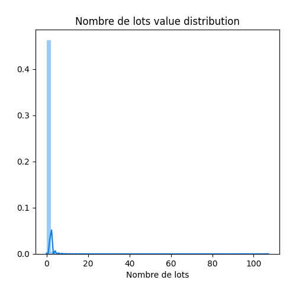
## Feature : Code type local
- **Feature type** : discrete
- **Missing** : 0.0%
- **Unique** : 5
- **Count** :613032.0
- **Mean** :0.11817653890824623
- **Std** :1.2061583975999035
- **Min** :-1.0
- **25%th Percentile** : -1.0
- **50%th Percentile** : 0.0
- **75%th Percentile** : 1.0
- **Max** :3.0

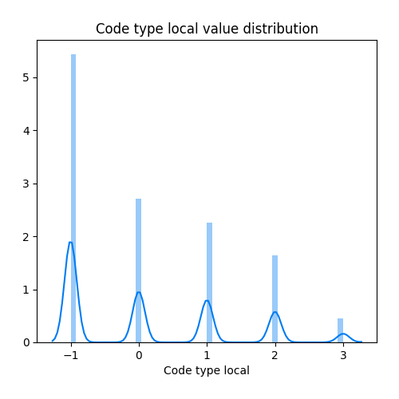
## Feature : Type local
- **Feature type** : discrete
- **Missing** : 0.0%
- **Unique** : 5
- **Count** :613032.0
- **Mean** :0.4209470304975923
- **Std** :1.5774749030471378
- **Min** :-1.0
- **25%th Percentile** : -1.0
- **50%th Percentile** : 0.0
- **75%th Percentile** : 2.0
- **Max** :3.0

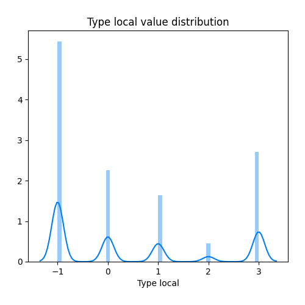
## Feature : Surface reelle bati
- **Feature type** : continous
- **Missing** : 43.49740307194404%
- **Unique** : 1912
- **Count** :346379.0
- **Mean** :81.53000326232248
- **Std** :465.1498668005969
- **Min** :0.0
- **25%th Percentile** : 15.0
- **50%th Percentile** : 60.0
- **75%th Percentile** : 94.0
- **Max** :120005.0

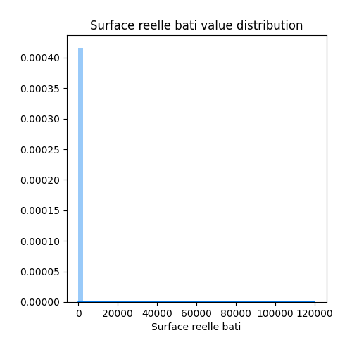
## Feature : Nombre pieces principales
- **Feature type** : continous
- **Missing** : 43.49740307194404%
- **Unique** : 29
- **Count** :346379.0
- **Mean** :2.4572101657433043
- **Std** :2.0912102629195584
- **Min** :0.0
- **25%th Percentile** : 0.0
- **50%th Percentile** : 3.0
- **75%th Percentile** : 4.0
- **Max** :70.0

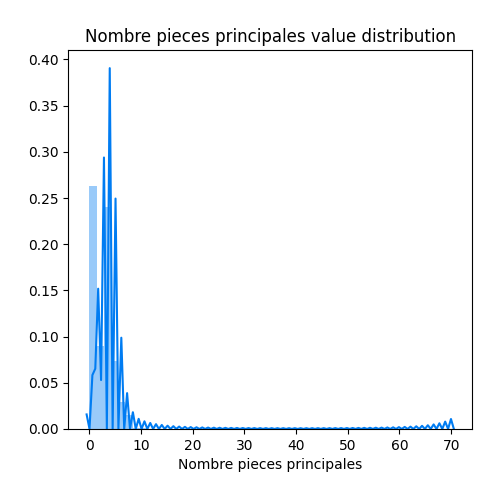
## Feature : Nature culture
- **Feature type** : discrete
- **Missing** : 0.0%
- **Unique** : 28
- **Count** :613032.0
- **Mean** :11.611721737201322
- **Std** :10.71436074667239
- **Min** :-1.0
- **25%th Percentile** : -1.0
- **50%th Percentile** : 14.0
- **75%th Percentile** : 22.0
- **Max** :26.0

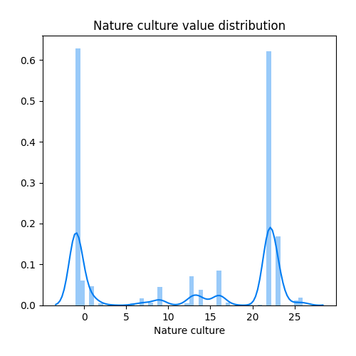
## Feature : Surface terrain
- **Feature type** : continous
- **Missing** : 33.89871980581764%
- **Unique** : 21899
- **Count** :405222.0
- **Mean** :2787.542238575398
- **Std** :14149.663958235597
- **Min** :0.0
- **25%th Percentile** : 217.0
- **50%th Percentile** : 563.0
- **75%th Percentile** : 1578.0
- **Max** :4428607.0

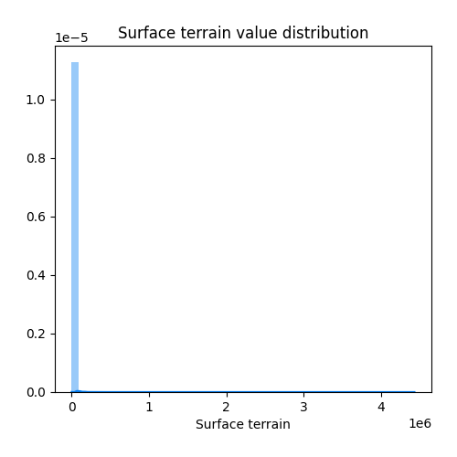

[<< Go back](../README.md)
