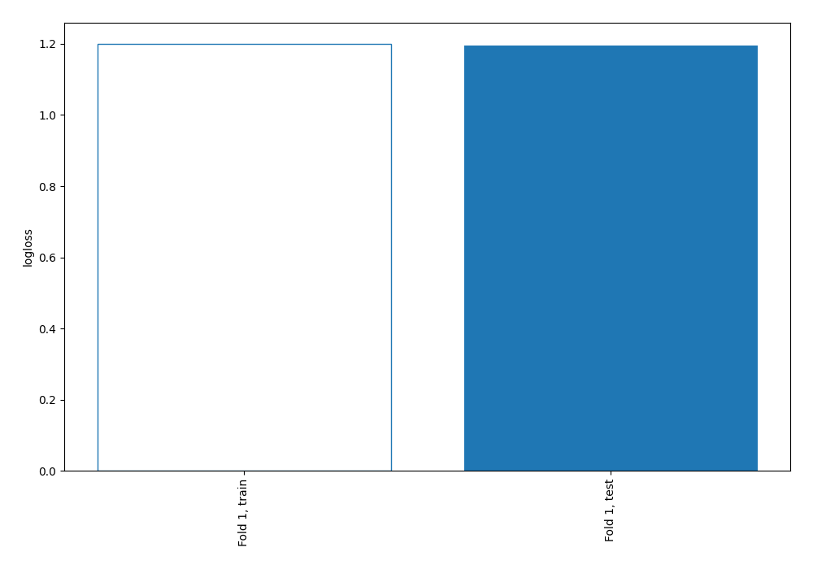

# Summary of 1_Baseline

[<< Go back](../README.md)

## Baseline Classifier (Baseline)
- **num_class**: 6
- **explain_level**: 2

## Validation
 - **validation_type**: split
 - **train_ratio**: 0.75
 - **shuffle**: True
 - **stratify**: True

## Optimized metric
logloss

## Training time

0.1 seconds

### Metric details
|           |   C1 |        C2 |   C3 |   C4 |   C5 |   nan |   accuracy |   macro avg |   weighted avg |   logloss |
|:----------|-----:|----------:|-----:|-----:|-----:|------:|-----------:|------------:|---------------:|----------:|
| precision |    0 |  0.542254 |    0 |    0 |    0 |     0 |   0.542254 |   0.0903756 |       0.294039 |   1.19558 |
| recall    |    0 |  1        |    0 |    0 |    0 |     0 |   0.542254 |   0.166667  |       0.542254 |   1.19558 |
| f1-score  |    0 |  0.703196 |    0 |    0 |    0 |     0 |   0.542254 |   0.117199  |       0.381311 |   1.19558 |
| support   |   43 | 77        |    7 |    5 |    5 |     5 |   0.542254 | 142         |     142        |   1.19558 |

## Confusion matrix
|                |   Predicted as C1 |   Predicted as C2 |   Predicted as C3 |   Predicted as C4 |   Predicted as C5 |   Predicted as nan |
|:---------------|------------------:|------------------:|------------------:|------------------:|------------------:|-------------------:|
| Labeled as C1  |                 0 |                43 |                 0 |                 0 |                 0 |                  0 |
| Labeled as C2  |                 0 |                77 |                 0 |                 0 |                 0 |                  0 |
| Labeled as C3  |                 0 |                 7 |                 0 |                 0 |                 0 |                  0 |
| Labeled as C4  |                 0 |                 5 |                 0 |                 0 |                 0 |                  0 |
| Labeled as C5  |                 0 |                 5 |                 0 |                 0 |                 0 |                  0 |
| Labeled as nan |                 0 |                 5 |                 0 |                 0 |                 0 |                  0 |

## Learning curves

[<< Go back](../README.md)
