# Summary of 4_Default_Xgboost

[<< Go back](../README.md)

## Extreme Gradient Boosting (Xgboost)
- **objective**: multi:softprob
- **eval_metric**: mlogloss
- **eta**: 0.075
- **max_depth**: 6
- **min_child_weight**: 1
- **subsample**: 1.0
- **colsample_bytree**: 1.0
- **num_class**: 6
- **explain_level**: 2

## Validation
 - **validation_type**: split
 - **train_ratio**: 0.75
 - **shuffle**: True
 - **stratify**: True

## Optimized metric
logloss

## Training time

17.3 seconds

### Metric details
|           |        C1 |        C2 |       C3 |       C4 |   C5 |      nan |   accuracy |   macro avg |   weighted avg |   logloss |
|:----------|----------:|----------:|---------:|---------:|-----:|---------:|-----------:|------------:|---------------:|----------:|
| precision |  0.906977 |  0.935897 | 1        | 0.833333 |    1 | 0.833333 |   0.922535 |    0.918257 |       0.925334 |  0.269899 |
| recall    |  0.906977 |  0.948052 | 0.571429 | 1        |    1 | 1        |   0.922535 |    0.90441  |       0.922535 |  0.269899 |
| f1-score  |  0.906977 |  0.941935 | 0.727273 | 0.909091 |    1 | 0.909091 |   0.922535 |    0.899061 |       0.920499 |  0.269899 |
| support   | 43        | 77        | 7        | 5        |    5 | 5        |   0.922535 |  142        |     142        |  0.269899 |

## Confusion matrix
|                |   Predicted as C1 |   Predicted as C2 |   Predicted as C3 |   Predicted as C4 |   Predicted as C5 |   Predicted as nan |
|:---------------|------------------:|------------------:|------------------:|------------------:|------------------:|-------------------:|
| Labeled as C1  |                39 |                 4 |                 0 |                 0 |                 0 |                  0 |
| Labeled as C2  |                 4 |                73 |                 0 |                 0 |                 0 |                  0 |
| Labeled as C3  |                 0 |                 1 |                 4 |                 1 |                 0 |                  1 |
| Labeled as C4  |                 0 |                 0 |                 0 |                 5 |                 0 |                  0 |
| Labeled as C5  |                 0 |                 0 |                 0 |                 0 |                 5 |                  0 |
| Labeled as nan |                 0 |                 0 |                 0 |                 0 |                 0 |                  5 |

## Learning curves
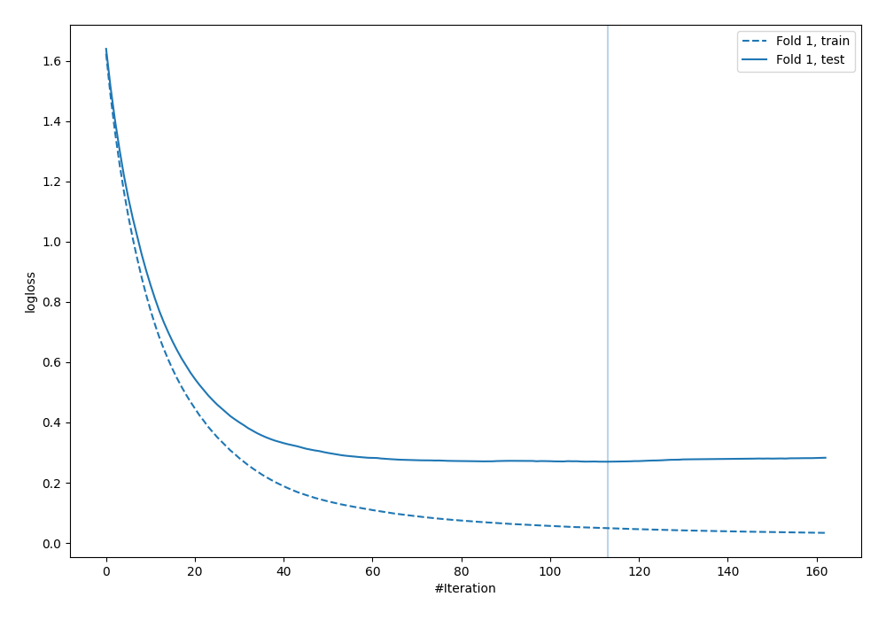

## Permutation-based Importance
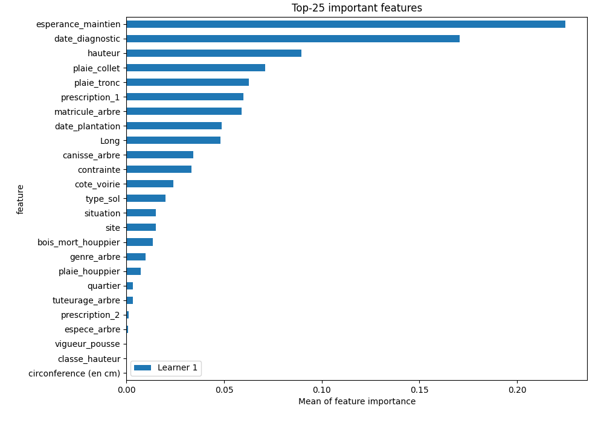

## SHAP Importance
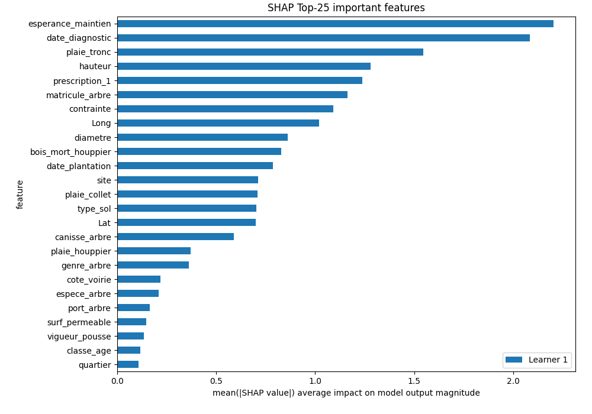

## SHAP Dependence plots

### Dependence C1 (Fold 1)
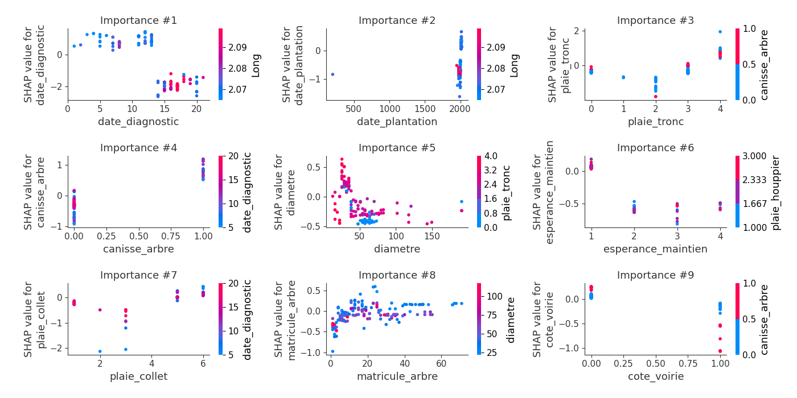
### Dependence C2 (Fold 1)
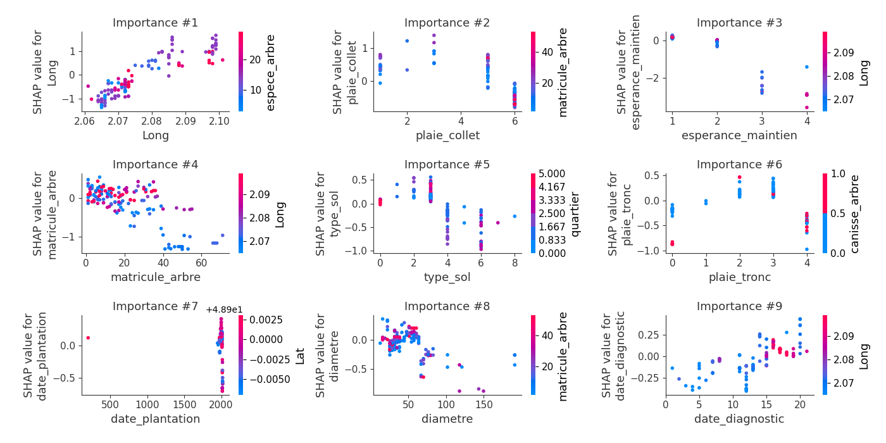
### Dependence C3 (Fold 1)
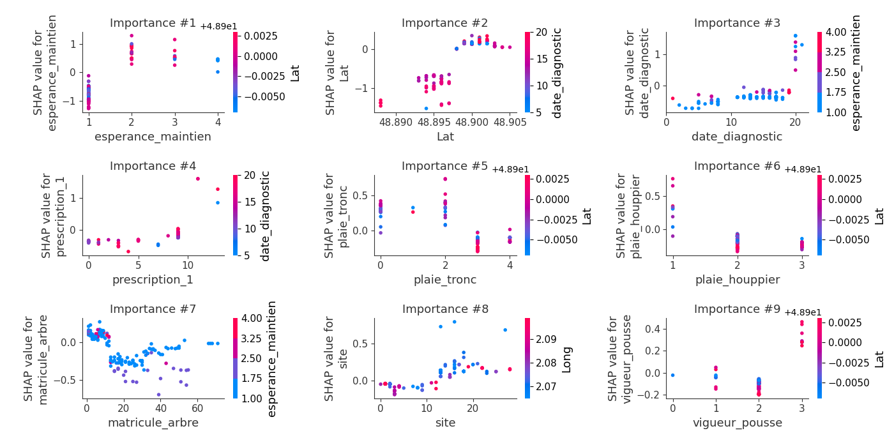
### Dependence C4 (Fold 1)
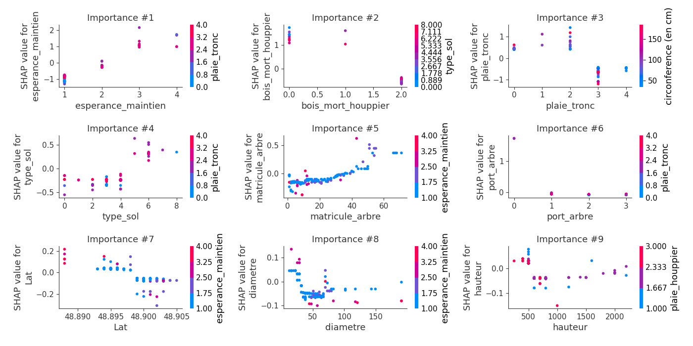
### Dependence C5 (Fold 1)
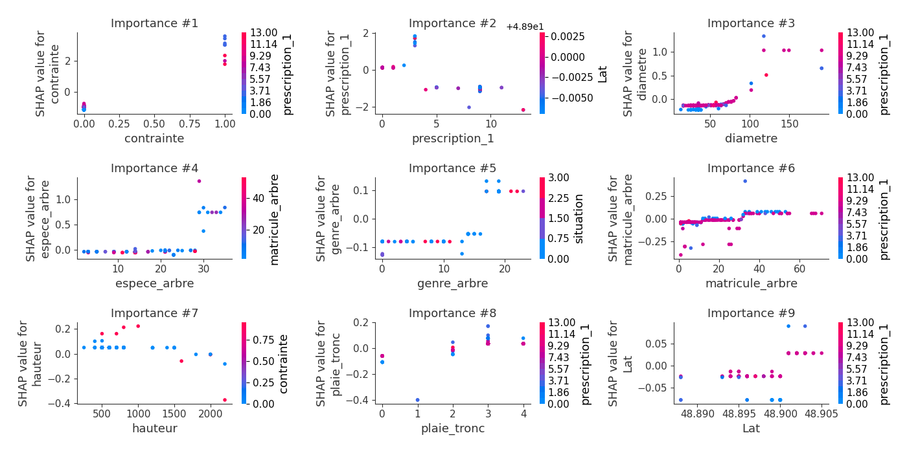
### Dependence nan (Fold 1)
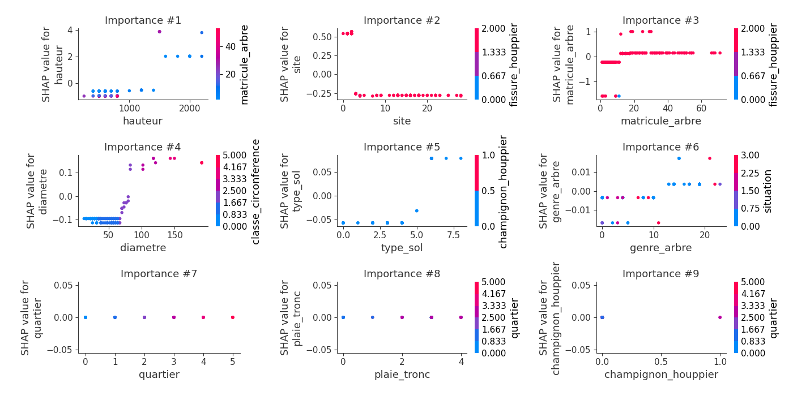

## SHAP Decision plots

### Worst decisions for selected sample 1 (Fold 1)
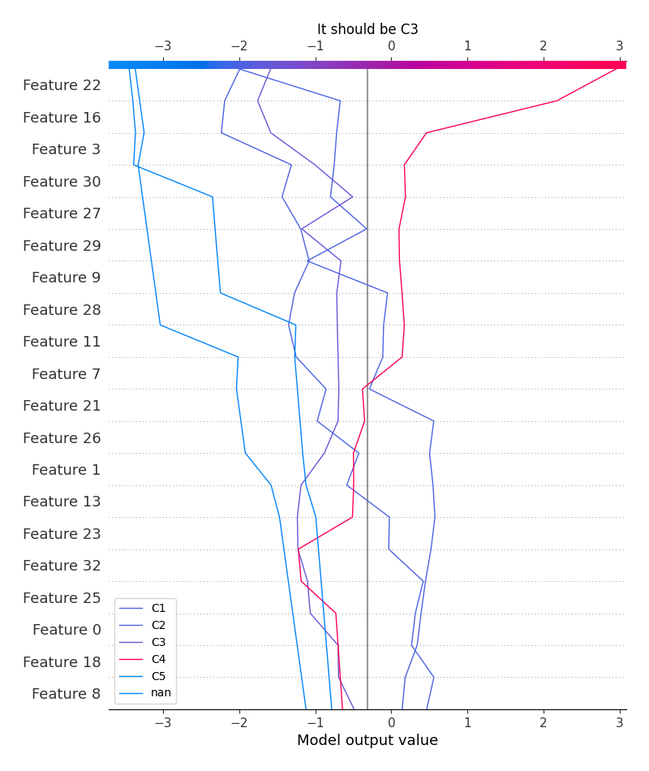
### Worst decisions for selected sample 2 (Fold 1)
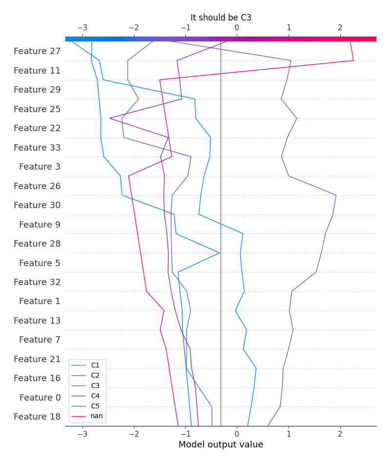
### Worst decisions for selected sample 3 (Fold 1)
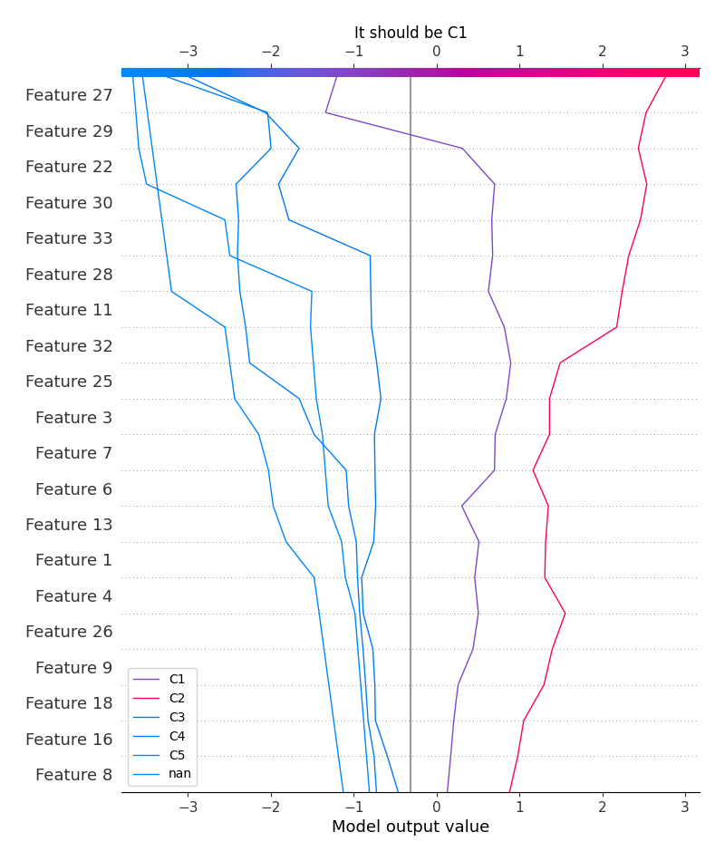
### Worst decisions for selected sample 4 (Fold 1)
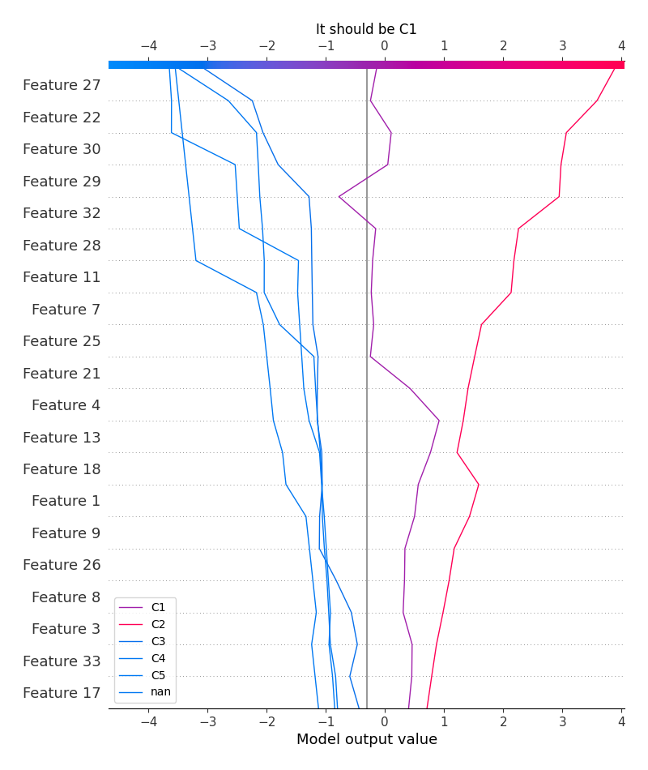
### Best decisions for selected sample 1 (Fold 1)

### Best decisions for selected sample 2 (Fold 1)
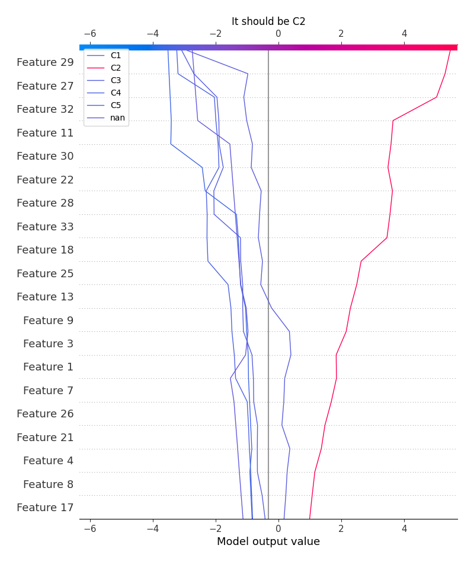
### Best decisions for selected sample 3 (Fold 1)
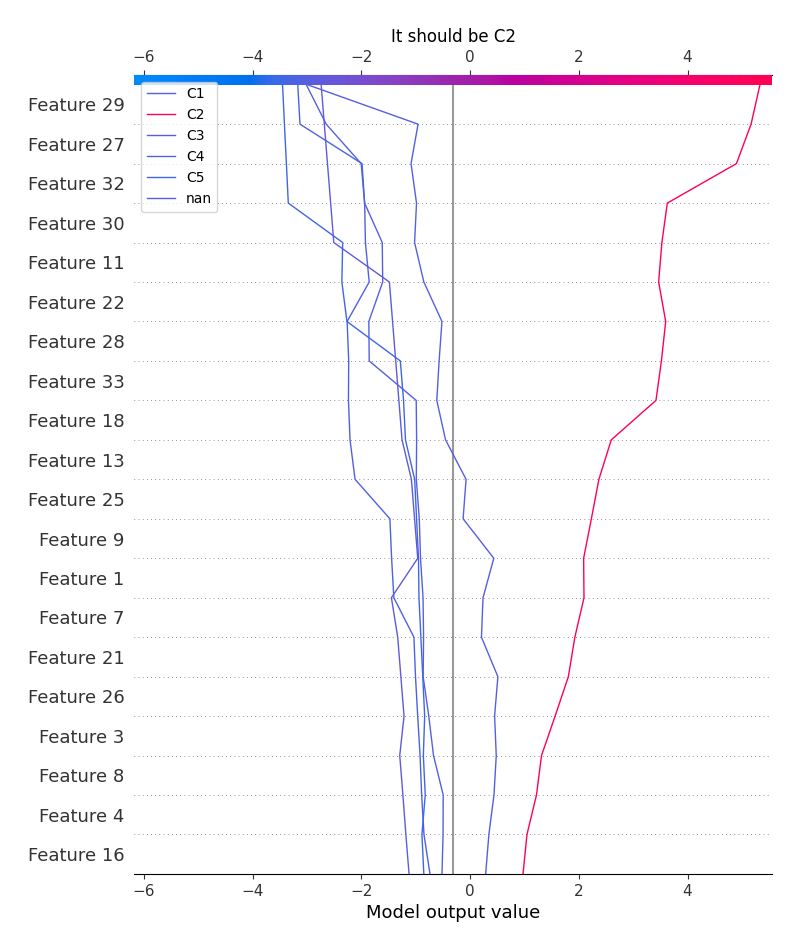
### Best decisions for selected sample 4 (Fold 1)
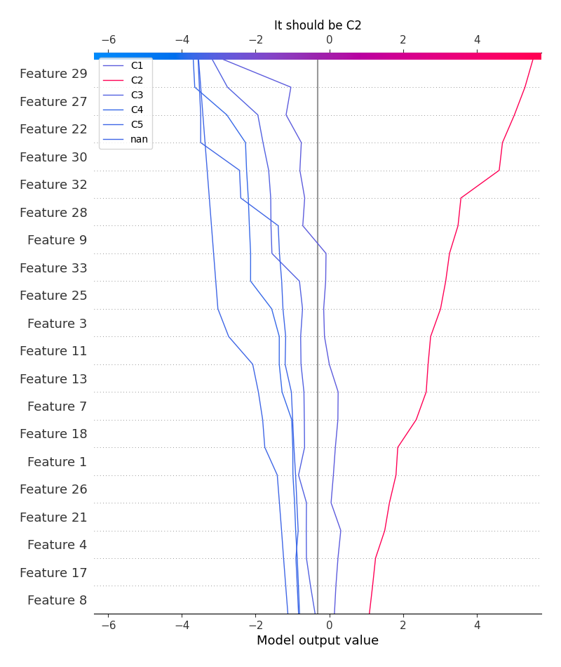

[<< Go back](../README.md)
