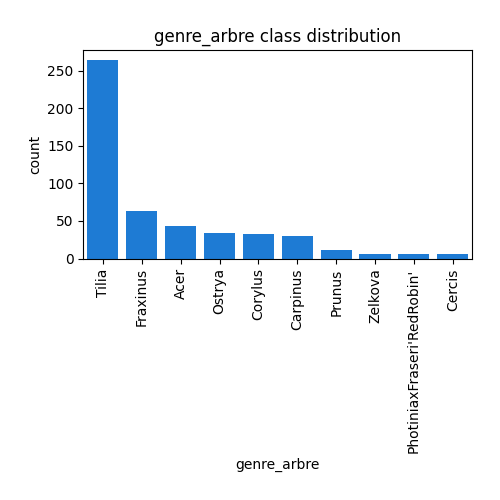
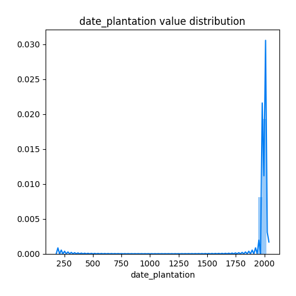
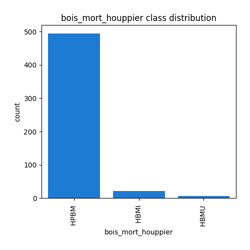
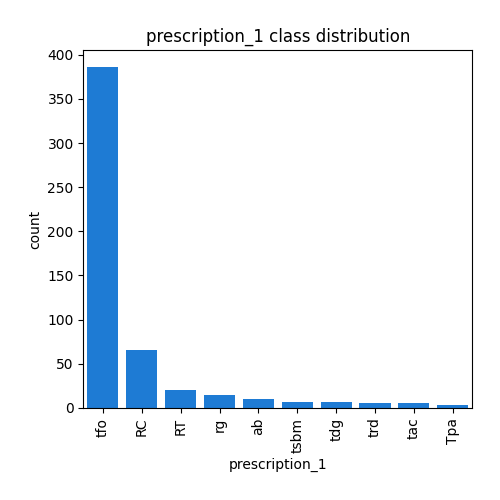
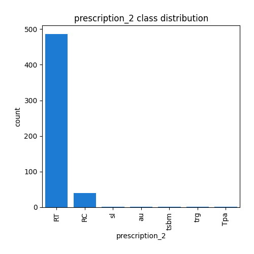

# Exploratory Data Analysis

[<< Go back](../README.md)
## Feature : target
- **Feature type** : categorical
- **Missing** : 0.0%
- **Unique** : 6
- **Count** :531
- **Unique** :6
- **Top** :C2
- **Freq** :308

## Feature : quartier
- **Feature type** : categorical
- **Missing** : 0.0%
- **Unique** : 6
- **Count** :531
- **Unique** :6
- **Top** :Quartier 2 - Alsace - Pereire
- **Freq** :219

## Feature : site
- **Feature type** : categorical
- **Missing** : 0.0%
- **Unique** : 29
- **Count** :531
- **Unique** :29
- **Top** :Avenue du Maréchal Foch
- **Freq** :85

## Feature : cote_voirie
- **Feature type** : categorical
- **Missing** : 0.0%
- **Unique** : 2
- **Count** :531
- **Unique** :2
- **Top** :Impair
- **Freq** :359

## Feature : matricule_arbre
- **Feature type** : discrete
- **Missing** : 0.0%
- **Unique** : 74
- **Count** :531.0
- **Mean** :21.99623352165725
- **Std** :17.95991303856764
- **Min** :1.0
- **25%th Percentile** : 7.0
- **50%th Percentile** : 18.0
- **75%th Percentile** : 32.0
- **Max** :74.0

## Feature : genre_arbre
- **Feature type** : categorical
- **Missing** : 0.0%
- **Unique** : 24
- **Count** :531
- **Unique** :24
- **Top** :Tilia
- **Freq** :264

## Feature : espece_arbre
- **Feature type** : categorical
- **Missing** : 1.1299435028248588%
- **Unique** : 36
- **Count** :525
- **Unique** :36
- **Top** : Europaea -  - Pallida
- **Freq** :243

## Feature : situation
- **Feature type** : categorical
- **Missing** : 0.18832391713747645%
- **Unique** : 4
- **Count** :530
- **Unique** :4
- **Top** :Alignement
- **Freq** :491

## Feature : type_sol
- **Feature type** : categorical
- **Missing** : 0.0%
- **Unique** : 9
- **Count** :531
- **Unique** :9
- **Top** :Gr
- **Freq** :222

## Feature : surf_permeable
- **Feature type** : continous
- **Missing** : 0.0%
- **Unique** : 9
- **Count** :531.0
- **Mean** :7.102636534839925
- **Std** :20.86565998525985
- **Min** :0.0
- **25%th Percentile** : 1.0
- **50%th Percentile** : 1.5
- **75%th Percentile** : 4.0
- **Max** :100.0

## Feature : date_plantation
- **Feature type** : discrete
- **Missing** : 0.0%
- **Unique** : 11
- **Count** :531.0
- **Mean** :1995.1864406779662
- **Std** :79.33940159836452
- **Min** :200.0
- **25%th Percentile** : 1980.0
- **50%th Percentile** : 2000.0
- **75%th Percentile** : 2010.0
- **Max** :2019.0

## Feature : classe_age
- **Feature type** : categorical
- **Missing** : 0.0%
- **Unique** : 4
- **Count** :531
- **Unique** :4
- **Top** :A
- **Freq** :284

## Feature : hauteur
- **Feature type** : discrete
- **Missing** : 0.0%
- **Unique** : 17
- **Count** :531.0
- **Mean** :691.9962335216572
- **Std** :333.2048041298637
- **Min** :250.0
- **25%th Percentile** : 500.0
- **50%th Percentile** : 600.0
- **75%th Percentile** : 800.0
- **Max** :2500.0

## Feature : classe_hauteur
- **Feature type** : categorical
- **Missing** : 0.0%
- **Unique** : 5
- **Count** :531
- **Unique** :5
- **Top** :H2
- **Freq** :259

## Feature : diametre
- **Feature type** : continous
- **Missing** : 0.0%
- **Unique** : 39
- **Count** :531.0
- **Mean** :45.925342750117835
- **Std** :26.379359193274592
- **Min** :12.732395447351628
- **25%th Percentile** : 28.64788975654116
- **50%th Percentile** : 38.197186342054884
- **75%th Percentile** : 57.29577951308232
- **Max** :222.81692032865345

## Feature : circonference (en cm)
- **Feature type** : discrete
- **Missing** : 0.0%
- **Unique** : 39
- **Count** :531.0
- **Mean** :72.13935969868173
- **Std** :41.43660052399891
- **Min** :20.0
- **25%th Percentile** : 45.0
- **50%th Percentile** : 60.0
- **75%th Percentile** : 90.0
- **Max** :350.0

.png)
## Feature : classe_circonference
- **Feature type** : categorical
- **Missing** : 0.0%
- **Unique** : 7
- **Count** :531
- **Unique** :7
- **Top** :C2
- **Freq** :250

## Feature : port_arbre
- **Feature type** : categorical
- **Missing** : 0.0%
- **Unique** : 4
- **Count** :531
- **Unique** :4
- **Top** :R5
- **Freq** :243

## Feature : vigueur_pousse
- **Feature type** : categorical
- **Missing** : 0.0%
- **Unique** : 4
- **Count** :531
- **Unique** :4
- **Top** :P
- **Freq** :470

## Feature : plaie_collet
- **Feature type** : categorical
- **Missing** : 1.3182674199623352%
- **Unique** : 7
- **Count** :524
- **Unique** :7
- **Top** :RCPPL
- **Freq** :280

## Feature : rejet_tronc
- **Feature type** : categorical
- **Missing** : 1.3182674199623352%
- **Unique** : 2
- **Count** :524
- **Unique** :2
- **Top** :Non
- **Freq** :477

## Feature : tuteurage_arbre
- **Feature type** : categorical
- **Missing** : 0.0%
- **Unique** : 4
- **Count** :531
- **Unique** :4
- **Top** :Non
- **Freq** :452

## Feature : canisse_arbre
- **Feature type** : categorical
- **Missing** : 0.0%
- **Unique** : 2
- **Count** :531
- **Unique** :2
- **Top** :Non
- **Freq** :410

## Feature : plaie_tronc
- **Feature type** : categorical
- **Missing** : 1.3182674199623352%
- **Unique** : 6
- **Count** :524
- **Unique** :6
- **Top** :TPLS
- **Freq** :310

## Feature : champignon_houppier
- **Feature type** : categorical
- **Missing** : 1.3182674199623352%
- **Unique** : 2
- **Count** :524
- **Unique** :2
- **Top** :Non
- **Freq** :518

## Feature : insecte_houppier
- **Feature type** : categorical
- **Missing** : 1.3182674199623352%
- **Unique** : 1
- **Count** :524
- **Unique** :1
- **Top** :Non
- **Freq** :524

## Feature : fissure_houppier
- **Feature type** : categorical
- **Missing** : 1.3182674199623352%
- **Unique** : 3
- **Count** :524
- **Unique** :3
- **Top** :HPF 
- **Freq** :521

## Feature : bois_mort_houppier
- **Feature type** : categorical
- **Missing** : 1.3182674199623352%
- **Unique** : 3
- **Count** :524
- **Unique** :3
- **Top** :HPBM 
- **Freq** :495

## Feature : plaie_houppier
- **Feature type** : categorical
- **Missing** : 1.3182674199623352%
- **Unique** : 5
- **Count** :524
- **Unique** :5
- **Top** :HPLS
- **Freq** :397

## Feature : esperance_maintien
- **Feature type** : continous
- **Missing** : 1.3182674199623352%
- **Unique** : 4
- **Count** :524.0
- **Mean** :1.3702290076335877
- **Std** :0.6719959319380361
- **Min** :1.0
- **25%th Percentile** : 1.0
- **50%th Percentile** : 1.0
- **75%th Percentile** : 2.0
- **Max** :4.0

## Feature : contrainte
- **Feature type** : categorical
- **Missing** : 1.3182674199623352%
- **Unique** : 2
- **Count** :524
- **Unique** :2
- **Top** :Non
- **Freq** :506

## Feature : date_diagnostic
- **Feature type** : categorical
- **Missing** : 1.3182674199623352%
- **Unique** : 22
- **Count** :524
- **Unique** :22
- **Top** :2020/11/24
- **Freq** :66

## Feature : prescription_1
- **Feature type** : categorical
- **Missing** : 0.0%
- **Unique** : 14
- **Count** :531
- **Unique** :14
- **Top** :tfo
- **Freq** :386

## Feature : prescription_2
- **Feature type** : categorical
- **Missing** : 0.0%
- **Unique** : 7
- **Count** :531
- **Unique** :7
- **Top** :RT
- **Freq** :486

## Feature : Long
- **Feature type** : continous
- **Missing** : 0.0%
- **Unique** : 34
- **Count** :531.0
- **Mean** :2.078207156308851
- **Std** :0.011444963694727767
- **Min** :2.061
- **25%th Percentile** : 2.069
- **50%th Percentile** : 2.074
- **75%th Percentile** : 2.085
- **Max** :2.101

## Feature : Lat
- **Feature type** : continous
- **Missing** : 0.0%
- **Unique** : 14
- **Count** :531.0
- **Mean** :48.89897551789077
- **Std** :0.0033749022997956496
- **Min** :48.888000000000005
- **25%th Percentile** : 48.896
- **50%th Percentile** : 48.9
- **75%th Percentile** : 48.901
- **Max** :48.905

[<< Go back](../README.md)
