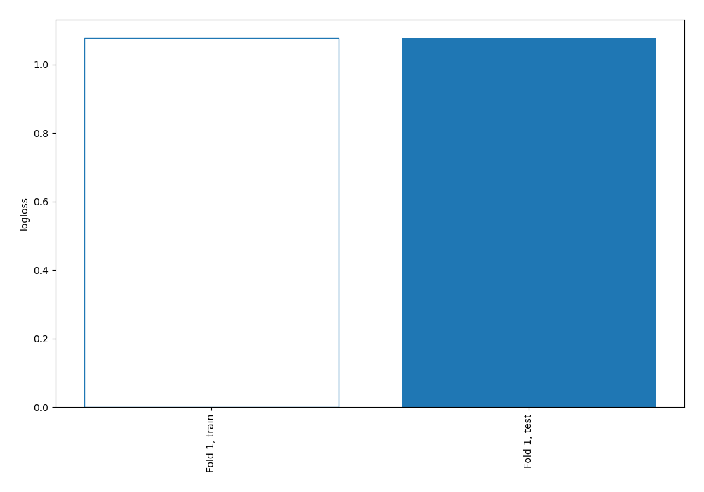

# Summary of 1_Baseline

[<< Go back](../README.md)

## Baseline Classifier (Baseline)
- **num_class**: 4
- **explain_level**: 0

## Validation
 - **validation_type**: split
 - **train_ratio**: 0.75
 - **shuffle**: True
 - **stratify**: True

## Optimized metric
logloss

## Training time

1.6 seconds

### Metric details
|           |            1 |    2 |    3 |     4 |   accuracy |    macro avg |   weighted avg |   logloss |
|:----------|-------------:|-----:|-----:|------:|-----------:|-------------:|---------------:|----------:|
| precision |     0.450041 |    0 |    0 |     0 |   0.450041 |     0.11251  |       0.202537 |   1.07752 |
| recall    |     1        |    0 |    0 |     0 |   0.450041 |     0.25     |       0.450041 |   1.07752 |
| f1-score  |     0.620729 |    0 |    0 |     0 |   0.450041 |     0.155182 |       0.279353 |   1.07752 |
| support   | 21390        | 1024 | 6336 | 18779 |   0.450041 | 47529        |   47529        |   1.07752 |

## Confusion matrix
|              |   Predicted as 1 |   Predicted as 2 |   Predicted as 3 |   Predicted as 4 |
|:-------------|-----------------:|-----------------:|-----------------:|-----------------:|
| Labeled as 1 |            21390 |                0 |                0 |                0 |
| Labeled as 2 |             1024 |                0 |                0 |                0 |
| Labeled as 3 |             6336 |                0 |                0 |                0 |
| Labeled as 4 |            18779 |                0 |                0 |                0 |

## Learning curves

[<< Go back](../README.md)
