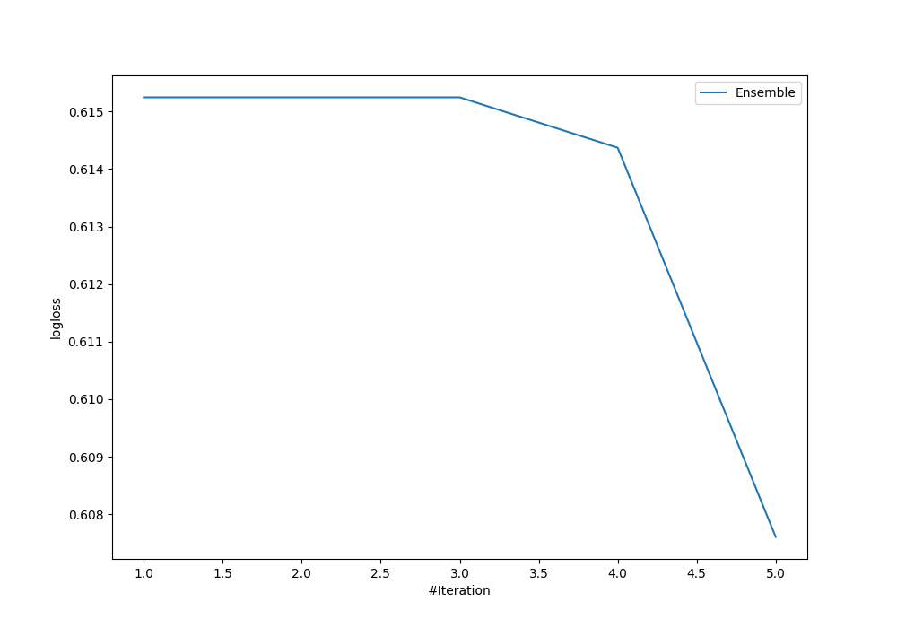

# Summary of Ensemble

[<< Go back](../README.md)

## Ensemble structure
| Model                  |   Weight |
|:-----------------------|---------:|
| 4_Default_Xgboost      |        4 |
| 5_Default_RandomForest |        1 |

### Metric details
|           |            1 |           2 |           3 |            4 |   accuracy |    macro avg |   weighted avg |   logloss |
|:----------|-------------:|------------:|------------:|-------------:|-----------:|-------------:|---------------:|----------:|
| precision |     0.797853 |    0.716599 |    0.668737 |     0.751823 |   0.764817 |     0.733753 |       0.760703 |  0.607605 |
| recall    |     0.861524 |    0.345703 |    0.543876 |     0.752063 |   0.764817 |     0.625792 |       0.764817 |  0.607605 |
| f1-score  |     0.828467 |    0.466403 |    0.599878 |     0.751943 |   0.764817 |     0.661673 |       0.759959 |  0.607605 |
| support   | 21390        | 1024        | 6336        | 18779        |   0.764817 | 47529        |   47529        |  0.607605 |

## Confusion matrix
|              |   Predicted as 1 |   Predicted as 2 |   Predicted as 3 |   Predicted as 4 |
|:-------------|-----------------:|-----------------:|-----------------:|-----------------:|
| Labeled as 1 |            18428 |               29 |              401 |             2532 |
| Labeled as 2 |              125 |              354 |              328 |              217 |
| Labeled as 3 |              890 |               87 |             3446 |             1913 |
| Labeled as 4 |             3654 |               24 |              978 |            14123 |

## Learning curves

[<< Go back](../README.md)
