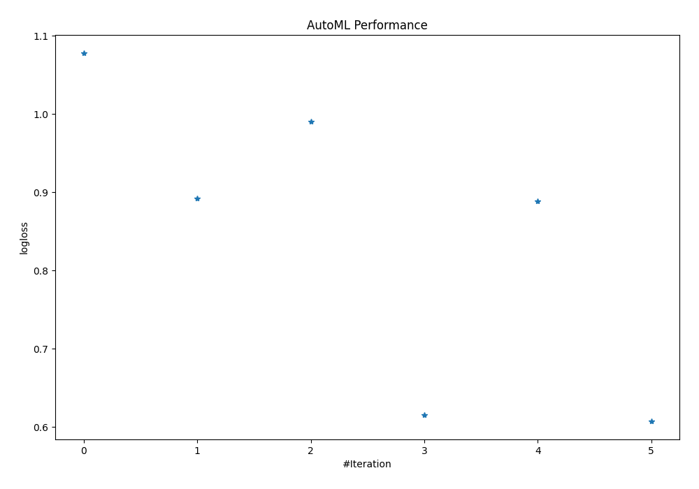
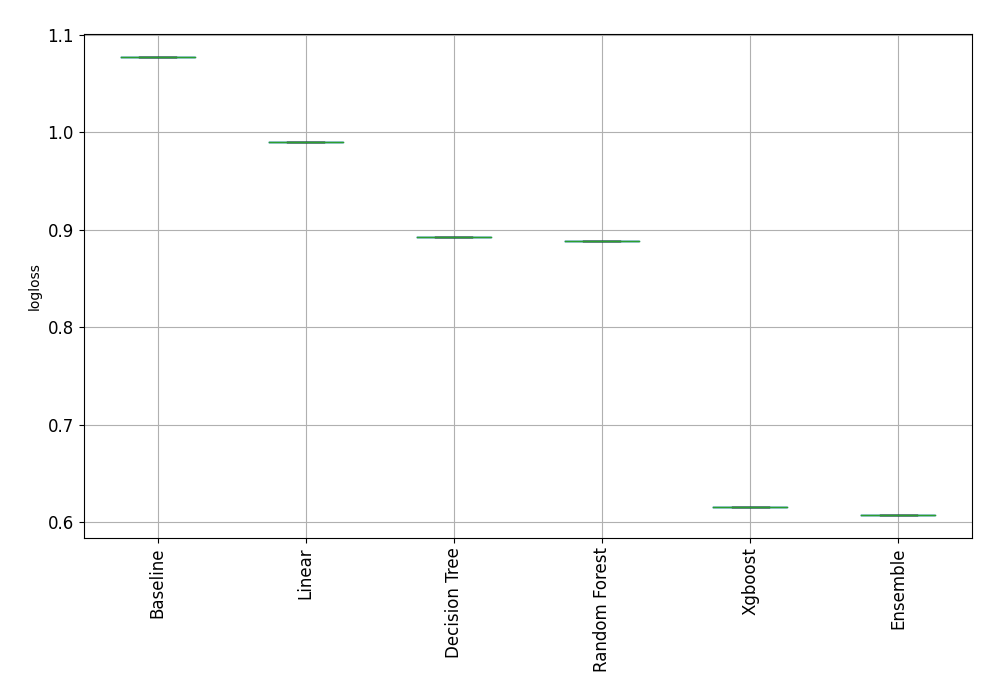

# AutoML Leaderboard

| Best model   | name                                                       | model_type    | metric_type   |   metric_value |   train_time |
|:-------------|:-----------------------------------------------------------|:--------------|:--------------|---------------:|-------------:|
|              | [1_Baseline](1_Baseline/README.md)                         | Baseline      | logloss       |       1.07752  |         2.09 |
|              | [2_DecisionTree](2_DecisionTree/README.md)                 | Decision Tree | logloss       |       0.892098 |         2.69 |
|              | [3_Linear](3_Linear/README.md)                             | Linear        | logloss       |       0.990101 |        19.78 |
|              | [4_Default_Xgboost](4_Default_Xgboost/README.md)           | Xgboost       | logloss       |       0.615246 |       450.64 |
|              | [5_Default_RandomForest](5_Default_RandomForest/README.md) | Random Forest | logloss       |       0.888669 |        15.97 |
| **the best** | [Ensemble](Ensemble/README.md)                             | Ensemble      | logloss       |       0.607605 |         1.3  |

### AutoML Performance

### AutoML Performance Boxplot
