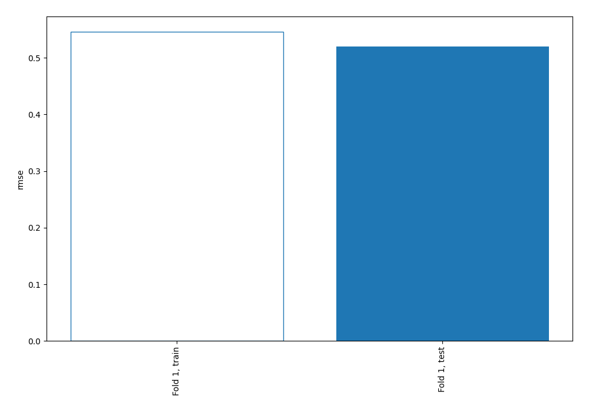

# Summary of 1_Baseline

[<< Go back](../README.md)

## Baseline Regressor (Baseline)
- **explain_level**: 2

## Validation
 - **validation_type**: split
 - **train_ratio**: 0.75
 - **shuffle**: True

## Optimized metric
rmse

## Training time

0.1 seconds

### Metric details:
| Metric   |        Score |
|:---------|-------------:|
| MAE      |  0.418359    |
| MSE      |  0.270377    |
| RMSE     |  0.519978    |
| R2       | -0.000575377 |

## Learning curves

[<< Go back](../README.md)
