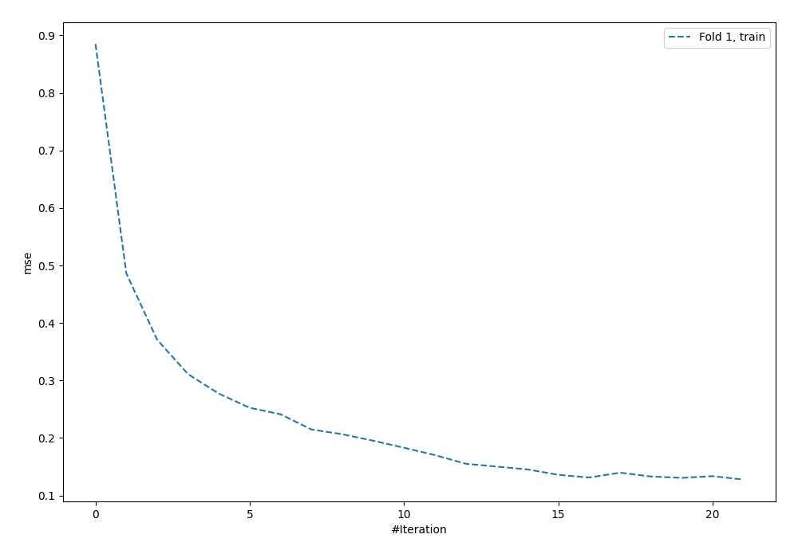

# Summary of 4_Default_NeuralNetwork

[<< Go back](../README.md)

## Neural Network
- **dense_1_size**: 32
- **dense_2_size**: 16
- **learning_rate**: 0.05
- **explain_level**: 2

## Validation
 - **validation_type**: split
 - **train_ratio**: 0.75
 - **shuffle**: True

## Optimized metric
rmse

## Training time

1.8 seconds

### Metric details:
| Metric   |    Score |
|:---------|---------:|
| MAE      | 0.292905 |
| MSE      | 0.162689 |
| RMSE     | 0.403348 |
| R2       | 0.397941 |

## Learning curves

## Permutation-based Importance

[<< Go back](../README.md)
