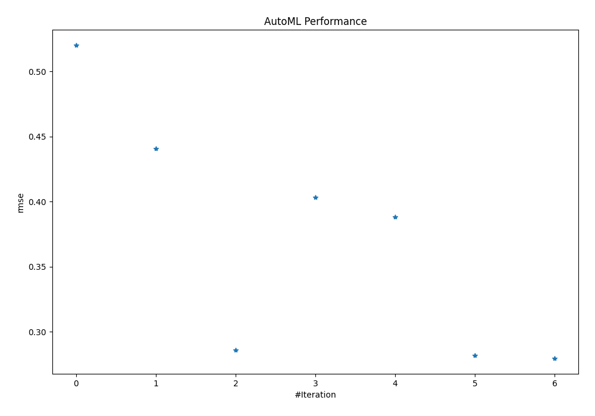

# AutoML Leaderboard

| Best model   | name                                                                             | model_type     | metric_type   |   metric_value |   train_time |
|:-------------|:---------------------------------------------------------------------------------|:---------------|:--------------|---------------:|-------------:|
|              | [1_Baseline](1_Baseline/README.md)                                               | Baseline       | rmse          |       0.519978 |         0.21 |
|              | [2_DecisionTree](2_DecisionTree/README.md)                                       | Decision Tree  | rmse          |       0.440668 |        12.16 |
|              | [3_Default_Xgboost](3_Default_Xgboost/README.md)                                 | Xgboost        | rmse          |       0.285951 |         6.04 |
|              | [4_Default_NeuralNetwork](4_Default_NeuralNetwork/README.md)                     | Neural Network | rmse          |       0.403348 |         2.24 |
|              | [5_Default_RandomForest](5_Default_RandomForest/README.md)                       | Random Forest  | rmse          |       0.388133 |         7.98 |
|              | [3_Default_Xgboost_categorical_mix](3_Default_Xgboost_categorical_mix/README.md) | Xgboost        | rmse          |       0.281749 |         8.5  |
| **the best** | [Ensemble](Ensemble/README.md)                                                   | Ensemble       | rmse          |       0.279767 |         0.1  |

### AutoML Performance

### AutoML Performance Boxplot
