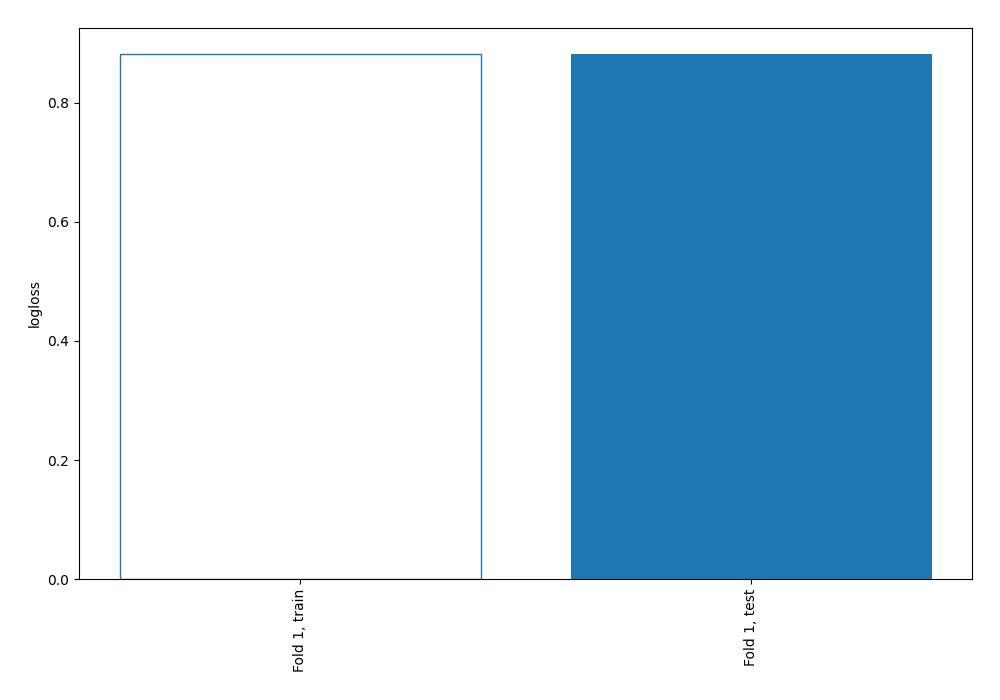

# Summary of 1_Baseline

[<< Go back](../README.md)

## Baseline Classifier (Baseline)
- **num_class**: 4
- **explain_level**: 2

## Validation
 - **validation_type**: split
 - **train_ratio**: 0.75
 - **shuffle**: True
 - **stratify**: True

## Optimized metric
logloss

## Training time

0.2 seconds

### Metric details
|           |   0 |   1 |           2 |    3 |   accuracy |   macro avg |   weighted avg |   logloss |
|:----------|----:|----:|------------:|-----:|-----------:|------------:|---------------:|----------:|
| precision |   0 |   0 |    0.496483 |    0 |   0.496483 |    0.124121 |       0.246495 |  0.881415 |
| recall    |   0 |   0 |    1        |    0 |   0.496483 |    0.25     |       0.496483 |  0.881415 |
| f1-score  |   0 |   0 |    0.663533 |    0 |   0.496483 |    0.165883 |       0.329433 |  0.881415 |
| support   | 282 |  19 | 2682        | 2419 |   0.496483 | 5402        |    5402        |  0.881415 |

## Confusion matrix
|              |   Predicted as 0 |   Predicted as 1 |   Predicted as 2 |   Predicted as 3 |
|:-------------|-----------------:|-----------------:|-----------------:|-----------------:|
| Labeled as 0 |                0 |                0 |              282 |                0 |
| Labeled as 1 |                0 |                0 |               19 |                0 |
| Labeled as 2 |                0 |                0 |             2682 |                0 |
| Labeled as 3 |                0 |                0 |             2419 |                0 |

## Learning curves

[<< Go back](../README.md)
