# Summary of 2_DecisionTree

[<< Go back](../README.md)

## Decision Tree
- **criterion**: entropy
- **max_depth**: 4
- **num_class**: 4
- **explain_level**: 2

## Validation
 - **validation_type**: split
 - **train_ratio**: 0.75
 - **shuffle**: True
 - **stratify**: True

## Optimized metric
logloss

## Training time

16.3 seconds

### Metric details
|           |   0 |   1 |           2 |           3 |   accuracy |   macro avg |   weighted avg |   logloss |
|:----------|----:|----:|------------:|------------:|-----------:|------------:|---------------:|----------:|
| precision |   0 |   0 |    0.603942 |    0.640371 |   0.618475 |    0.311078 |       0.586603 |  0.807468 |
| recall    |   0 |   0 |    0.731171 |    0.570484 |   0.618475 |    0.325414 |       0.618475 |  0.807468 |
| f1-score  |   0 |   0 |    0.661494 |    0.603411 |   0.618475 |    0.316226 |       0.598626 |  0.807468 |
| support   | 282 |  19 | 2682        | 2419        |   0.618475 | 5402        |    5402        |  0.807468 |

## Confusion matrix
|              |   Predicted as 0 |   Predicted as 1 |   Predicted as 2 |   Predicted as 3 |
|:-------------|-----------------:|-----------------:|-----------------:|-----------------:|
| Labeled as 0 |                0 |                0 |              232 |               50 |
| Labeled as 1 |                0 |                0 |               15 |                4 |
| Labeled as 2 |                0 |                0 |             1961 |              721 |
| Labeled as 3 |                0 |                0 |             1039 |             1380 |

## Learning curves
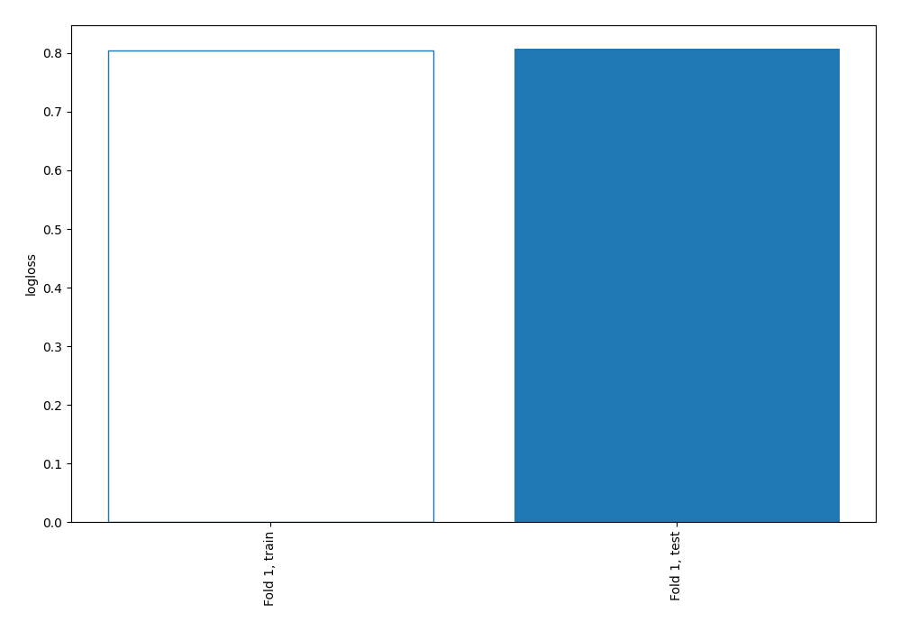

## Permutation-based Importance
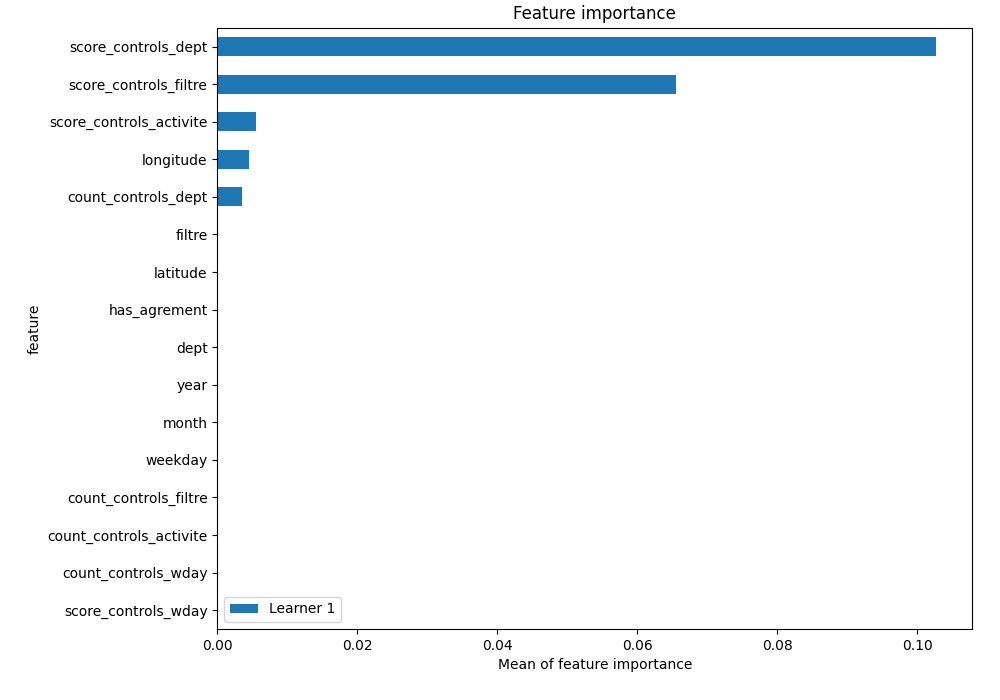

## SHAP Importance
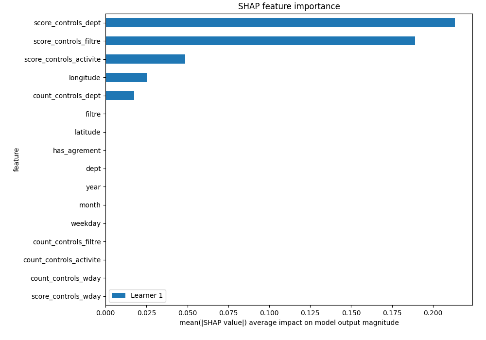

## SHAP Dependence plots

### Dependence 0 (Fold 1)
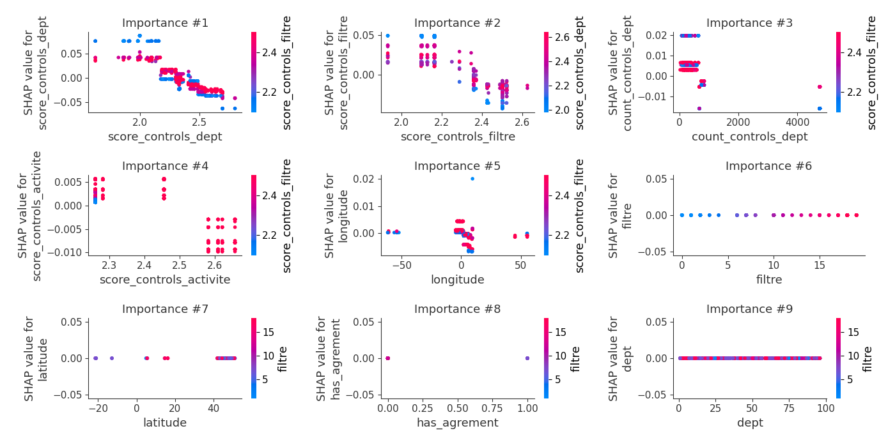
### Dependence 1 (Fold 1)
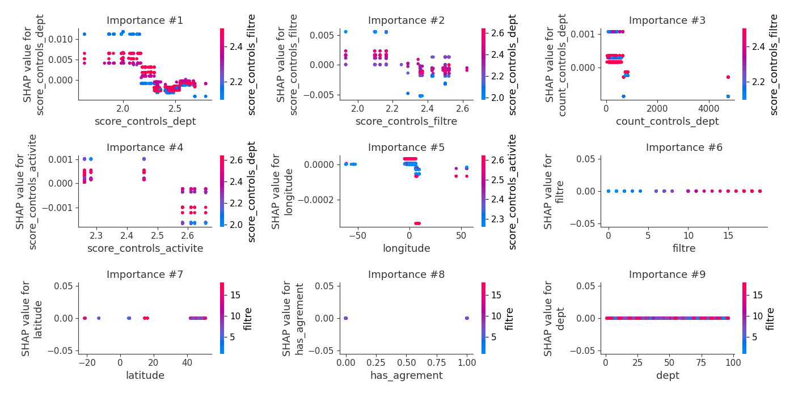
### Dependence 2 (Fold 1)
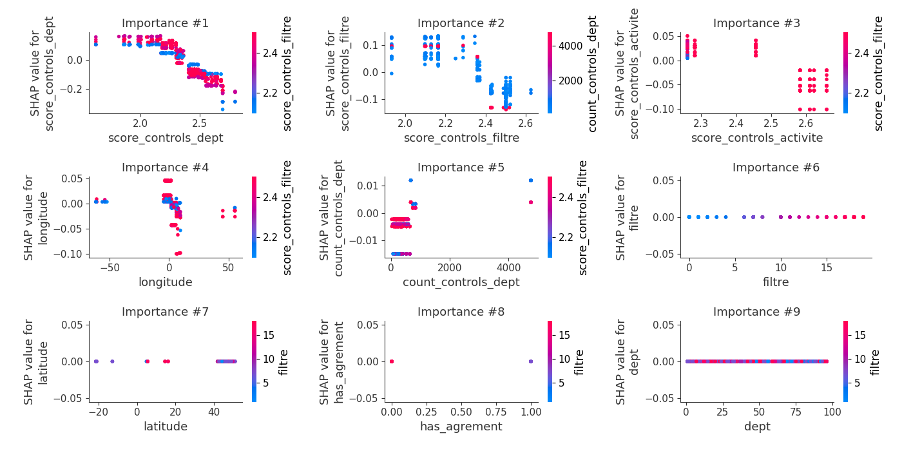
### Dependence 3 (Fold 1)
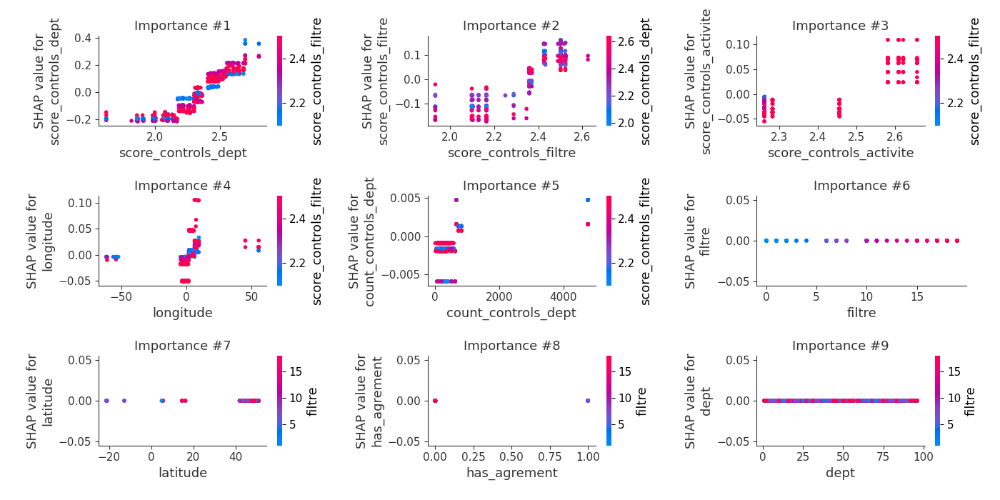

## SHAP Decision plots

### Worst decisions for selected sample 1 (Fold 1)

### Worst decisions for selected sample 2 (Fold 1)
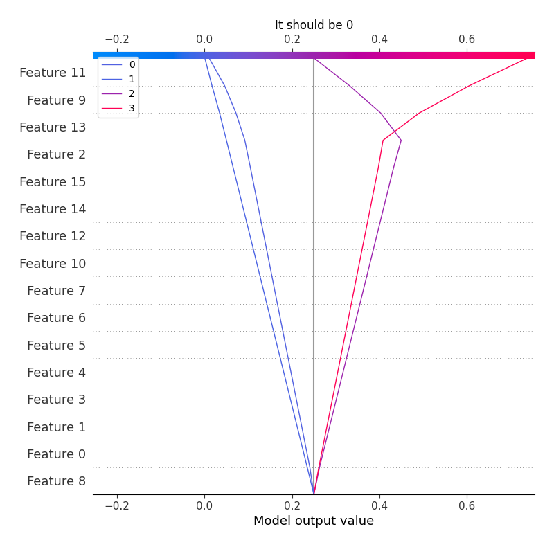
### Worst decisions for selected sample 3 (Fold 1)
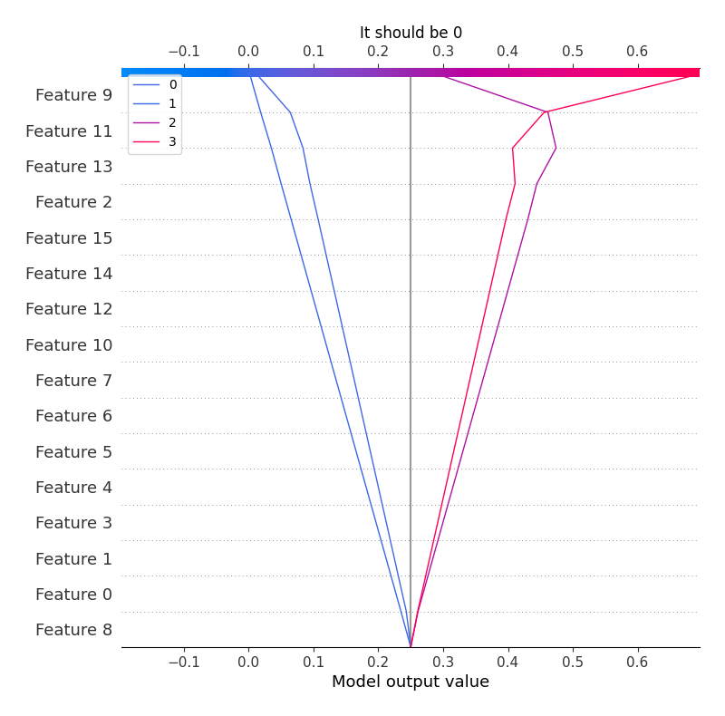
### Worst decisions for selected sample 4 (Fold 1)
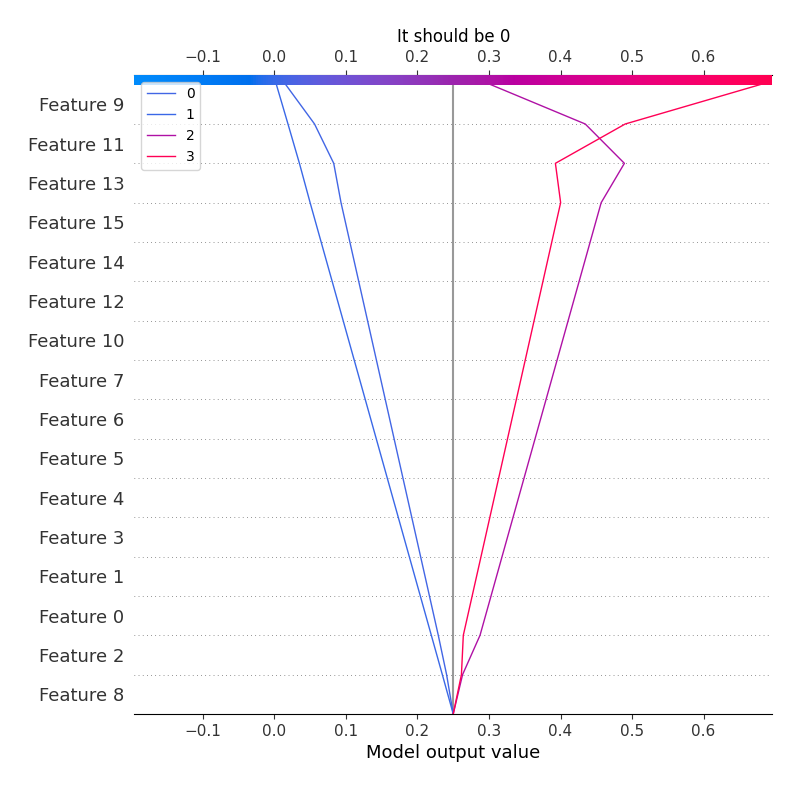
### Best decisions for selected sample 1 (Fold 1)
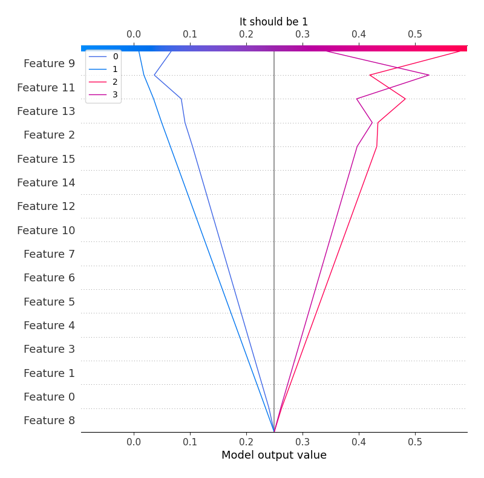
### Best decisions for selected sample 2 (Fold 1)

### Best decisions for selected sample 3 (Fold 1)
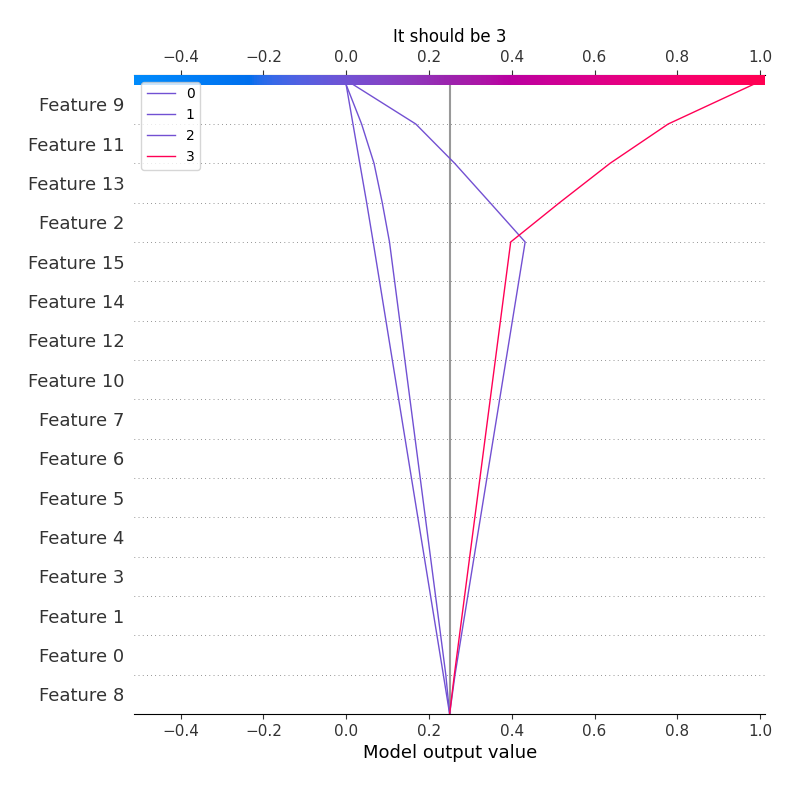
### Best decisions for selected sample 4 (Fold 1)
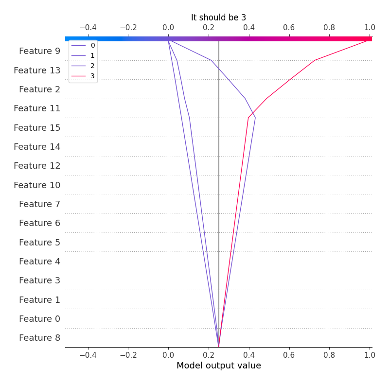

[<< Go back](../README.md)
