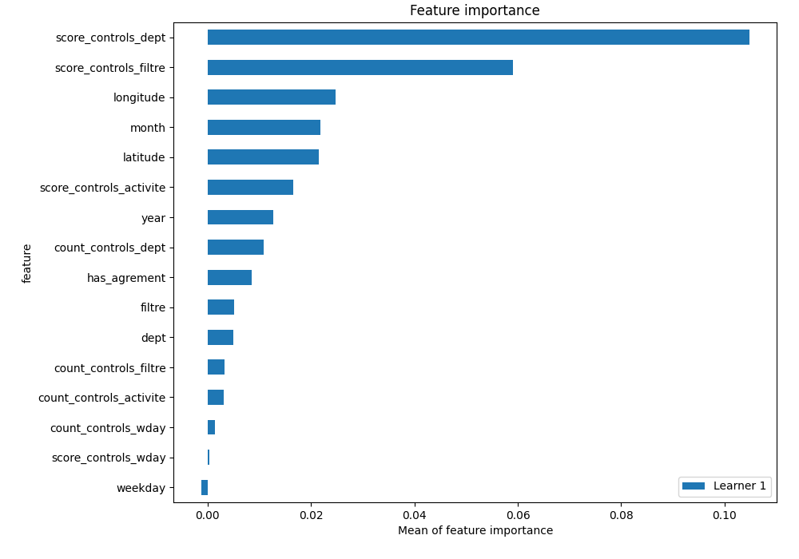
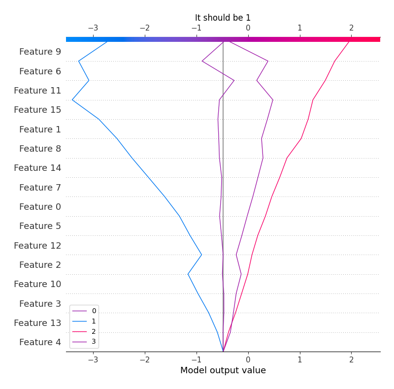
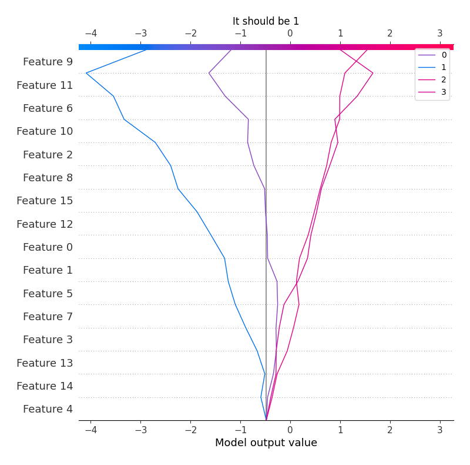

# Summary of 4_Default_Xgboost

[<< Go back](../README.md)

## Extreme Gradient Boosting (Xgboost)
- **objective**: multi:softprob
- **eval_metric**: mlogloss
- **eta**: 0.075
- **max_depth**: 6
- **min_child_weight**: 1
- **subsample**: 1.0
- **colsample_bytree**: 1.0
- **num_class**: 4
- **explain_level**: 2

## Validation
 - **validation_type**: split
 - **train_ratio**: 0.75
 - **shuffle**: True
 - **stratify**: True

## Optimized metric
logloss

## Training time

20.7 seconds

### Metric details
|           |           0 |          1 |           2 |           3 |   accuracy |   macro avg |   weighted avg |   logloss |
|:----------|------------:|-----------:|------------:|------------:|-----------:|------------:|---------------:|----------:|
| precision |   0.541667  |  0.5       |    0.642049 |    0.659494 |   0.649204 |    0.585802 |       0.644121 |  0.760418 |
| recall    |   0.0460993 |  0.0526316 |    0.719612 |    0.646135 |   0.649204 |    0.366119 |       0.649204 |  0.760418 |
| f1-score  |   0.0849673 |  0.0952381 |    0.678622 |    0.652746 |   0.649204 |    0.377893 |       0.633992 |  0.760418 |
| support   | 282         | 19         | 2682        | 2419        |   0.649204 | 5402        |    5402        |  0.760418 |

## Confusion matrix
|              |   Predicted as 0 |   Predicted as 1 |   Predicted as 2 |   Predicted as 3 |
|:-------------|-----------------:|-----------------:|-----------------:|-----------------:|
| Labeled as 0 |               13 |                0 |              211 |               58 |
| Labeled as 1 |                0 |                1 |               14 |                4 |
| Labeled as 2 |                6 |                1 |             1930 |              745 |
| Labeled as 3 |                5 |                0 |              851 |             1563 |

## Learning curves

## Permutation-based Importance

## SHAP Importance

## SHAP Dependence plots

### Dependence 0 (Fold 1)

### Dependence 1 (Fold 1)

### Dependence 2 (Fold 1)

### Dependence 3 (Fold 1)

## SHAP Decision plots

### Worst decisions for selected sample 1 (Fold 1)

### Worst decisions for selected sample 2 (Fold 1)

### Worst decisions for selected sample 3 (Fold 1)

### Worst decisions for selected sample 4 (Fold 1)

### Best decisions for selected sample 1 (Fold 1)

### Best decisions for selected sample 2 (Fold 1)

### Best decisions for selected sample 3 (Fold 1)

### Best decisions for selected sample 4 (Fold 1)

[<< Go back](../README.md)
