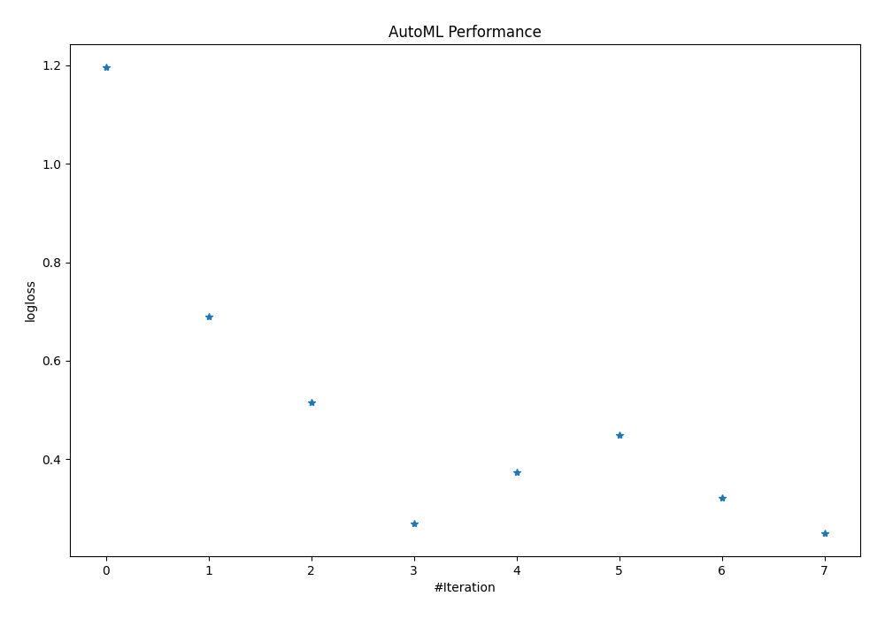
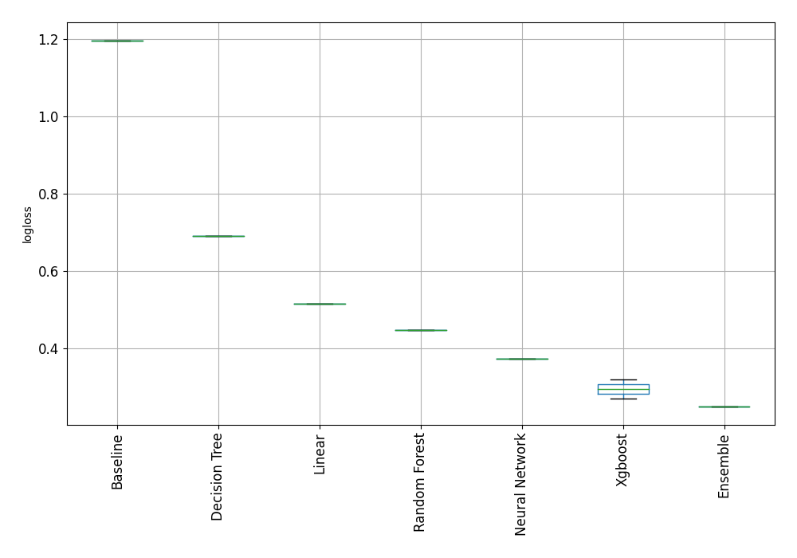

# AutoML Leaderboard

| Best model   | name                                                                             | model_type     | metric_type   |   metric_value |   train_time |
|:-------------|:---------------------------------------------------------------------------------|:---------------|:--------------|---------------:|-------------:|
|              | [1_Baseline](1_Baseline/README.md)                                               | Baseline       | logloss       |       1.19558  |         0.32 |
|              | [2_DecisionTree](2_DecisionTree/README.md)                                       | Decision Tree  | logloss       |       0.69032  |        25.55 |
|              | [3_Linear](3_Linear/README.md)                                                   | Linear         | logloss       |       0.515071 |        14.85 |
|              | [4_Default_Xgboost](4_Default_Xgboost/README.md)                                 | Xgboost        | logloss       |       0.269899 |        18.28 |
|              | [5_Default_NeuralNetwork](5_Default_NeuralNetwork/README.md)                     | Neural Network | logloss       |       0.372544 |         0.95 |
|              | [6_Default_RandomForest](6_Default_RandomForest/README.md)                       | Random Forest  | logloss       |       0.448182 |        16.6  |
|              | [4_Default_Xgboost_categorical_mix](4_Default_Xgboost_categorical_mix/README.md) | Xgboost        | logloss       |       0.320313 |        29.55 |
| **the best** | [Ensemble](Ensemble/README.md)                                                   | Ensemble       | logloss       |       0.249979 |         0.22 |

### AutoML Performance

### AutoML Performance Boxplot
