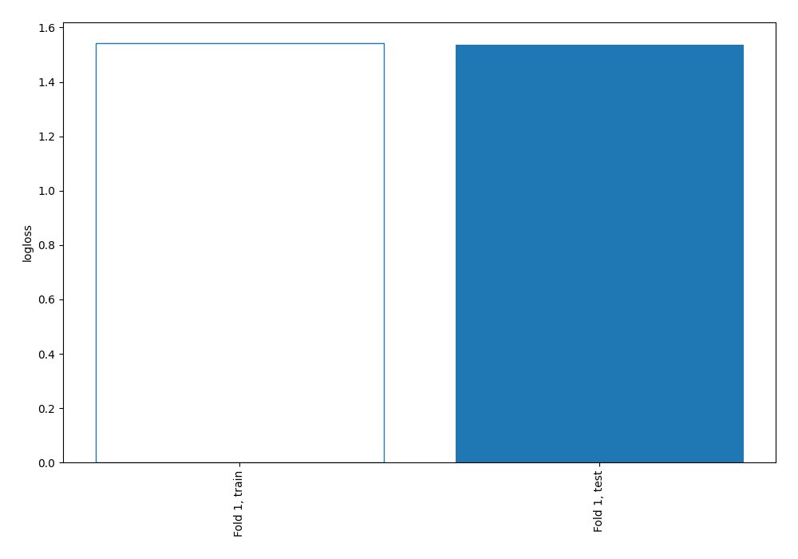

# Summary of 1_Baseline

[<< Go back](../README.md)

## Baseline Classifier (Baseline)
- **num_class**: 5
- **explain_level**: 2

## Validation
 - **validation_type**: split
 - **train_ratio**: 0.75
 - **shuffle**: True
 - **stratify**: True

## Optimized metric
logloss

## Training time

0.1 seconds

### Metric details
|           |   0 |         1 |   2 |   3 |   4 |   accuracy |   macro avg |   weighted avg |   logloss |
|:----------|----:|----------:|----:|----:|----:|-----------:|------------:|---------------:|----------:|
| precision |   0 |  0.285714 |   0 |   0 |   0 |   0.285714 |   0.0571429 |      0.0816327 |   1.53789 |
| recall    |   0 |  1        |   0 |   0 |   0 |   0.285714 |   0.2       |      0.285714  |   1.53789 |
| f1-score  |   0 |  0.444444 |   0 |   0 |   0 |   0.285714 |   0.0888889 |      0.126984  |   1.53789 |
| support   |  47 | 50        |  29 |  34 |  15 |   0.285714 | 175         |    175         |   1.53789 |

## Confusion matrix
|              |   Predicted as 0 |   Predicted as 1 |   Predicted as 2 |   Predicted as 3 |   Predicted as 4 |
|:-------------|-----------------:|-----------------:|-----------------:|-----------------:|-----------------:|
| Labeled as 0 |                0 |               47 |                0 |                0 |                0 |
| Labeled as 1 |                0 |               50 |                0 |                0 |                0 |
| Labeled as 2 |                0 |               29 |                0 |                0 |                0 |
| Labeled as 3 |                0 |               34 |                0 |                0 |                0 |
| Labeled as 4 |                0 |               15 |                0 |                0 |                0 |

## Learning curves

[<< Go back](../README.md)
