# Summary of 3_Linear

[<< Go back](../README.md)

## Logistic Regression (Linear)
- **num_class**: 5
- **explain_level**: 2

## Validation
 - **validation_type**: split
 - **train_ratio**: 0.75
 - **shuffle**: True
 - **stratify**: True

## Optimized metric
logloss

## Training time

8.2 seconds

### Metric details
|           |         0 |         1 |         2 |         3 |         4 |   accuracy |   macro avg |   weighted avg |   logloss |
|:----------|----------:|----------:|----------:|----------:|----------:|-----------:|------------:|---------------:|----------:|
| precision |  0.520548 |  0.333333 |  0.666667 |  0.380952 |  0.666667 |   0.491429 |    0.513633 |       0.476675 |   1.08111 |
| recall    |  0.808511 |  0.28     |  0.689655 |  0.235294 |  0.4      |   0.491429 |    0.482692 |       0.491429 |   1.08111 |
| f1-score  |  0.633333 |  0.304348 |  0.677966 |  0.290909 |  0.5      |   0.491429 |    0.481311 |       0.468777 |   1.08111 |
| support   | 47        | 50        | 29        | 34        | 15        |   0.491429 |  175        |     175        |   1.08111 |

## Confusion matrix
|              |   Predicted as 0 |   Predicted as 1 |   Predicted as 2 |   Predicted as 3 |   Predicted as 4 |
|:-------------|-----------------:|-----------------:|-----------------:|-----------------:|-----------------:|
| Labeled as 0 |               38 |                7 |                0 |                2 |                0 |
| Labeled as 1 |               19 |               14 |                3 |               11 |                3 |
| Labeled as 2 |                5 |                4 |               20 |                0 |                0 |
| Labeled as 3 |                6 |               13 |                7 |                8 |                0 |
| Labeled as 4 |                5 |                4 |                0 |                0 |                6 |

## Learning curves
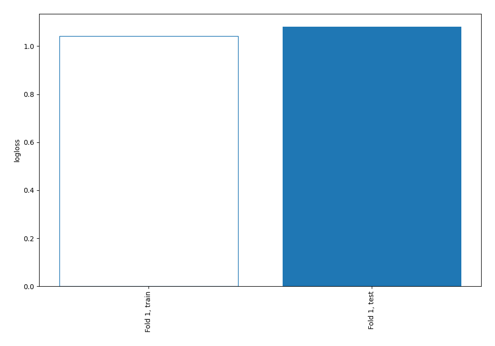

## Coefficients

### Coefficients learner #1
|                    |           0 |          1 |         2 |           3 |           4 |
|:-------------------|------------:|-----------:|----------:|------------:|------------:|
| intercept          |  1.80784    |  2.01673   | -2.72552  |  0.50835    | -1.6074     |
| nom_com            |  0.380576   |  0.367239  | -1.3283   | -0.316997   |  0.897483   |
| insee_com          |  0.380576   |  0.367239  | -1.3283   | -0.316997   |  0.897483   |
| nom_station        |  0.0596358  |  0.0612581 | -0.394172 | -0.690075   |  0.963353   |
| code_station       | -0.432223   | -0.38998   |  1.4818   | -0.231621   | -0.427975   |
| typologie          |  0.29101    |  0.287097  | -0.82773  |  0.215953   |  0.0336699  |
| influence          |  0.117335   |  0.103726  | -0.347627 |  0.27383    | -0.147263   |
| valeur             | -0.853461   | -0.0459299 |  1.04733  | -0.125223   | -0.0227164  |
| lat                |  0.225976   |  0.192929  | -0.939005 | -0.17667    |  0.69677    |
| long               | -0.227332   | -0.211188  |  0.572259 | -0.642842   |  0.509103   |
| jour_semaine_debut | -0.0166062  | -0.0175814 |  0.012963 |  0.0134262  |  0.00779841 |
| jour_semaine_fin   | -0.0166062  | -0.0175814 |  0.012963 |  0.0134262  |  0.00779841 |
| jour_debut         | -0.0166062  | -0.0175814 |  0.012963 |  0.0134262  |  0.00779841 |
| jour_fin           | -0.0166062  | -0.0175814 |  0.012963 |  0.0134262  |  0.00779841 |
| heure_debut        | -0.00304425 | -0.0303952 |  0.034434 | -0.00822246 |  0.00722798 |
| heure_fin          | -0.00304425 | -0.0303952 |  0.034434 | -0.00822246 |  0.00722798 |

## Permutation-based Importance
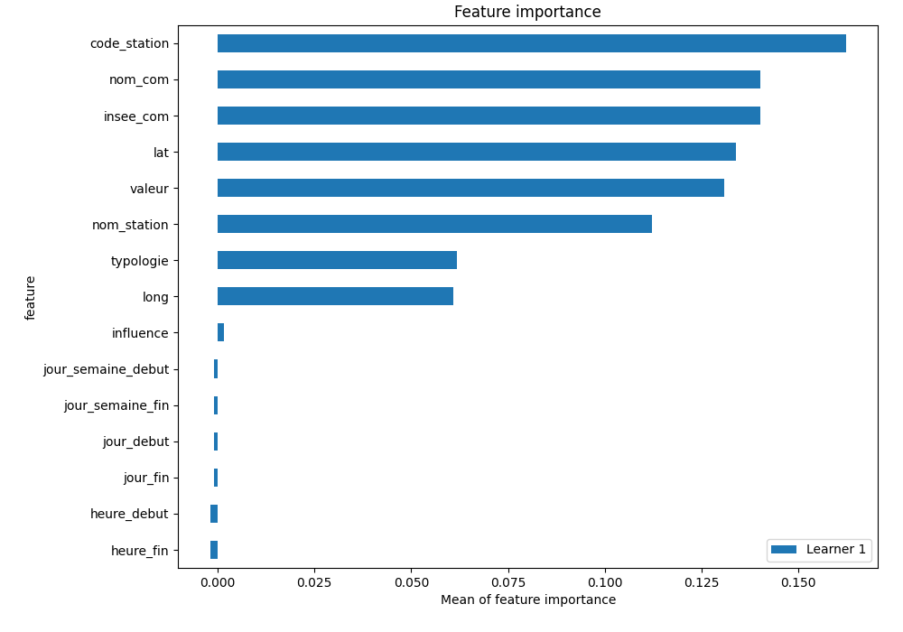

## SHAP Importance
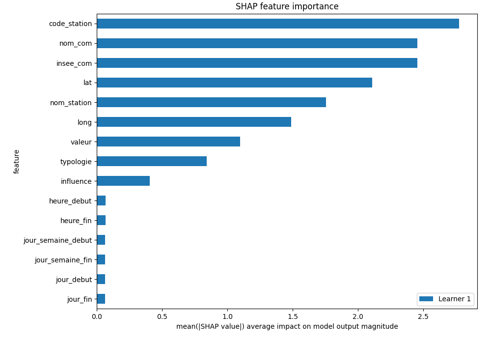

## SHAP Dependence plots

### Dependence 0 (Fold 1)
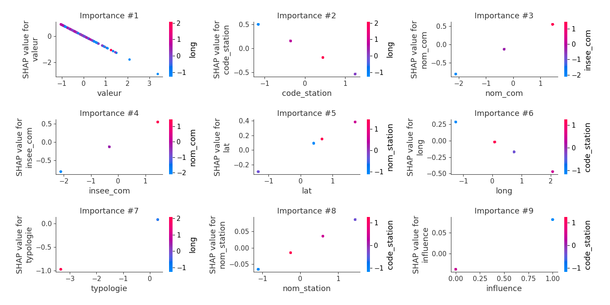
### Dependence 1 (Fold 1)
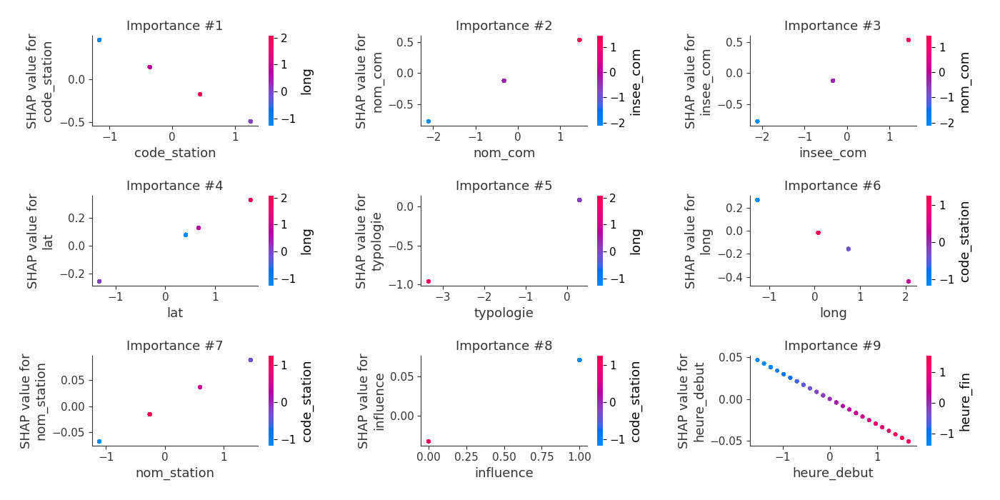
### Dependence 2 (Fold 1)
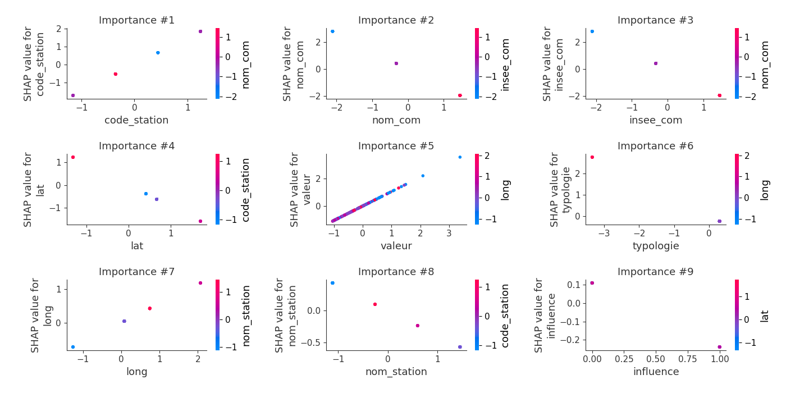
### Dependence 3 (Fold 1)
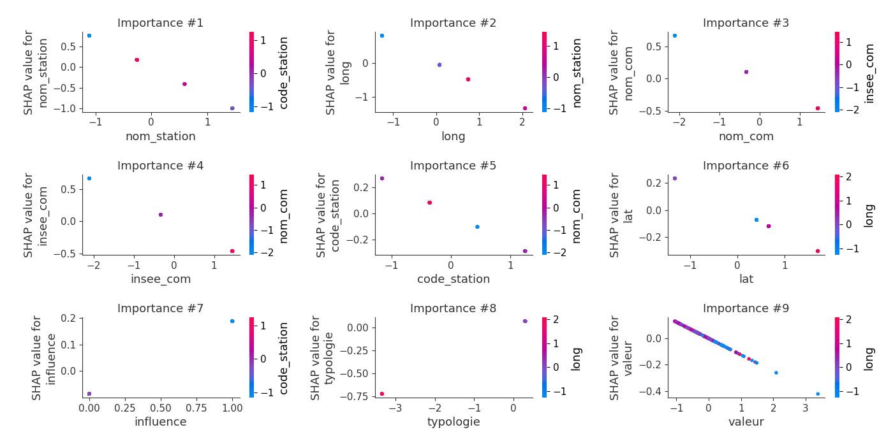
### Dependence 4 (Fold 1)
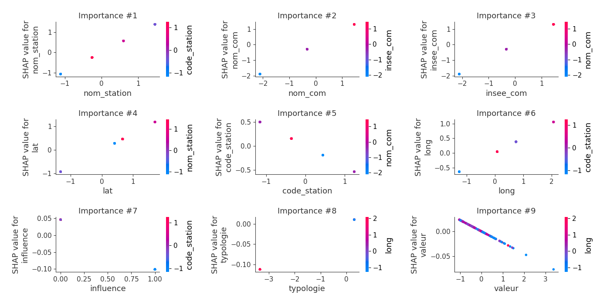

## SHAP Decision plots

### Worst decisions for selected sample 1 (Fold 1)
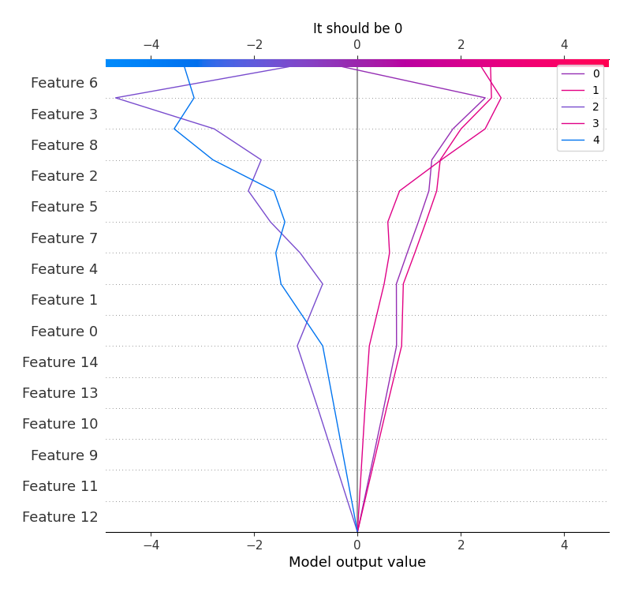
### Worst decisions for selected sample 2 (Fold 1)
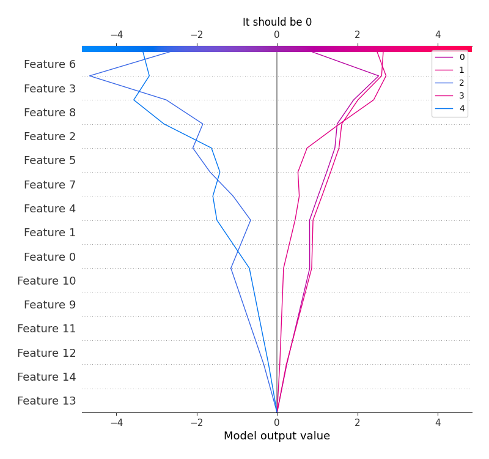
### Worst decisions for selected sample 3 (Fold 1)
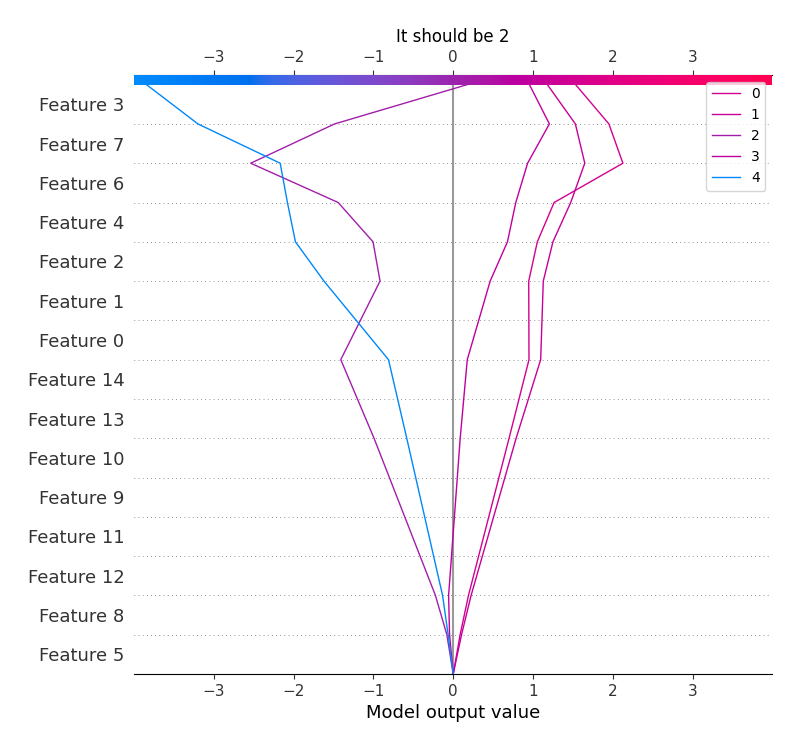
### Worst decisions for selected sample 4 (Fold 1)
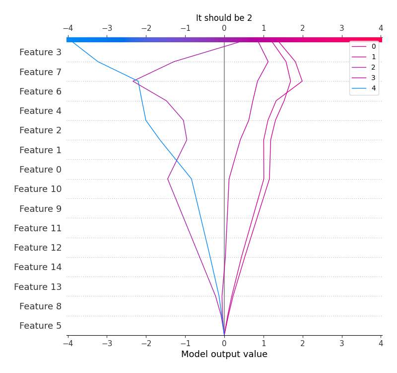
### Best decisions for selected sample 1 (Fold 1)

### Best decisions for selected sample 2 (Fold 1)
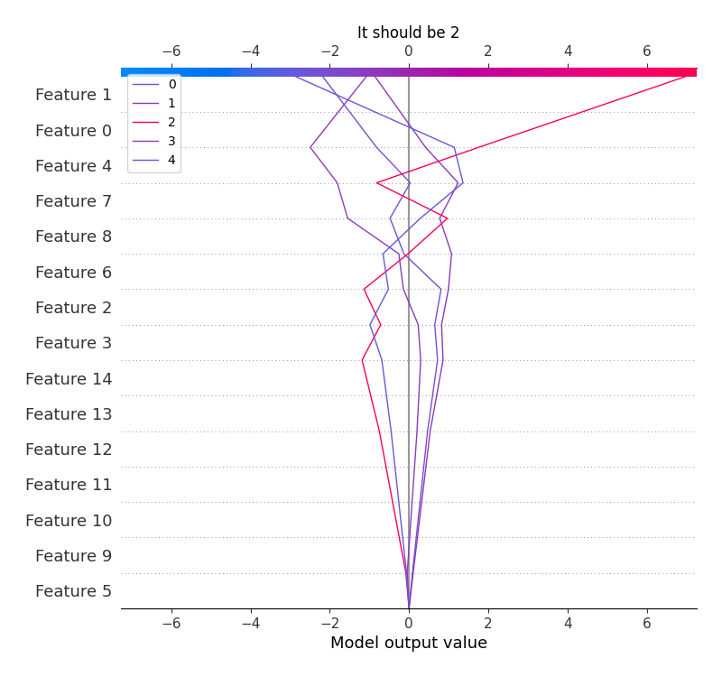
### Best decisions for selected sample 3 (Fold 1)
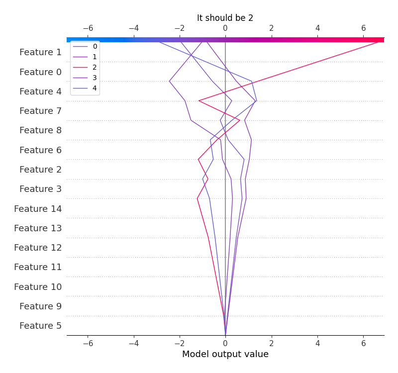
### Best decisions for selected sample 4 (Fold 1)
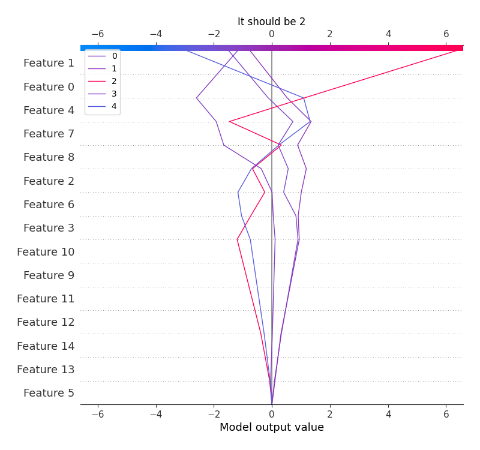

[<< Go back](../README.md)
